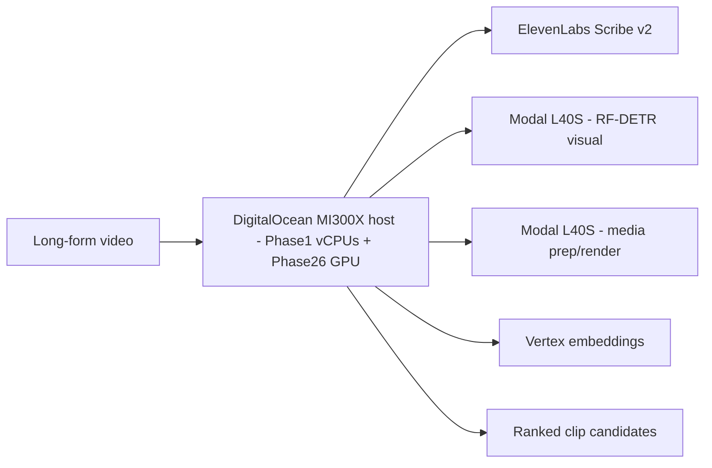
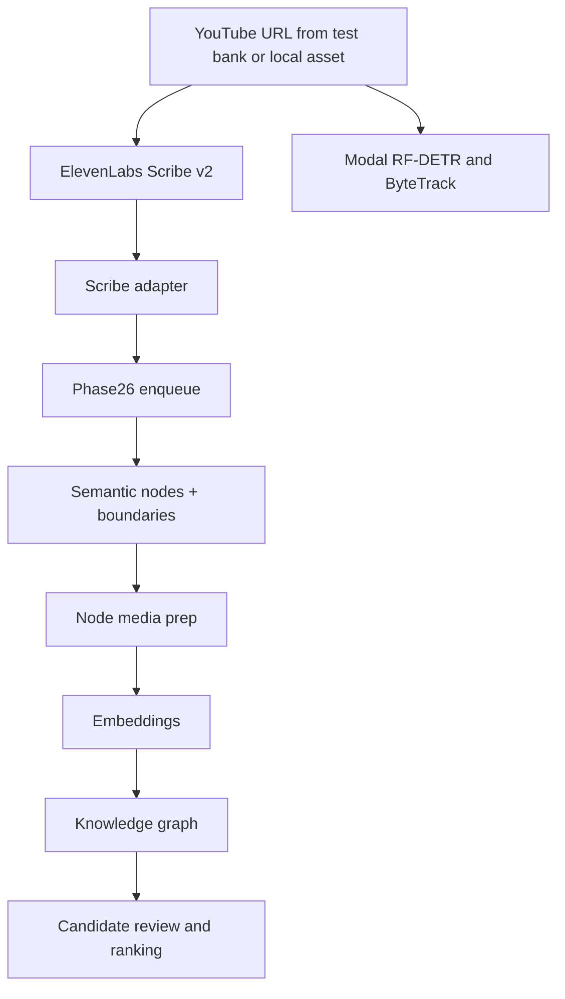

# Clypt Backend

Context-aware clipping and content intelligence infrastructure for creators.

Clypt exists because most AI clipping tools still treat every upload like an isolated file and every creator like the same channel. They wait for a video, score moments with generic virality heuristics, and return clips with very little awareness of audience behavior, cultural timing, or editorial intent.

Clypt takes a different approach. It combines multimodal video understanding, post-publish audience engagement, and real-time trend detection to surface the right clip at the right moment, whether that moment lives in a video from yesterday or one from eight months ago.

Just as importantly, Clypt does not hide its reasoning. It turns videos and channels into editable context graphs that creators can inspect and steer: follow what comments or trends point to, mark moments as must-include, and refine how the system thinks about narrative structure before export.

This repository is the backend system that powers it.

## What Makes Clypt Different

- **Audience-aware clipping**: clip discovery can incorporate real audience response instead of only structure-based heuristics.
- **Trend-aware resurfacing**: old long-form videos can become newly relevant when the cultural moment changes.
- **Reasoning you can inspect**: Clypt builds explicit video and channel graphs instead of treating ranking as a black box.
- **Editor-steerable intelligence**: creators can guide the model by marking key moments and adjusting relationships between ideas.
- **Strong base video tooling**: transcription, diarization, multimodal scrubbing, captioning/effects hooks, and editable person tracking still matter and are built into the system.

## What This Repository Owns

This repo currently implements **Phases 1-4** of Clypt’s backend:

1. **Phase 1**: ingest long-form video, run Scribe v2 ASR/diarization/audio tagging, submit RF-DETR visual extraction, and hand off audio-first artifacts downstream.
2. **Phase 2**: build semantic nodes, prepare clip media, and generate retrieval-ready embeddings.
3. **Phase 3**: construct the video-level knowledge graph.
4. **Phase 4**: retrieve, review, and rank clip candidates.

Planned next:

- **Phase 5**: participation grounding and creator-control layers
- **Phase 6**: final render/export orchestration

## Current Production Topology

The backend is currently designed around one DigitalOcean AMD GPU host that runs Phase1 orchestration on MI300X vCPUs and Phase26/Qwen on the MI300X GPU, plus two persistent Modal L40S pools.



### Phase 1 orchestrator

Phase 1 runs on the MI300X host's vCPUs and owns ingestion/orchestration, but not local GPU inference:

- Phase 1 runner/orchestrator
- signed HTTPS GCS audio URL generation for ElevenLabs Scribe v2
- Scribe response adaptation into canonical diarization/audio-event payloads
- Modal RF-DETR visual future submission
- immediate Phase26 handoff after audio is ready

### Phase26 host

The same MI300X host owns the downstream graph and ranking pipeline. The `Phase26` name is retained as a host/project shorthand because the machine owns the downstream queue, Qwen GPU service, and future Phase 5-6 orchestration boundary:

- `POST /tasks/phase26-enqueue`
- local SQLite queue and worker
- SGLang Qwen on `:8001`
- current Phase 2-4 runtime
- future Phase 5-6 orchestration boundary

### Modal

Modal currently handles visual extraction plus media-prep/render:

- `POST /tasks/visual-extract`
- `POST /tasks/node-media-prep`
- `POST /tasks/render-video`
- CPU web submit/poll surface
- one dedicated warm visual `L40S` worker via `visual_extract_job`
- one shared warm media `L40S` worker via `media_gpu_job`
- timeline-batched ffmpeg GPU path for clip extraction/encoding before multimodal embedding

Current render caveat: the Phase5-less auto-follow render fallback is implemented and produces valid vertical MP4s, but the latest reviewed clips were still unacceptable: tracking/subject selection was poor and crop motion was not smooth enough. Treat that fallback as experimental until the tracking and crop planner are repaired; manual Phase5 grounding remains the expected path for production-quality renders.

## End-to-End Flow



One important runtime property: Phase26 starts as soon as Scribe audio artifacts are ready. It does **not** wait for RF-DETR; Phase26 joins the visual future before Phase5/frontend grounding or Phase6 visual use.

## Core Capabilities Today

- Long-form video ingestion
- ElevenLabs Scribe v2 ASR, diarization, word timings, and coarse audio tags
- Modal RF-DETR + ByteTrack visual extraction
- semantic node construction
- clip media extraction for multimodal embedding
- video-level graph construction
- candidate retrieval and ranking

## Backend Stack

- **GPU compute**: DigitalOcean MI300X droplet on the `Rithvik-AMD` team for colocated Phase1 vCPU orchestration and Phase26 GPU inference
- **Serverless visual/media GPU work**: Modal L40S
- **Local generation**: SGLang ROCm serving Qwen 3.6
- **Embeddings**: Vertex AI
- **Persistence**: Google Cloud Storage + Spanner
- **Primary languages/runtimes**: Python, systemd services, ffmpeg, ROCm, TensorRT, SGLang

## Repository Map

```text
backend/phase1_runtime/                     Phase 1 orchestration and payload assembly
backend/providers/                          Config, remote clients, storage, embeddings, LLM clients
backend/runtime/phase26_dispatch_service/  Downstream enqueue API
backend/runtime/                           Entry points for Phase 1 and Phase26 services/workers
scripts/do_phase26/                        Phase26 host bootstrap and deploy scripts
scripts/modal/                             Modal visual extraction plus shared media worker apps
docs/                                      Runtime, deployment, architecture, specs, and run references
tests/                                     Backend tests
```

## Quick Start

### Local development

```bash
python3 -m venv .venv
source .venv/bin/activate
python -m pip install -r requirements-local.txt
```

### Host-specific dependency sets

Phase 1 orchestrator:

```bash
python -m pip install -r requirements-phase1-orchestrator.txt
```

Phase26 host:

```bash
python -m pip install -r requirements-do-phase26-mi300x.txt
```

### Run tests

```bash
source .venv/bin/activate
python -m pytest tests/backend/pipeline -q
```

## Runtime and Deployment Docs

Start here if you want the operational details:

- [Runtime guide](docs/runtime/RUNTIME_GUIDE.md)
- [Environment reference](docs/runtime/ENV_REFERENCE.md)
- [Run reference and benchmarks](docs/runtime/RUN_REFERENCE.md)
- [Architecture deep dive](docs/ARCHITECTURE.md)
- [Phase 1 colocated deploy](docs/deployment/PHASE1_HOST_DEPLOY.md)
- [Phase26 host deploy](docs/deployment/PHASE26_HOST_DEPLOY.md)
- [Modal node-media-prep deploy](docs/deployment/MODAL_NODE_MEDIA_PREP_DEPLOY.md)
- [Specs index](docs/specs/SPEC_INDEX.md)

Operational note:

- `source_url` ingestion now assumes a YouTube URL that exists in the configured Phase 1 test-bank mapping.
- Phase 1 also fetches public long-form YouTube metadata into `source_context.json` during ingress, so the host needs a project-scoped YouTube Data API key (`CLYPT_YOUTUBE_DATA_API_KEY` or `YOUTUBE_API_KEY`) unless you are using `source_path` instead.

## Status

- Implemented and actively exercised: **Phases 1-4**
- Planned next: **Phases 5-6**
- Current target architecture on `AMD-refactor`: **DigitalOcean MI300X Phase1-vCPU/Phase26-GPU + Modal L40S x2**
- Historical H200 files and Phase1 MI300X/VibeVoice runtime files are deleted on this branch. Historical incidents remain in `docs/ERROR_LOG.md` only as debugging context.
