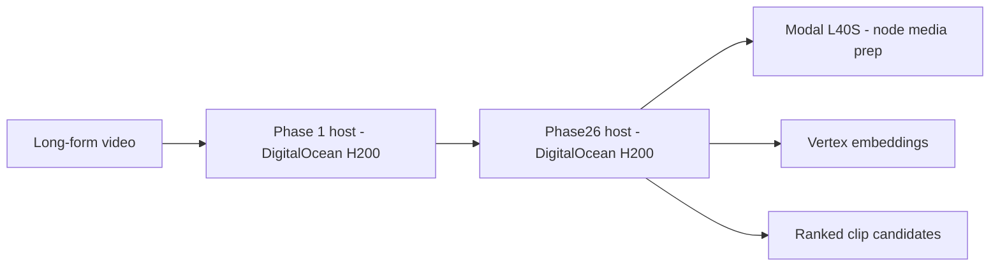
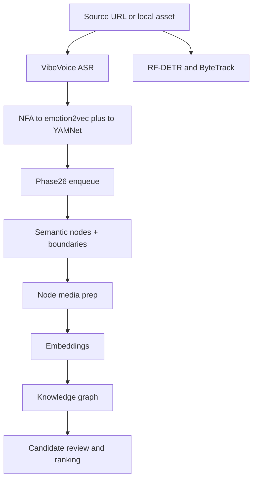

# Clypt Backend

Context-aware clipping and content intelligence infrastructure for creators.

Clypt exists because most AI clipping tools still treat every upload like an isolated file and every creator like the same channel. They wait for a video, score moments with generic virality heuristics, and return clips with very little awareness of audience behavior, cultural timing, or editorial intent.

Clypt takes a different approach. It combines multimodal video understanding, post-publish audience engagement, and real-time trend detection to surface the right clip at the right moment, whether that moment lives in a video from yesterday or one from eight months ago.

Just as importantly, Clypt does not hide its reasoning. It turns videos and channels into editable context graphs that creators can inspect and steer: follow what comments or trends point to, mark moments as must-include, and refine how the system thinks about narrative structure before export.

This repository is the backend system that powers it.

## What Makes Clypt Different

- **Audience-aware clipping**: clip discovery can incorporate real audience response instead of only structure-based heuristics.
- **Trend-aware resurfacing**: old long-form videos can become newly relevant when the cultural moment changes.
- **Reasoning you can inspect**: Clypt builds explicit video and channel graphs instead of treating ranking as a black box.
- **Editor-steerable intelligence**: creators can guide the model by marking key moments and adjusting relationships between ideas.
- **Strong base video tooling**: transcription, diarization, multimodal scrubbing, captioning/effects hooks, and editable person tracking still matter and are built into the system.

## What This Repository Owns

This repo currently implements **Phases 1-4** of Clypt’s backend:

1. **Phase 1**: ingest long-form video, run ASR, run the post-ASR audio chain, and extract visual structure.
2. **Phase 2**: build semantic nodes, prepare clip media, and generate retrieval-ready embeddings.
3. **Phase 3**: construct the video-level knowledge graph.
4. **Phase 4**: retrieve, review, and rank clip candidates.

Planned next:

- **Phase 5**: participation grounding and creator-control layers
- **Phase 6**: final render/export orchestration

## Current Production Topology

The backend is currently designed around two DigitalOcean GPU hosts plus one serverless media-prep surface on Modal.



### Phase 1 host

The Phase 1 host owns the real-time multimodal understanding path:

- Phase 1 runner/orchestrator
- persistent local VibeVoice service
- co-located VibeVoice vLLM sidecar
- persistent local visual service
- RF-DETR + ByteTrack
- in-process NFA, emotion2vec+, and YAMNet

### Phase26 host

The downstream host owns the graph and ranking pipeline:

- `POST /tasks/phase26-enqueue`
- local SQLite queue and worker
- SGLang Qwen on `:8001`
- current Phase 2-4 runtime
- future Phase 5-6 orchestration boundary

### Modal

Modal currently handles the stateless media-prep step:

- `POST /tasks/node-media-prep`
- `L40S`
- `min_containers=1`
- timeline-batched ffmpeg GPU path for clip extraction/encoding before multimodal embedding

## End-to-End Flow



One important runtime property: the post-ASR audio chain starts as soon as ASR returns. It does **not** wait for the visual chain to finish.

## Core Capabilities Today

- Long-form video ingestion
- VibeVoice ASR
- forced alignment
- emotion2vec+ segment scoring
- YAMNet event extraction
- RF-DETR + ByteTrack visual extraction
- semantic node construction
- clip media extraction for multimodal embedding
- video-level graph construction
- candidate retrieval and ranking

## Backend Stack

- **GPU compute**: DigitalOcean H200 droplets
- **Serverless media prep**: Modal L40S
- **Local generation**: SGLang serving Qwen 3.6
- **Embeddings**: Vertex AI
- **Persistence**: Google Cloud Storage + Spanner
- **Primary languages/runtimes**: Python, systemd services, ffmpeg, vLLM, TensorRT

## Repository Map

```text
backend/phase1_runtime/                     Phase 1 orchestration and payload assembly
backend/providers/                          Config, remote clients, storage, embeddings, LLM clients
backend/runtime/phase1_vibevoice_service/  Local Phase 1 ASR service
backend/runtime/phase1_visual_service/     Local Phase 1 visual extraction service
backend/runtime/phase26_dispatch_service/  Downstream enqueue API
backend/runtime/                           Entry points for Phase 1 and Phase26 services/workers
docker/vibevoice-vllm/                     VibeVoice vLLM container image
scripts/do_phase1/                         Phase 1 host bootstrap and deploy scripts
scripts/do_phase26/                        Phase26 host bootstrap and deploy scripts
scripts/modal/                             Modal node-media-prep and future render stubs
docs/                                      Runtime, deployment, architecture, specs, and run references
tests/                                     Backend tests
```

## Quick Start

### Local development

```bash
python3 -m venv .venv
source .venv/bin/activate
python -m pip install -r requirements-local.txt
```

### Host-specific dependency sets

Phase 1 host:

```bash
python -m pip install -r requirements-do-phase1-h200.txt
```

Phase26 host:

```bash
python -m pip install -r requirements-do-phase26-h200.txt
```

### Run tests

```bash
source .venv/bin/activate
python -m pytest tests/backend/pipeline -q
```

## Runtime and Deployment Docs

Start here if you want the operational details:

- [Runtime guide](docs/runtime/RUNTIME_GUIDE.md)
- [Environment reference](docs/runtime/ENV_REFERENCE.md)
- [Run reference and benchmarks](docs/runtime/RUN_REFERENCE.md)
- [Architecture deep dive](docs/ARCHITECTURE.md)
- [Phase 1 host deploy](docs/deployment/PHASE1_HOST_DEPLOY.md)
- [Phase26 host deploy](docs/deployment/PHASE26_HOST_DEPLOY.md)
- [Modal node-media-prep deploy](docs/deployment/MODAL_NODE_MEDIA_PREP_DEPLOY.md)
- [Specs index](docs/specs/SPEC_INDEX.md)

## Status

- Implemented and actively exercised: **Phases 1-4**
- Planned next: **Phases 5-6**
- Current validated architecture: **DigitalOcean H200 + H200 + Modal L40S**
