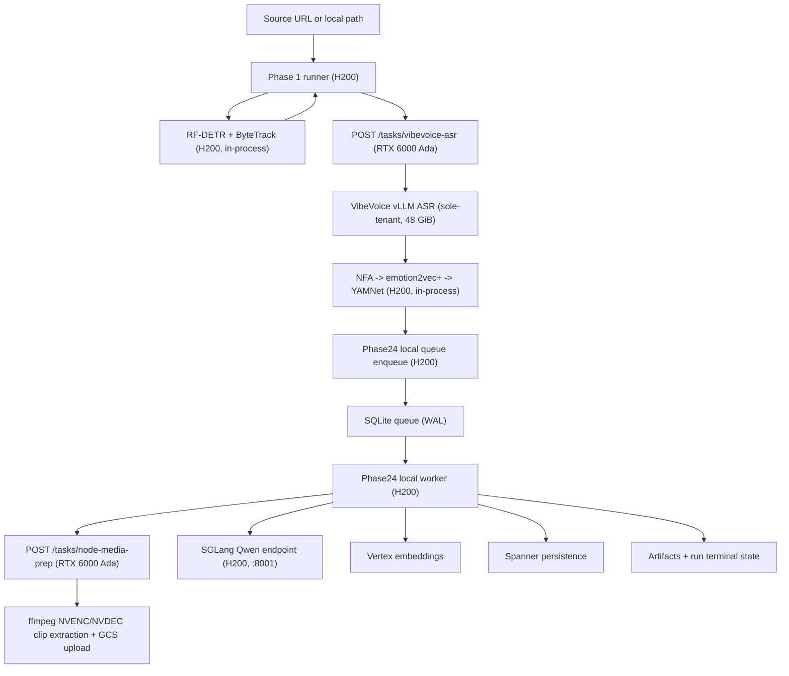

# ARCHITECTURE

**Status:** Active (implemented Phases 1-4, planned Phases 5-6)
**Last updated:** 2026-04-17

This document describes the code-backed architecture currently in this
repository. Phase 1 runs across two single-GPU droplets — a **RTX 6000
Ada VibeVoice ASR / node-media-prep host** and the existing **H200**
visual + orchestrator host — with no local fallback in either direction.

## 1) End-to-End Flow

## 2) Host Topology

Two single-GPU DigitalOcean droplets:

| Host | Runs |
| --- | --- |
| **RTX 6000 Ada (48 GB), sole-tenant** | VibeVoice vLLM ASR (OpenAI-compatible, `:8000`), ffmpeg NVENC/NVDEC for node-media prep, FastAPI service ("clypt-audio-host", `:9100`) exposing `/tasks/vibevoice-asr` and `/tasks/node-media-prep`. |
| **H200** | RF-DETR + ByteTrack (TensorRT FP16), NeMo Forced Aligner, emotion2vec+, YAMNet (CPU), SGLang Qwen3.6-35B-A3B on `:8001`, Phase 1 orchestrator (`run_phase1`, Phase 1 API/worker), Phase 2-4 local SQLite queue + worker, Spanner/GCS I/O. |

Design rationale:

- H200 NVENC is unusable for our ffmpeg clip-extraction path
  (`h264_nvenc` returns `unsupported device (2)`). RTX 6000 Ada provides
  a working NVENC/NVDEC pipeline.
- RTX 6000 Ada's 48 GB VRAM lets VibeVoice run as a **sole tenant** —
  no more `--max-num-seqs 1`, `--max-model-len 32768`,
  `--gpu-memory-utilization 0.60`, `--enforce-eager`, or
  `PYTORCH_CUDA_ALLOC_CONF=expandable_segments:True`. Those were
  co-tenancy hacks needed when NFA also ran on the RTX.
- NFA global alignment OOM'd reliably on the 48 GiB card when co-tenant
  with vLLM, even after the tuning above. Moving NFA / emotion2vec+ /
  YAMNet back to the H200's 141 GiB gives them room to run next to
  RF-DETR without contention.
- Keeping ffmpeg NVENC on the RTX host is still forced by the H200 NVENC
  bug, so node-media prep stays there.

Current RTX 6000 Ada vLLM (VibeVoice) flags:
- `--gpu-memory-utilization 0.77` — leaves ~8 GiB free for concurrent
  NVDEC contexts during node-media prep
- `--max-num-seqs 2`
- `--dtype bfloat16`
- CUDA graph capture enabled (`enforce_eager=False`, the default)
- No speculative decoding — VibeVoice is an encoder-decoder (Whisper
  architecture), not decoder-only; MTP/speculative heads do not apply.
- VibeVoice weights and all Python deps are baked into the Docker image
  (767 MB layer: ffmpeg, libsndfile1, vibevoice[vllm] dependencies).
  Model weights live on a host mount at `/root/.cache/huggingface`.
  Cold restart ~45 s (vs ~5 min before baking).

Current H200 SGLang (Qwen3.6-35B-A3B) flags:
- `--context-length 65536` (reduced from 131072 to reclaim KV-cache headroom)
- `--kv-cache-dtype fp8_e4m3`
- `--mem-fraction-static 0.78`
- `--speculative-algorithm NEXTN --speculative-num-steps 3 --speculative-num-draft-tokens 4`
- `HF_HUB_OFFLINE=1` (prevents DNS failures on startup)
- Effective limits: `max_total_num_tokens=1,739,188`, `max_running_requests=48`

No-fallback rule: `backend/providers/config.py` requires
`CLYPT_PHASE1_VIBEVOICE_ASR_SERVICE_URL` /
`CLYPT_PHASE1_VIBEVOICE_ASR_SERVICE_AUTH_TOKEN` and
`CLYPT_PHASE24_NODE_MEDIA_PREP_URL` /
`CLYPT_PHASE24_NODE_MEDIA_PREP_TOKEN` on the H200. There is no
in-process VibeVoice or ffmpeg path on the orchestrator host.

> **Compat note:** `CLYPT_PHASE1_AUDIO_HOST_URL` and
> `CLYPT_PHASE1_AUDIO_HOST_TOKEN` still work for one release as
> deprecated aliases. New deployments should use the
> `_VIBEVOICE_ASR_SERVICE_*` names.

## 3) Phase 1 Architecture

### 3.1 Core behavior

- `run_phase1` builds `Phase1JobRunner` through
  `build_default_phase1_job_runner()`. The factory always constructs a
  `RemoteVibeVoiceAsrClient` for the ASR leg; NFA / emotion2vec+ /
  YAMNet are built as in-process H200 providers.
- Input mode is `test_bank` only (enforced).
- Phase 1 has two sub-chains:
  - **Audio chain:**
    - ASR leg (RTX 6000 Ada): VibeVoice vLLM ASR, dispatched via
      `POST /tasks/vibevoice-asr`. Response is a
      `VibeVoiceAsrResponse` with `{turns, stage_events}`.
    - Post-ASR leg (H200, in-process): NeMo forced aligner →
      emotion2vec+ → YAMNet (CPU). Runs on the H200 immediately when
      the HTTP call returns.
  - **Visual chain (H200):** RF-DETR + ByteTrack (TensorRT FP16 fast
    path), in-process.
- The audio chain begins immediately when the ASR HTTP call returns,
  not when RF-DETR finishes.

### 3.2 Phase24 handoff

- When `--run-phase14` is enabled, handoff is pushed through
  `Phase24LocalDispatcherClient`.
- Queue rows are stored in local SQLite with unique `run_id`.
- Handoff can start while visual work is still running (the audio-chain
  completion callback fires as soon as NFA / emotion2vec+ / YAMNet
  finish on the H200; no RF-DETR dependency).

## 4) Phase 2-4 Architecture

### 4.1 Worker runtime boundary

- `run_phase24_local_worker` is the canonical local worker.
- Queue backend must be `local_sqlite`.
- Worker loads `Phase24WorkerService` from `phase24_worker_app`. The
  factory always wires `node_media_preparer=RemoteNodeMediaPrepClient(...)`
  built from `CLYPT_PHASE24_NODE_MEDIA_PREP_*` settings.

### 4.2 LLM and embedding boundaries

- Generation path in local worker is hard-gated to
  `GENAI_GENERATION_BACKEND=local_openai`.
- LLM client is `LocalOpenAIQwenClient` (OpenAI-compatible chat
  completions).
- Embeddings remain Vertex-backed.
- Node-media prep always delegates to the RTX host via
  `RemoteNodeMediaPrepClient`. The H200 never touches ffmpeg in the
  hot path; the local file in returned descriptors is empty because
  downstream multimodal embedding only consumes `file_uri`.

### 4.3 Execution overlap

- Phase 2 merge/classify and boundary reconciliation use separate
  concurrency caps.
- After raw nodes exist, semantic text embeddings and node-media prep
  are launched in parallel.
- **Multimodal embedding is chained inside the Phase 2 pool** — it
  begins as soon as media URIs arrive from node-media prep, with no
  inter-pool gap. Gemini multimodal embedding `max_workers` is 32
  (raised from 10).
- **Phase 3 long-range adjudication is prefetched during the Phase 2
  node-media prep window** (alongside the existing Phase 3 local
  prefetch). This overlaps the GCS-upload-bound media_prep latency
  with long-range pair selection, reducing Phase 3 wall-clock to
  ~40–65 ms observed.
- Phase 3 local-edge work can start from raw nodes before the rest of
  Phase 2 fully finishes.
- Phase 3 local-edge and long-range lanes run concurrently, each with
  its own concurrency cap.

### 4.4 Structured output policy

- Response format always uses strict JSON schema.
- Object schemas are normalized to `additionalProperties=false`.
- Client performs post-parse schema subset checks.
- Non-thinking request mode is forced for structured output calls.

## 5) Queue and Failure Semantics

### 5.1 Lease management

- Queue supports expired lease reclaim, but defaults disable reclaim.
- Worker defaults:
  - `reclaim_expired_leases = false`
  - `fail_fast_on_stale_running = true`

### 5.2 Failure classification

- Fail-fast class includes signatures such as:
  - `connection refused`
  - `xgrammar`
  - `compile_json_schema`
  - `enginecore`
- Transient class includes retryable HTTP transport errors and 5xx from
  the remote VibeVoice ASR / node-media-prep hosts (with bounded
  retries in the respective clients).
- Validation/schema/type failures are non-transient.

### 5.3 Operational implication

- Crash scenarios are intentionally surfaced quickly.
- Manual intervention is expected for stale-running lease cleanup under
  fail-fast defaults.
- A hard failure from the RTX VibeVoice ASR service fails the Phase 1
  run; there is no local fallback path to recover on the H200.

## 6) Persistence Boundaries

- **Local artifacts (H200):** `backend/outputs/v3_1/<run_id>/...`
- **Local queue (H200):** `backend/outputs/phase24_local_queue.sqlite` (default)
- **Scratch (RTX 6000 Ada):** `/opt/clypt-audio-host/scratch/<tmp-...>` (ephemeral per request)
- **System of record:** Spanner for runs, phase metrics, graph/candidate entities (written from H200 worker)
- **Object storage:** GCS for source/handoff assets and node clips (RTX uploads clips; H200 reads them back for multimodal embedding)

## 7) Implemented vs Planned

- **Implemented:** Two-host Phase 1 with remote VibeVoice ASR + remote
  node-media prep; Phase 1-4 pipeline execution and persistence on the
  H200; in-process NFA / emotion2vec+ / YAMNet on the H200; local
  phase24 queue runtime; strict structured-output validation path.
- **Planned:** Phase 5 participation grounding, Phase 6 render
  planning/output.

## 8) Architectural Invariants

1. Phase 1 output is mandatory upstream input for Phase 2-4.
2. Phase 1 splits into two sub-chains by design: an **audio chain**
   (VibeVoice vLLM ASR on the RTX → NFA → emotion2vec+ → YAMNet CPU,
   the last three running in-process on the H200), and a **visual
   chain** (RF-DETR + ByteTrack) on the H200. The audio chain does not
   block on the visual chain.
3. The H200 never runs VibeVoice vLLM ASR or ffmpeg NVENC in-process;
   config load fails fast if the remote endpoints are unset.
4. The RTX 6000 Ada serves exactly two authenticated endpoints
   (`/tasks/vibevoice-asr`, `/tasks/node-media-prep`) plus `/health`.
   It does not run NFA, emotion2vec+, or YAMNet; it does not write
   Spanner or touch the Phase 2-4 queue.
5. Phase 1 visual chain runs on the H200 via the TensorRT FP16 fast
   path.
6. Node-media prep requires working NVENC, which currently exists only
   on the RTX 6000 Ada host.
7. Local phase24 worker requires local OpenAI generation backend.
8. Queue backend for local runtime is SQLite only.
9. Fail-fast behavior on stale leases/crash signatures is intentional
   and currently default.

## 9) Related Docs

- Runtime operations: `docs/runtime/RUNTIME_GUIDE.md`
- H200 deployment runbook: `docs/deployment/P1_DEPLOY.md`
- RTX 6000 Ada audio host runbook: `docs/deployment/P1_AUDIO_HOST_DEPLOY.md`
- H200 env template: `docs/runtime/known-good.env`
- RTX env template: `docs/runtime/known-good-audio-host.env`
- Active specs: `docs/specs/SPEC_INDEX.md`
- Incident history: `docs/ERROR_LOG.md`
