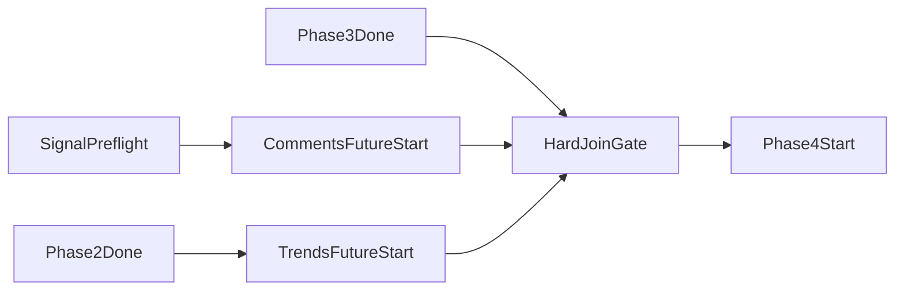

# ARCHITECTURE

**Status:** Mixed (implemented + planned)  
**Last updated:** 2026-04-10

This is the technical source of truth for:

- implemented backend architecture (Phases 1-4), and
- planned extension architecture (Phases 5-6).

---

## 1) Big End-to-End Pipeline Diagram

```mermaid
flowchart TD
  startNode["StartRunRequest"]
  ingress["IngressValidateInput"]
  mediaResolve["Phase1MediaResolve"]
  phase24Preflight["Phase24SignalPreflight"]
  preflightFail["FailFastPreflightError"]

  subgraph p1exec ["Phase1TimelineFoundationImplemented"]
    p1Launch["LaunchPhase1ConcurrentWorkers"]

    subgraph p1visual ["VisualBranch"]
      p1VisualExtract["RFDETRAndByteTrack"]
      p1VisualArtifacts["WriteShotTrackletAndGeometry"]
    end

    subgraph p1audio ["AudioBranch"]
      p1Asr["VibeVoiceASRviaVLLM"]
      p1Align["NeMoForcedAligner"]
      p1Emotion["Emotion2vecTimeline"]
      p1Yamnet["YAMNetTimeline"]
      p1TimelineAssemble["AssembleCanonicalTimeline"]
    end

    p1Join["Phase1JoinAndSidecarOutputsReady"]
  end

  queueDecision["RunPhase14Decision"]
  modeQueue["QueueModeCloudTasks"]

  phase2["Phase2NodeConstructionAndEmbeddings"]
  phase3["Phase3GraphConstruction"]

  commentsFlag["CommentSignalsEnabledCheck"]
  trendsFlag["TrendSignalsEnabledCheck"]
  commentsFuture["CommentsFutureStartAfterPreflight"]
  trendsFuture["TrendsFutureStartAfterPhase2"]
  hardJoin["SignalsHardJoinBeforePhase4"]
  signalFail["FailFastSignalPipelineError"]

  phase4["Phase4RetrievalSubgraphReviewPoolRanking"]
  spannerPersist["SpannerPersistenceRunMetricsGraphCandidatesSignals"]
  localArtifacts["LocalArtifactPersistence"]

  phase5Planned["Phase5ParticipationGroundingPlanned"]
  phase6Planned["Phase6RenderPlanningAndOutputPlanned"]
  doneNode["RunComplete"]

  startNode --> ingress
  ingress --> mediaResolve
  ingress --> phase24Preflight
  phase24Preflight --> commentsFlag
  phase24Preflight --> trendsFlag

  phase24Preflight -->| "invalid preflight" | preflightFail

  mediaResolve --> p1Launch
  p1Launch --> p1VisualExtract --> p1VisualArtifacts --> p1Join
  p1Launch --> p1Asr --> p1Align --> p1Emotion --> p1Yamnet --> p1TimelineAssemble --> p1Join

  p1Join --> queueDecision
  queueDecision --> modeQueue
  modeQueue --> phase2

  commentsFlag -->| "enabled" | commentsFuture
  trendsFlag -->| "enabled and after phase2" | trendsFuture

  phase2 --> phase3
  phase2 --> trendsFuture
  phase3 --> hardJoin
  commentsFuture --> hardJoin
  trendsFuture --> hardJoin

  commentsFuture -->| "future failed" | signalFail
  trendsFuture -->| "future failed" | signalFail
  hardJoin -->| "invalid signal payload" | signalFail

  hardJoin --> phase4
  phase4 --> spannerPersist
  phase4 --> localArtifacts
  spannerPersist --> phase5Planned --> phase6Planned --> doneNode
```

---

## 2) Architecture by Phase

## 2.1 Phase 1 - Timeline Foundation (Implemented)

### Responsibilities

- Convert media input into synchronized timeline + visual/audio sidecars.
- Preserve turn-level transcript ownership and word-level alignment.
- Produce deterministic artifacts consumed by Phases 2-4.

### Runtime behavior

- Visual and ASR execute concurrently.
- Audio chain starts immediately after ASR completion.
- Audio chain remains serial (`aligner -> emotion -> yamnet`) while visual continues.

### Key artifacts

- `timeline/canonical_timeline.json`
- `timeline/shot_tracklet_index.json`
- `timeline/tracklet_geometry.json`
- `timeline/speech_emotion_timeline.json`
- `timeline/audio_event_timeline.json`

## 2.2 Phase 2 - Node Construction (Implemented)

### Responsibilities

- Build local turn neighborhoods.
- Merge/classify nodes via Gemini.
- Reconcile boundaries.
- Generate semantic + multimodal embeddings.

### Important implementation constraints

- Raw turn boundaries are atomic for merge boundaries.
- `response_schema` constrained decoding is used for JSON validity.
- output-token caps are enforced per call path.

## 2.3 Phase 3 - Graph Construction (Implemented)

### Responsibilities

- Build structural + semantic + long-range edges.
- Persist graph edges/nodes to storage.
- Enforce strict long-range pair validation.

### Failure characteristics

- Long clips can still hit `RESOURCE_EXHAUSTED` on local-edge batching.
- Strict non-shortlisted long-range edge proposals are hard failures.

## 2.4 Phase 4 - Retrieval + Ranking (Implemented)

### Responsibilities

- Build dynamic meta prompts.
- Retrieve seed nodes.
- Expand local subgraphs.
- Review subgraphs and pool/rank candidates.
- Persist candidate set and ranking metadata.

### Signal augmentation behavior

- comments and trends are augment overlays, not alternate candidate lists.
- hard join before Phase 4 execution ensures deterministic prompt composition.
- fail-fast on enabled signal pipeline failures protects data trust boundaries.

---

## 3) Signal Augmentation Architecture (Implemented)

## 3.1 Concurrency model



## 3.2 Persistence model

- external signals and clusters persist independently.
- node-level and candidate-level links capture attribution.
- prompt source and provenance records support explainability.

---

## 4) Runtime Execution Path

## 4.1 Queue handoff (production)

- Phase 1 host enqueues Phase 2-4 work to Cloud Tasks.
- Cloud Run worker executes Phase 2-4 (default profile: `us-east4` L4 GPU-accelerated).
- All production runs use this path.

## 5) Storage and Data Boundaries

## 5.1 Local artifacts

- Root: `backend/outputs/v3_1/<run_id>/`
- Includes phase artifacts and debug files.

## 5.2 Spanner system of record

- run status and phase metrics
- graph entities and candidate entities
- signal attribution and provenance entities

## 5.3 External storage

- source media upload path uses GCS.
- signed URLs are required for bucket policy compatibility.

---

## 6) Planned Architecture (Phases 5-6)

## 6.1 Phase 5 (Planned)

### Goals

- Capture participation truth for finalists.
- Capture camera intent independently from participation truth.
- Materialize deterministic timelines from user-confirmed events.

### Planned packages

- `backend/pipeline/grounding/`
- `backend/pipeline/camera/`

## 6.2 Phase 6 (Planned)

### Goals

- Compile Phase 5 timelines + geometry into renderer-ready shot segments.
- Produce deterministic `render_plan.json`.
- Emit 9:16 outputs from a standalone render path.

### Planned package

- `backend/pipeline/render/`

---

## 7) Architectural Invariants

1. Phase 1 outputs are mandatory upstream dependencies for Phases 2-4.
2. Turn-level transcript ownership remains canonical.
3. Signal augmentation cannot bypass hard join.
4. Enabled signal failures are terminal by design.
5. Participation and camera intent remain separate concerns.
6. Future rerendering should not require recomputing Phases 1-4.

---

## 8) Related Docs

- Runtime and runbooks: [RUNTIME_GUIDE.md](runtime/RUNTIME_GUIDE.md)
- Reference runs: [RUN_REFERENCE.md](runtime/RUN_REFERENCE.md)
- Deployment operations: [PHASE_1_DEPLOYMENT.md](deployment/PHASE_1_DEPLOYMENT.md)
- Active specs index: [SPEC_INDEX.md](specs/SPEC_INDEX.md)
- Planned Phase 5-6 spec: [2026-04-10_phase5_6_spec.md](specs/2026-04-10_phase5_6_spec.md)
