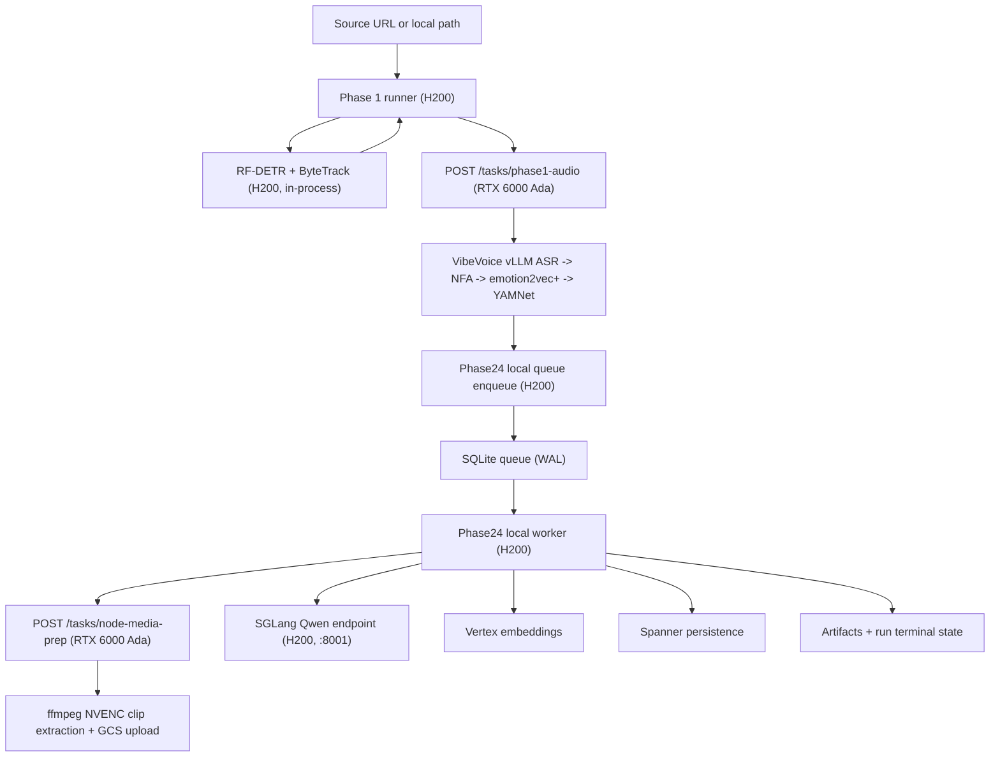

# ARCHITECTURE

**Status:** Active (implemented Phases 1-4, planned Phases 5-6)
**Last updated:** 2026-04-17

This document describes the code-backed architecture currently in this
repository. Phase 1 runs across two single-GPU droplets — a **RTX 6000
Ada audio host** and the existing **H200** visual + orchestrator host —
with no local fallback in either direction.

## 1) End-to-End Flow

## 2) Host Topology

Two single-GPU DigitalOcean droplets:

| Host | Runs |
| --- | --- |
| **Phase 1 audio host — RTX 6000 Ada (48 GB)** | VibeVoice vLLM ASR, NeMo Forced Aligner, emotion2vec+, YAMNet (CPU), ffmpeg NVENC/NVDEC for node-media prep, FastAPI service exposing `/tasks/phase1-audio` and `/tasks/node-media-prep`. |
| **Phase 1 visual + Phase 2-4 host — H200** | RF-DETR + ByteTrack (TensorRT FP16), SGLang Qwen3.6-35B-A3B on `:8001`, Phase 1 orchestrator (`run_phase1`, Phase 1 API/worker), Phase 2-4 local SQLite queue + worker, Spanner/GCS I/O. |

Design rationale:

- H200 NVENC is unusable for our ffmpeg clip-extraction path
  (`h264_nvenc` returns `unsupported device (2)`). RTX 6000 Ada provides
  a working NVENC/NVDEC pipeline.
- RTX 6000 Ada's 48 GB VRAM lets VibeVoice run native dtype (no bf16
  audio-encoder patch).
- Moving VibeVoice + node-media prep off the H200 frees SM time and
  VRAM for RF-DETR and SGLang.

No-fallback rule: `backend/providers/config.py` requires
`CLYPT_PHASE1_AUDIO_HOST_URL`/`_TOKEN` and
`CLYPT_PHASE24_NODE_MEDIA_PREP_URL`/`_TOKEN` on the H200. There is no
in-process audio-chain or ffmpeg path on the orchestrator host.

## 3) Phase 1 Architecture

### 3.1 Core behavior

- `run_phase1` builds `Phase1JobRunner` through
  `build_default_phase1_job_runner()`. The factory always constructs a
  `RemoteAudioChainClient`; there is no H200-side VibeVoice/NFA/
  emotion2vec/YAMNet instantiation.
- Input mode is `test_bank` only (enforced).
- Phase 1 has two sub-chains:
  - **Audio chain (RTX 6000 Ada):** VibeVoice vLLM ASR → NeMo forced
    aligner → emotion2vec+ → YAMNet (CPU). The H200 calls
    `POST /tasks/phase1-audio` and receives the merged payload plus
    re-emitted stage events in one round trip.
  - **Visual chain (H200):** RF-DETR + ByteTrack (TensorRT FP16 fast
    path), in-process.
- The audio chain begins immediately when the HTTP call returns, not
  when RF-DETR finishes.

### 3.2 Phase24 handoff

- When `--run-phase14` is enabled, handoff is pushed through
  `Phase24LocalDispatcherClient`.
- Queue rows are stored in local SQLite with unique `run_id`.
- Handoff can start while visual work is still running (the audio-chain
  completion callback fires immediately; no RF-DETR dependency).

## 4) Phase 2-4 Architecture

### 4.1 Worker runtime boundary

- `run_phase24_local_worker` is the canonical local worker.
- Queue backend must be `local_sqlite`.
- Worker loads `Phase24WorkerService` from `phase24_worker_app`. The
  factory always wires `node_media_preparer=RemoteNodeMediaPrepClient(...)`
  built from `CLYPT_PHASE24_NODE_MEDIA_PREP_*` settings.

### 4.2 LLM and embedding boundaries

- Generation path in local worker is hard-gated to
  `GENAI_GENERATION_BACKEND=local_openai`.
- LLM client is `LocalOpenAIQwenClient` (OpenAI-compatible chat
  completions).
- Embeddings remain Vertex-backed.
- Node-media prep always delegates to the RTX host via
  `RemoteNodeMediaPrepClient`. The H200 never touches ffmpeg in the
  hot path; the local file in returned descriptors is empty because
  downstream multimodal embedding only consumes `file_uri`.

### 4.3 Execution overlap

- Phase 2 merge/classify and boundary reconciliation use separate
  concurrency caps.
- After raw nodes exist, semantic text embeddings and node-media prep
  are launched in parallel.
- Multimodal embeddings begin as soon as media URIs arrive.
- Phase 3 local-edge work can start from raw nodes before the rest of
  Phase 2 fully finishes.
- Phase 3 local-edge and long-range lanes run concurrently, each with
  its own concurrency cap.

### 4.4 Structured output policy

- Response format always uses strict JSON schema.
- Object schemas are normalized to `additionalProperties=false`.
- Client performs post-parse schema subset checks.
- Non-thinking request mode is forced for structured output calls.

## 5) Queue and Failure Semantics

### 5.1 Lease management

- Queue supports expired lease reclaim, but defaults disable reclaim.
- Worker defaults:
  - `reclaim_expired_leases = false`
  - `fail_fast_on_stale_running = true`

### 5.2 Failure classification

- Fail-fast class includes signatures such as:
  - `connection refused`
  - `xgrammar`
  - `compile_json_schema`
  - `enginecore`
- Transient class includes retryable HTTP transport errors and 5xx from
  the remote audio / node-media-prep hosts (with bounded retries in the
  respective clients).
- Validation/schema/type failures are non-transient.

### 5.3 Operational implication

- Crash scenarios are intentionally surfaced quickly.
- Manual intervention is expected for stale-running lease cleanup under
  fail-fast defaults.
- A hard failure from the RTX audio host fails the Phase 1 run; there
  is no local fallback path to recover on the H200.

## 6) Persistence Boundaries

- **Local artifacts (H200):** `backend/outputs/v3_1/<run_id>/...`
- **Local queue (H200):** `backend/outputs/phase24_local_queue.sqlite` (default)
- **Scratch (RTX 6000 Ada):** `/opt/clypt-audio-host/scratch/<tmp-...>` (ephemeral per request)
- **System of record:** Spanner for runs, phase metrics, graph/candidate entities (written from H200 worker)
- **Object storage:** GCS for source/handoff assets and node clips (RTX uploads clips; H200 reads them back for multimodal embedding)

## 7) Implemented vs Planned

- **Implemented:** Two-host Phase 1 with remote audio + remote
  node-media prep; Phase 1-4 pipeline execution and persistence on the
  H200; local phase24 queue runtime; strict structured-output validation
  path.
- **Planned:** Phase 5 participation grounding, Phase 6 render
  planning/output.

## 8) Architectural Invariants

1. Phase 1 output is mandatory upstream input for Phase 2-4.
2. Phase 1 splits into two sub-chains by design: an **audio chain**
   (VibeVoice vLLM → NFA → emotion2vec+ → YAMNet CPU) on the RTX 6000
   Ada, and a **visual chain** (RF-DETR + ByteTrack) on the H200. The
   audio chain does not block on the visual chain.
3. The H200 never runs the audio chain or ffmpeg NVENC in-process;
   config load fails fast if the remote endpoints are unset.
4. The RTX 6000 Ada serves exactly two endpoints
   (`/tasks/phase1-audio`, `/tasks/node-media-prep`) plus `/health`;
   it does not write Spanner or touch the Phase 2-4 queue.
5. Phase 1 visual chain runs on the H200 via the TensorRT FP16 fast
   path.
6. Node-media prep requires working NVENC, which currently exists only
   on the RTX 6000 Ada host.
7. Local phase24 worker requires local OpenAI generation backend.
8. Queue backend for local runtime is SQLite only.
9. Fail-fast behavior on stale leases/crash signatures is intentional
   and currently default.

## 9) Related Docs

- Runtime operations: `docs/runtime/RUNTIME_GUIDE.md`
- H200 deployment runbook: `docs/deployment/P1_DEPLOY.md`
- RTX 6000 Ada audio host runbook: `docs/deployment/P1_AUDIO_HOST_DEPLOY.md`
- H200 env template: `docs/runtime/known-good.env`
- RTX env template: `docs/runtime/known-good-audio-host.env`
- Active specs: `docs/specs/SPEC_INDEX.md`
- Incident history: `docs/ERROR_LOG.md`
