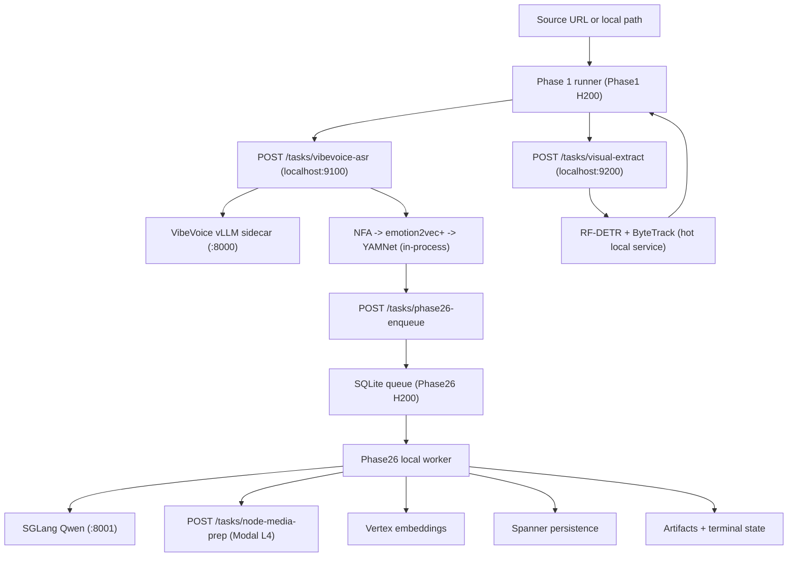

# ARCHITECTURE

**Status:** Active (implemented Phases 1-4, planned Phases 5-6)  
**Last updated:** 2026-04-17

This document describes the current code-backed topology: a **Phase 1 H200**, a **Phase26 H200**, and a **Modal L4 media-prep service**.

## 1) End-to-End Flow

## 2) Host Topology

| Surface | Runs |
| --- | --- |
| **Phase1 host (H200 default)** | Phase 1 runner, persistent local VibeVoice service, co-located VibeVoice vLLM, persistent local visual service, RF-DETR + ByteTrack settings preserved, in-process NFA + emotion2vec+ + YAMNet. |
| **Phase26 host (H200)** | `POST /tasks/phase26-enqueue`, local SQLite queue, current Phase 2-4 worker/runtime, SGLang Qwen on `:8001`, future Phase 5-6 orchestration. |
| **Modal L4** | `POST /tasks/node-media-prep`, bearer-auth protected, `min_containers=1`, ffmpeg NVDEC/NVENC smoke-checked at startup. Future `render-video` endpoint will live here too. |

### Design rationale

- Phase 1 stays cohesive on one host. The runner still owns orchestration, but the heavy model boundaries are now hot local services rather than in-process one-off initialization.
- RF-DETR remains fast because the existing visual config is preserved:
  - backend `tensorrt_fp16`
  - batch size `16`
  - threshold `0.35`
  - shape `640`
  - ByteTrack buffer `30`
  - ByteTrack match threshold `0.7`
  - GPU decode required
- NFA, emotion2vec+, and YAMNet stay in-process because they already benefit from long-lived provider singletons without requiring more RPC boundaries.
- Phase26 becomes the clean downstream execution boundary. The queue remains local to that host, but Phase 1 no longer reaches into SQLite directly.
- Node-media-prep moves to Modal because it is naturally stateless, and it sits after node creation on the Phase26 side of the boundary.

## 3) Phase 1 Architecture

### 3.1 Core behavior

- `run_phase1` still builds `Phase1JobRunner`.
- The factory now wires:
  - `RemoteVibeVoiceAsrClient` -> local Phase 1 VibeVoice service
  - `RemotePhase1VisualClient` -> local Phase 1 visual service
  - `RemotePhase26DispatchClient` -> remote Phase26 enqueue API
- NFA / emotion2vec+ / YAMNet remain provider singletons held in-process by the Phase 1 runtime factory.

### 3.2 Local Phase 1 services

- **VibeVoice service**
  - endpoint: `POST /tasks/vibevoice-asr`
  - health: `GET /health`
  - co-located with a VibeVoice vLLM sidecar
- **Visual service**
  - endpoint: `POST /tasks/visual-extract`
  - health: `GET /health`
  - owns hot RF-DETR + ByteTrack initialization

### 3.3 Execution semantics

- Audio and visual paths run concurrently.
- The audio-post chain launches immediately after the VibeVoice HTTP response returns.
- Phase 1 dispatches downstream through `POST /tasks/phase26-enqueue` when its Phase 1 handoff payload is ready.

## 4) Phase26 Architecture

### 4.1 Dispatch boundary

- The Phase26 host exposes `POST /tasks/phase26-enqueue`.
- That API writes to its own local SQLite queue.
- The Phase 1 host never owns or mounts the downstream queue file.

### 4.2 Current worker/runtime behavior

- The Phase26 host still runs the current Phase 2-4 business logic.
- `run_phase26_worker` is the host-level entrypoint.
- Under the hood, it still wraps the existing Phase 2-4 worker service until Phase 5-6 logic lands.

### 4.3 LLM and media boundaries

- Local generation is still OpenAI-compatible against SGLang Qwen at `127.0.0.1:8001`.
- Vertex embeddings remain unchanged.
- Node-media-prep is always remote via `RemoteNodeMediaPrepClient`, now pointed at Modal instead of an RTX host.

## 5) Modal Boundary

- `scripts/modal/node_media_prep_app.py` is the active serverless service surface for node-media-prep.
- GPU target: `L4`
- Warm capacity target: `min_containers=1`
- The app validates that ffmpeg exposes `h264_nvenc` and `h264_cuvid` before serving work.
- The JSON contract is intentionally unchanged so `RemoteNodeMediaPrepClient` does not need a new request/response shape.

Future:

- `scripts/modal/render_video_app.py` is the stub for eventual Phase 6 render/export.
- Phase 6 planning should stay on the Phase26 host; only final render/export should move remote.

## 6) Config Invariants

Phase 1 host must have:

- `CLYPT_PHASE1_VIBEVOICE_ASR_SERVICE_*`
- `CLYPT_PHASE1_VISUAL_SERVICE_*`
- `CLYPT_PHASE24_DISPATCH_*`

Phase26 host must have:

- `CLYPT_PHASE24_QUEUE_BACKEND=local_sqlite`
- `CLYPT_PHASE24_NODE_MEDIA_PREP_*`
- local SGLang / OpenAI-compatible generation settings

Phase 1 H100 fallback:

- `docs/runtime/known-good-phase1-h100-backup.env` is an overlay only
- it may change memory-sensitive VibeVoice knobs
- it must not change RF-DETR thresholds, tracker behavior, or semantic defaults

## 7) Implemented vs Planned

- **Implemented now**
  - Phase 1 H200 with local persistent VibeVoice + visual services
  - remote Phase26 enqueue boundary
  - local Phase26 queue + worker + SGLang
  - Modal node-media-prep surface
- **Planned later**
  - Phase 5 participation grounding on Phase26
  - Phase 6 render planning on Phase26
  - Modal final render/export endpoint
