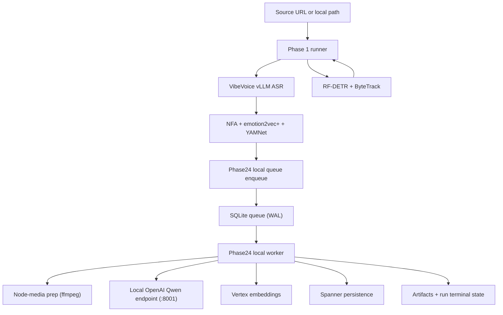

# ARCHITECTURE

**Status:** Active (implemented Phases 1-4, planned Phases 5-6)  
**Last updated:** 2026-04-17

This document describes the code-backed architecture currently in this
repository, plus the agreed target host topology that the RTX 6000 Ada
refactor is moving us toward. See
[`docs/deployment/REFACTOR_RTX6000ADA.md`](deployment/REFACTOR_RTX6000ADA.md)
for the full refactor plan.

## 1) End-to-End Flow (Current Code)

## 2) Host Topology

### 2.1 Current code (single host)

- `run_phase1_sidecars()` runs the visual chain and the audio chain in the
  same process via `ThreadPoolExecutor`.
- `Phase24WorkerService` runs `node_media_preparer=None`, falling back to
  in-process ffmpeg + GCS upload on the Phase 2-4 worker host.
- In the DO H200 deploy, that single host ends up doing VibeVoice vLLM +
  RF-DETR + SGLang Qwen + Phase 2-4 worker + node-clip ffmpeg all on one
  box.

### 2.2 Target topology (RTX 6000 Ada refactor, in progress)

Two single-GPU DigitalOcean droplets:

| Host                                    | Runs                                                                                                                              |
| --------------------------------------- | --------------------------------------------------------------------------------------------------------------------------------- |
| **Phase 1 audio host — RTX 6000 Ada**   | VibeVoice vLLM ASR, NeMo Forced Aligner, emotion2vec+, YAMNet (CPU), NVENC/NVDEC ffmpeg for node-media prep                        |
| **Phase 1 visual + Phase 2-4 host — H200** | RF-DETR + ByteTrack (TensorRT FP16), SGLang Qwen3.6-35B-A3B (`:8001`), Phase 2-4 local SQLite queue + local worker, Spanner/GCS I/O |

Design rationale:

- RTX 6000 Ada has 48 GB VRAM, which lets VibeVoice run native dtype (no
  bf16 audio-encoder patch).
- H200 NVENC is not usable for our ffmpeg clip-extraction path; RTX 6000
  Ada provides a working NVENC/NVDEC pipeline.
- Moving VibeVoice + node-media prep off H200 frees headroom for RF-DETR,
  SGLang, and Phase 2-4 LLM concurrency.

Refactor status and migration plan:
[`docs/deployment/REFACTOR_RTX6000ADA.md`](deployment/REFACTOR_RTX6000ADA.md).

## 3) Phase 1 Architecture (Implemented)

### 3.1 Core behavior

- `run_phase1` builds `Phase1JobRunner` through `build_default_phase1_job_runner()`.
- Input mode is `test_bank` only (enforced).
- Phase 1 ASR path uses local `VibeVoiceVLLMProvider`
  (`CLYPT_PHASE1_ASR_BACKEND=vllm`; only supported option today).
- `VIBEVOICE_BACKEND` is also `vllm` only on mainline.
- Phase 1 has **two sub-chains that currently run in one process**:
  - **Audio chain** (VibeVoice vLLM ASR → NeMo forced aligner → emotion2vec+ → YAMNet (CPU)).
    In the target topology this whole chain moves to the RTX 6000 Ada host.
  - **Visual chain** (RF-DETR + ByteTrack). This stays on the H200.
- The audio chain begins immediately after ASR returns, not after RF-DETR
  finishes.

### 3.2 Phase24 handoff

- When `--run-phase14` is enabled, handoff is pushed through
  `Phase24LocalDispatcherClient`.
- Queue rows are stored in local SQLite with unique `run_id`.
- Handoff can start while visual work is still running (the audio-chain
  completion callback fires immediately; no RF-DETR dependency).

## 4) Phase 2-4 Architecture (Implemented)

### 4.1 Worker runtime boundary

- `run_phase24_local_worker` is the canonical local worker.
- Queue backend must be `local_sqlite`.
- Worker loads `Phase24WorkerService` from `phase24_worker_app`.

### 4.2 LLM and embedding boundaries

- Generation path in local worker is hard-gated to
  `GENAI_GENERATION_BACKEND=local_openai`.
- LLM client is `LocalOpenAIQwenClient` (OpenAI-compatible chat completions).
- Embeddings remain Vertex-backed.
- Node-media prep today runs in-process on the Phase 2-4 worker host
  (ffmpeg + GCS upload). In the target topology it moves off-host to the
  RTX 6000 Ada NVENC service — the `node_media_preparer` pluggable hook on
  `Phase24WorkerService` is already in place for this swap.

### 4.3 Execution overlap

- Phase 2 merge/classify and boundary reconciliation use separate
  concurrency caps.
- After raw nodes exist, semantic text embeddings and node-media prep are
  launched in parallel.
- Multimodal embeddings begin as soon as media URIs arrive.
- Phase 3 local-edge work can start from raw nodes before the rest of
  Phase 2 fully finishes.
- Phase 3 local-edge and long-range lanes run concurrently, each with its
  own concurrency cap.

### 4.4 Structured output policy

- Response format always uses strict JSON schema.
- Object schemas are normalized to `additionalProperties=false`.
- Client performs post-parse schema subset checks.
- Non-thinking request mode is forced for structured output calls.

## 5) Queue and Failure Semantics (Implemented)

### 5.1 Lease management

- Queue supports expired lease reclaim, but defaults disable reclaim.
- Worker defaults:
  - `reclaim_expired_leases = false`
  - `fail_fast_on_stale_running = true`

### 5.2 Failure classification

- Fail-fast class includes signatures such as:
  - `connection refused`
  - `xgrammar`
  - `compile_json_schema`
  - `enginecore`
- Transient class includes retryable HTTP transport errors.
- Validation/schema/type failures are non-transient.

### 5.3 Operational implication

- Crash scenarios are intentionally surfaced quickly.
- Manual intervention is expected for stale-running lease cleanup under
  fail-fast defaults.

## 6) Persistence Boundaries

- **Local artifacts:** `backend/outputs/v3_1/<run_id>/...`
- **Local queue:** `backend/outputs/phase24_local_queue.sqlite` (default)
- **System of record:** Spanner for runs, phase metrics, graph/candidate entities
- **Object storage:** GCS for source/handoff assets

## 7) Implemented vs Planned

- **Implemented:** Phase 1-4 pipeline execution and persistence, local
  phase24 queue runtime, strict structured-output validation path.
- **In progress:** Phase 1 audio-chain + node-media-prep split onto the
  RTX 6000 Ada host (see `docs/deployment/REFACTOR_RTX6000ADA.md`).
- **Planned:** Phase 5 participation grounding, Phase 6 render planning/output.

## 8) Architectural Invariants

1. Phase 1 output is mandatory upstream input for Phase 2-4.
2. Phase 1 splits into two sub-chains by design: an **audio chain**
   (VibeVoice vLLM → NFA → emotion2vec+ → YAMNet CPU) and a **visual
   chain** (RF-DETR + ByteTrack). The audio chain does not block on the
   visual chain.
3. Phase 1 audio chain runs on a CUDA-capable host with working NVENC/NVDEC
   (today: colocated with Phase 2-4 on H200; target: RTX 6000 Ada).
4. Phase 1 visual chain runs on the H200 via the TensorRT FP16 fast path.
5. Node-media prep requires working NVENC on whatever host runs it.
6. Local phase24 worker requires local OpenAI generation backend.
7. Queue backend for local runtime is SQLite only.
8. Fail-fast behavior on stale leases/crash signatures is intentional and
   currently default.

## 9) Related Docs

- Runtime operations: `docs/runtime/RUNTIME_GUIDE.md`
- Deployment runbook: `docs/deployment/P1_DEPLOY.md`
- RTX 6000 Ada split refactor plan: `docs/deployment/REFACTOR_RTX6000ADA.md`
- Active specs: `docs/specs/SPEC_INDEX.md`
- Incident history: `docs/ERROR_LOG.md`
