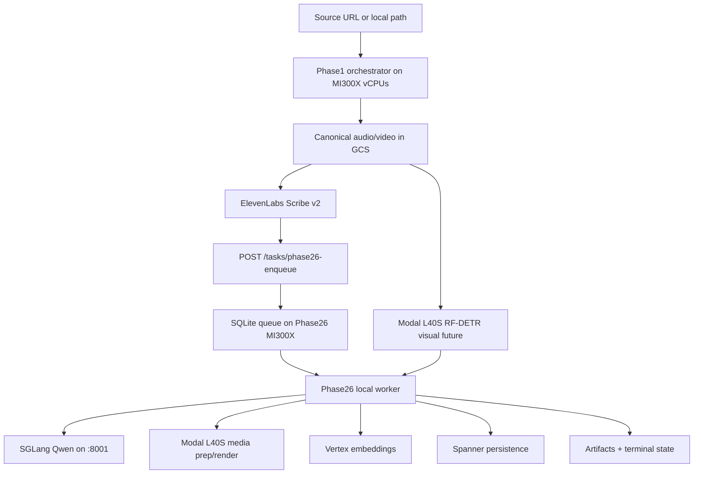

# ARCHITECTURE

**Status:** Active Scribe/Modal + Phase26 MI300X topology
**Last updated:** 2026-05-04

This document describes the current `AMD-refactor` topology: Phase1 orchestration colocated on the DigitalOcean MI300X host's vCPUs, Phase26/Qwen on the same MI300X GPU host, and two persistent Modal L40S GPU workers.

## 1) End-to-End Flow

Phase26 starts as soon as Scribe audio artifacts are adapted. It does not wait for RF-DETR before Phase2-4, but it must join and fail hard on the visual future before Phase5/frontend grounding or any Phase6 visual use.

## 2) Surfaces

| Surface | Runs |
| --- | --- |
| **Phase1 orchestrator** | Runs on the MI300X host's vCPUs. Test-bank ingress, canonical media upload, signed HTTPS GCS URL creation, synchronous ElevenLabs Scribe v2 call, Modal visual future submission, and Phase26 dispatch. No local GPU service. |
| **Modal visual L40S** | `POST /tasks/visual-extract` submit/poll API plus one warm `visual_extract_job` using CUDA/NVDEC decode, TensorRT FP16 RF-DETR, and ByteTrack. |
| **Phase26 MI300X** | `POST /tasks/phase26-enqueue`, local SQLite queue, Phase2-4 worker/runtime, SGLang ROCm Qwen on `127.0.0.1:8001`, future Phase5-6 orchestration boundary. |
| **Modal media L40S** | `POST /tasks/node-media-prep` and `POST /tasks/render-video` submit/poll APIs, both backed by one warm `media_gpu_job` worker. |

## 3) Phase1

Phase1 is orchestration-only and colocated with Phase26:

- resolves test-bank source URLs or accepts local source paths
- prepares canonical audio/video artifacts and uploads them to GCS
- signs the audio GCS object as an HTTPS URL for Scribe v2
- submits the source video GCS URI to Modal visual extraction
- adapts Scribe words, speakers, and audio-event tags into the canonical Phase1 handoff payload
- enqueues Phase26 immediately after audio adaptation

There is no VibeVoice, local NFA, emotion2vec+, YAMNet, local RF-DETR, local vLLM, local SGLang, VAAPI, or ROCm requirement on Phase1.

## 4) Visual

The active visual fast path is Modal L40S only:

- Phase1 orchestrator route: `CLYPT_PHASE1_VISUAL_BACKEND=modal_rfdetr`
- `CLYPT_PHASE1_VISUAL_MODEL=nano`
- `CLYPT_PHASE1_VISUAL_BATCH_SIZE=16`
- `CLYPT_PHASE1_VISUAL_THRESHOLD=0.85`
- `CLYPT_PHASE1_VISUAL_SHAPE=640`
- `CLYPT_PHASE1_VISUAL_GPU_DECODE_BACKEND=nvdec`
- sampled YOLO11s-pose TensorRT validation marks `auto_follow_eligible` tracklets and stores source-space pose anchors for Phase5-less render auto-follow
- Phase5-less render auto-follow locks one pose-qualified subject tracklet per shot and emits a smooth `tracklet_follow_9x16_smooth_inside_person` crop path rather than caption-segment crop jumps
- Modal worker detector route: `CLYPT_MODAL_VISUAL_BACKEND=tensorrt`; the worker sets internal `CLYPT_PHASE1_VISUAL_BACKEND=tensorrt_fp16`.
- ByteTrack buffer `30`
- ByteTrack match threshold `0.7`

The worker fails hard if CUDA ffmpeg hwaccel, `scale_cuda`, TensorRT, `trtexec`, CUDA PyTorch, or RF-DETR dependencies are unavailable. There is no software decode, CPU detector, VAAPI, or PyTorch ROCm fallback path.

### Current Render Quality Caveat

The Phase5-less auto-follow render path is implemented but **not accepted as production-quality**. The latest Modal render replay proved that the technical crop/render contract runs end-to-end and emits valid `1080x1920` MP4s, but the clips still looked terrible in review: crop movement was not smooth enough and subject tracking/selection was visibly wrong in places. Treat `tracklet_follow_9x16_smooth_inside_person` as an experimental fallback for Phase5-less demos only. The production path still needs a tracking/crop-quality pass before it can replace manual Phase5 grounding.

## 5) Phase26

Phase26 owns the downstream queue and graph pipeline:

- local SQLite queue with `CLYPT_PHASE24_QUEUE_BACKEND=local_sqlite`
- worker entrypoint: `python -m backend.runtime.run_phase26_worker`
- local generation through SGLang ROCm Qwen at `http://127.0.0.1:8001/v1`
- `GENAI_GENERATION_BACKEND=local_openai`
- Vertex-backed embeddings
- Modal-backed media prep/render
- Spanner persistence

The worker may process Phase2-4 while the visual future is pending. Pending visual payloads require a configured Modal visual client and malformed or failed visual results fail hard.

## 6) Removed Paths

The atomic refactor deletes, rather than keeps, the old active runtime families:

- H200 Phase1/Phase26 env baselines and deploy scripts
- Phase1 MI300X/VibeVoice env baselines and deploy scripts
- local VibeVoice service and vLLM Docker images
- local NFA, emotion2vec+, YAMNet, and speaker-verification providers
- local Phase1 visual FastAPI service
- PyTorch ROCm/VAAPI RF-DETR path
- VibeVoice transcript output references

Historical incidents remain in [ERROR_LOG.md](/Users/rithvik/Clypt-Backend/docs/ERROR_LOG.md) because they are useful debugging context, but they are not current operator entrypoints.
