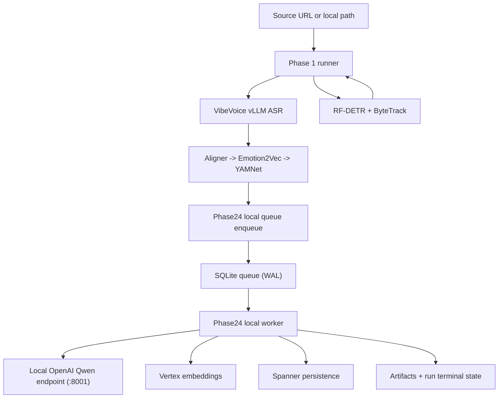

# ARCHITECTURE

**Status:** Active (implemented Phases 1-4, planned Phases 5-6)  
**Last updated:** 2026-04-17

This document describes the code-backed architecture currently in this repository.

## 1) End-to-End Flow (Current)

## 2) Phase 1 Architecture (Implemented)

### 2.1 Core behavior

- `run_phase1` builds `Phase1JobRunner` through `build_default_phase1_job_runner()`.
- Input mode is `test_bank` only (enforced).
- Phase 1 ASR path uses local `VibeVoiceVLLMProvider` (`CLYPT_PHASE1_ASR_BACKEND=vllm`; only supported option today).
- `VIBEVOICE_BACKEND` is also `vllm` only on mainline.
- Visual branch and ASR branch run concurrently.
- Audio sidecar chain begins right after ASR returns.

### 2.2 Phase24 handoff

- When `--run-phase14` is enabled, handoff is pushed through `Phase24LocalDispatcherClient`.
- Queue rows are stored in local SQLite with unique `run_id`.
- Handoff can start while visual work is still running.

## 3) Phase 2-4 Architecture (Implemented)

### 3.1 Worker runtime boundary

- `run_phase24_local_worker` is the canonical local worker.
- Queue backend must be `local_sqlite`.
- Worker loads `Phase24WorkerService` from `phase24_worker_app`.

### 3.2 LLM and embedding boundaries

- Generation path in local worker is hard-gated to `GENAI_GENERATION_BACKEND=local_openai`.
- LLM client is `LocalOpenAIQwenClient` (OpenAI-compatible chat completions).
- Embeddings remain Vertex-backed.
- Node-media prep runs in-process on the Phase 2-4 worker host (ffmpeg + GCS upload); no remote offload.

### 3.3 Execution overlap

- Phase 2 merge/classify and boundary reconciliation use separate concurrency caps.
- After raw nodes exist, semantic text embeddings and node-media prep are launched in parallel.
- Multimodal embeddings begin as soon as media URIs arrive.
- Phase 3 local-edge work can start from raw nodes before the rest of Phase 2 fully finishes.
- Phase 3 local-edge and long-range lanes run concurrently, each with its own concurrency cap.

### 3.4 Structured output policy

- Response format always uses strict JSON schema.
- Object schemas are normalized to `additionalProperties=false`.
- Client performs post-parse schema subset checks.
- Non-thinking request mode is forced for structured output calls.

## 4) Queue and Failure Semantics (Implemented)

### 4.1 Lease management

- Queue supports expired lease reclaim, but defaults disable reclaim.
- Worker defaults:
  - `reclaim_expired_leases = false`
  - `fail_fast_on_stale_running = true`

### 4.2 Failure classification

- Fail-fast class includes signatures such as:
  - `connection refused`
  - `xgrammar`
  - `compile_json_schema`
  - `enginecore`
- Transient class includes retryable HTTP transport errors.
- Validation/schema/type failures are non-transient.

### 4.3 Operational implication

- Crash scenarios are intentionally surfaced quickly.
- Manual intervention is expected for stale-running lease cleanup under fail-fast defaults.

## 5) Persistence Boundaries

- **Local artifacts:** `backend/outputs/v3_1/<run_id>/...`
- **Local queue:** `backend/outputs/phase24_local_queue.sqlite` (default)
- **System of record:** Spanner for runs, phase metrics, graph/candidate entities
- **Object storage:** GCS for source/handoff assets

## 6) Implemented vs Planned

- **Implemented:** Phase 1-4 pipeline execution and persistence, local phase24 queue runtime, strict structured-output validation path.
- **Planned:** Phase 5 participation grounding, Phase 6 render planning/output.

## 7) Architectural Invariants

1. Phase 1 output is mandatory upstream input for Phase 2-4.
2. Phase 1 ASR runs locally on the Phase 1 GPU host (VibeVoice vLLM).
3. Local phase24 worker requires local OpenAI generation backend.
4. Queue backend for local runtime is SQLite only.
5. Fail-fast behavior on stale leases/crash signatures is intentional and currently default.

## 8) Related Docs

- Runtime operations: `docs/runtime/RUNTIME_GUIDE.md`
- Deployment runbook: `docs/deployment/P1_DEPLOY.md`
- Active specs: `docs/specs/SPEC_INDEX.md`
- Incident history: `docs/ERROR_LOG.md`
