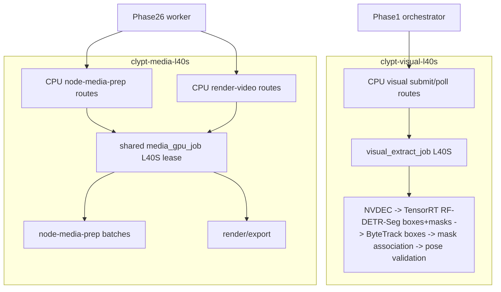

# Modal GPU Worker Deploy

Deploy the Modal L40S services used by the Scribe/Modal topology.

There are two GPU pools:

- **Visual pool:** dedicated RF-DETR-Seg Nano worker.
- **Media pool:** one shared worker for node-media-prep and render/export.



## 1) Visual RF-DETR-Seg App

Source:

- [scripts/modal/visual_extract_app.py](/Users/rithvik/Clypt-Backend/scripts/modal/visual_extract_app.py)
- deps: [requirements-modal-visual-l40s.txt](/Users/rithvik/Clypt-Backend/requirements-modal-visual-l40s.txt)

Deploy:

```bash
modal deploy scripts/modal/visual_extract_app.py
```

The Modal image is pinned to Python `3.12`. Keep that pin unless the CUDA
PyTorch/TensorRT wheels in `requirements-modal-visual-l40s.txt` have been
validated on a newer Python runtime.

Required secret/env:

- `GCS_BUCKET`
- `VISUAL_EXTRACT_AUTH_TOKEN` or `CLYPT_PHASE1_VISUAL_SERVICE_AUTH_TOKEN`
- `GOOGLE_APPLICATION_CREDENTIALS_JSON`

Public contract:

- `GET /health`
- `POST /tasks/visual-extract` -> `202 Accepted` with `call_id`
- `GET /tasks/visual-extract/result/{call_id}` -> `202 pending` or `200` final result

The GPU function is `visual_extract_job` with:

- `gpu="L40S"`
- `min_containers=1`
- `max_containers=1`

Required fast-path capabilities:

- CUDA ffmpeg hwaccel
- `scale_cuda`
- TensorRT Python runtime
- `trtexec`
- CUDA PyTorch
- RF-DETR-Seg Nano export/inference with a usable mask output binding

The worker fails hard if any of these are missing. It must not fall back to software decode, CPU RF-DETR, or detection-only RF-DETR. Masks are persisted as `rle_row_major_v1` artifacts for future caption negative-space work; current Phase6 crop/caption code does not consume them.

## 2) Shared Media App

Source:

- [scripts/modal/media_worker_app.py](/Users/rithvik/Clypt-Backend/scripts/modal/media_worker_app.py)
- compatibility shims:
  - [scripts/modal/node_media_prep_app.py](/Users/rithvik/Clypt-Backend/scripts/modal/node_media_prep_app.py)
  - [scripts/modal/render_video_app.py](/Users/rithvik/Clypt-Backend/scripts/modal/render_video_app.py)

Deploy:

```bash
modal deploy scripts/modal/media_worker_app.py
```

The Modal image is pinned to Python `3.12` for parity with the visual app and
to avoid accidental wheel drift from Modal's default Python runtime.

Required secret/env:

- `GCS_BUCKET`
- `NODE_MEDIA_PREP_AUTH_TOKEN` or `CLYPT_PHASE24_NODE_MEDIA_PREP_TOKEN`
- `PHASE6_RENDER_AUTH_TOKEN` or `CLYPT_PHASE24_PHASE6_RENDER_TOKEN`
- `GOOGLE_APPLICATION_CREDENTIALS_JSON`

Public contract:

- `GET /health`
- `POST /tasks/node-media-prep` -> `202 Accepted` with `call_id`
- `GET /tasks/node-media-prep/result/{call_id}` -> `202 pending` or `200` final result
- `POST /tasks/render-video` -> `202 Accepted` with `call_id`
- `GET /tasks/render-video/result/{call_id}` -> `202 pending` or `200` final result

The only media GPU function is `media_gpu_job` with:

- `gpu="L40S"`
- `min_containers=1`
- `max_containers=1`

Do not deploy separate warm GPU pools for `node_media_prep_job` and `render_video_job`; those names are compatibility shims only.

## 3) Phase26 Env

Set Phase26 to the deployed endpoints:

- `CLYPT_PHASE24_NODE_MEDIA_PREP_URL`
- `CLYPT_PHASE24_NODE_MEDIA_PREP_TOKEN`
- `CLYPT_PHASE24_PHASE6_RENDER_URL`
- `CLYPT_PHASE24_PHASE6_RENDER_TOKEN`
- `CLYPT_PHASE1_VISUAL_SERVICE_URL`
- `CLYPT_PHASE1_VISUAL_SERVICE_AUTH_TOKEN`

The URL may be either the Modal app base URL or the full task endpoint URL. The clients normalize both forms and must not append duplicate `/tasks/...` suffixes.

## 4) Smoke Checks

```bash
modal app list
modal logs clypt-visual-l40s
modal logs clypt-media-l40s
```

Submit smoke requests with bearer auth and confirm each returns a `call_id` immediately, then poll the corresponding result endpoint.

`GOOGLE_APPLICATION_CREDENTIALS_JSON` should be a real service-account JSON key blob. Avoid token-only `authorized_user` ADC documents for production deploys.

Current known-good deployed endpoints:

- `https://rithuuu--clypt-visual-l40s-visual-extract.modal.run/tasks/visual-extract`
- `https://rithuuu--clypt-media-l40s-media-worker.modal.run/tasks/node-media-prep`
- `https://rithuuu--clypt-media-l40s-media-worker.modal.run/tasks/render-video`

For ad hoc live tests, stop the persistent apps when warm GPUs should not remain allocated:

```bash
modal app stop clypt-visual-l40s --yes
modal app stop clypt-media-l40s --yes
```

Stopping the apps is an operator cost-control action; it does not remove the checked-in deploy definitions. Redeploy with the commands above when the next live test begins.
