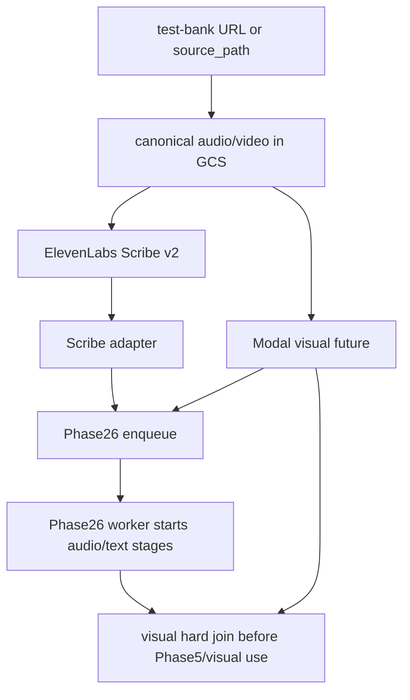

# Phase1 Orchestrator Deploy

**Status:** Active Scribe/Modal topology. Phase1 is deployed on the Phase26 MI300X droplet's vCPUs. The old separate Phase1 MI300X/VibeVoice deploy is superseded on `AMD-refactor`.

Phase1 now owns orchestration only and runs beside the Phase26 services:

- test-bank media ingress
- canonical audio/video upload to GCS
- signed HTTPS GCS audio URL generation for ElevenLabs Scribe v2
- Modal RF-DETR-Seg visual future submission
- Phase26 dispatch after Scribe audio adaptation

Phase1 must not start or require local VibeVoice, VibeVoice vLLM, NFA, emotion2vec+, YAMNet, local RF-DETR, ROCm, VAAPI, TensorRT, or any GPU service. The `Phase26` host/project name is retained because the same droplet still owns the downstream queue, Qwen GPU service, and Phase 5-6 boundary.

## 1) Dependencies

```bash
python3 -m venv .venv
source .venv/bin/activate
python -m pip install -r requirements-phase1-orchestrator.txt
```

Production deploys install this into the shared `/opt/clypt-phase26/venvs/phase26` venv through [deploy_phase26_mi300x_services.sh](/Users/rithvik/Clypt-Backend/scripts/do_phase26/deploy_phase26_mi300x_services.sh).

The old Phase1 H200/MI300X dependency files, `scripts/do_phase1/`, local visual service, and VibeVoice Docker files are deleted on this branch. Do not recreate them as compatibility shims.

## 2) Required Env

Set these in `/etc/clypt-phase26/phase26.env` using [known-good-phase26-mi300x.env](/Users/rithvik/Clypt-Backend/docs/runtime/known-good-phase26-mi300x.env) as the baseline:

- `GOOGLE_CLOUD_PROJECT`
- `GCS_BUCKET` or `CLYPT_GCS_BUCKET`
- `GOOGLE_APPLICATION_CREDENTIALS` pointing at a signing-capable service-account JSON key
- `ELEVENLABS_API_KEY`
- `CLYPT_PHASE1_AUDIO_BACKEND=elevenlabs_scribe_v2`
- `CLYPT_PHASE1_INPUT_MODE=test_bank`
- `CLYPT_PHASE1_TEST_BANK_PATH`
- `CLYPT_PHASE1_VISUAL_SERVICE_URL`
- `CLYPT_PHASE1_VISUAL_SERVICE_AUTH_TOKEN`
- `CLYPT_PHASE24_DISPATCH_URL=http://127.0.0.1:9300`
- `CLYPT_PHASE24_DISPATCH_AUTH_TOKEN`
- `CLYPT_YOUTUBE_DATA_API_KEY` or `YOUTUBE_API_KEY` when using public YouTube `source_url` metadata ingress

If the YouTube key is server/IP restricted, its allowed caller IPs must include
the current MI300X droplet public IPv4 before `source_url` ingestion will work.

Scribe defaults are intentionally sparse:

- `CLYPT_PHASE1_SCRIBE_MODEL_ID=scribe_v2`
- `CLYPT_PHASE1_SCRIBE_LANGUAGE_CODE=en`
- `CLYPT_PHASE1_SCRIBE_URL_FIELD=source_url`
- omit `CLYPT_PHASE1_SCRIBE_NUM_SPEAKERS` unless the frontend supplies a value later
- omit `CLYPT_PHASE1_SCRIBE_KEYTERMS` unless the frontend supplies values later

Do not copy user ADC (`authorized_user`) credentials onto the host. Signed GCS URLs require signing-capable service-account credentials.

## 3) Services

Phase1 is managed by systemd on the MI300X host:

- `clypt-phase1-api.service`
- `clypt-phase1-worker.service`

The API listens on `127.0.0.1:8080`/`0.0.0.0:8080` depending on the unit and stores jobs in `/var/lib/clypt/phase1/jobs.db`.

## 4) Run

```bash
python -m backend.runtime.run_phase1 \
  --job-id "run_$(date +%Y%m%d_%H%M%S)" \
  --source-path /path/to/video.mp4 \
  --run-phase14
```

For `source_url`, configure the test-bank mapping and use a mapped YouTube URL.

## 5) Health Checks

Phase1 health is mostly dependency health:

- Local API: `curl -sf http://127.0.0.1:8080/health`
- Scribe: `ELEVENLABS_API_KEY` present, synchronous Scribe request succeeds in smoke test.
- GCS: upload + signed URL generation succeeds.
- Modal visual: `GET /health` succeeds and `POST /tasks/visual-extract` returns `202` with `call_id`.
- Phase26 dispatch: `GET http://127.0.0.1:9300/health` succeeds and enqueue returns a local queue task.

## 6) Handoff Invariant

Phase1 must enqueue Phase26 as soon as Scribe audio artifacts are adapted. The enqueue payload must include:

- `phase1_visual_status="pending"`
- `visual_call_id`
- `visual_future`
- source video GCS metadata

Phase26 may run Phase2-4 before RF-DETR-Seg is complete, but must join/fail-hard on the visual future before Phase5/frontend grounding or Phase6 visual use.


