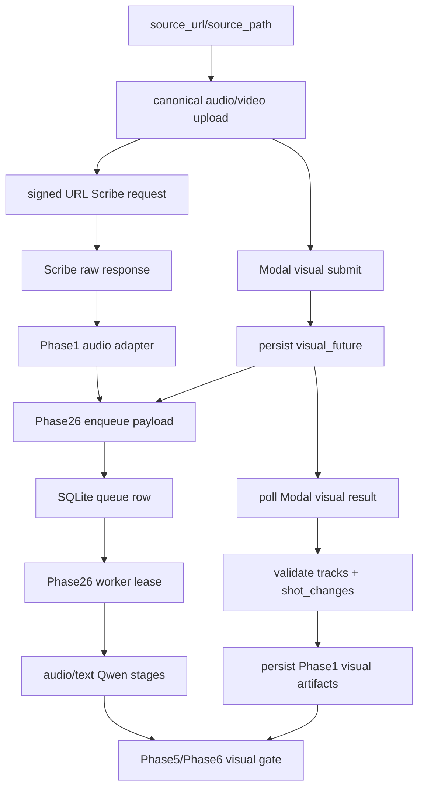
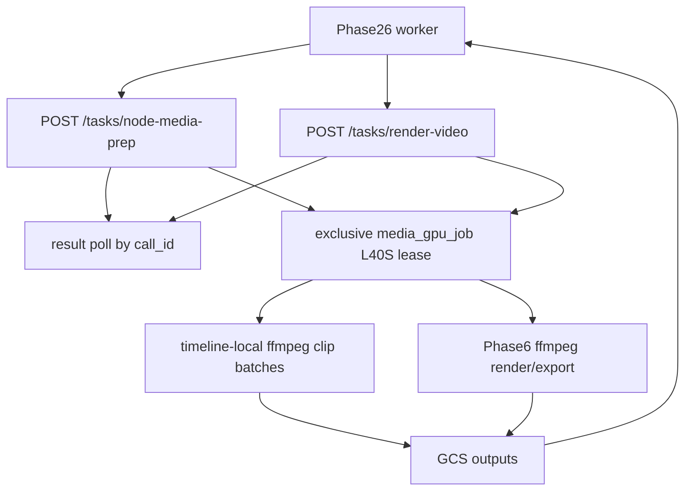

# RUNTIME GUIDE

**Status:** Active  
**Last updated:** 2026-05-07

This is the runtime source of truth for the current AMD-refactor state.

## 1) Runtime Topology

The active topology is:

- **Phase1 orchestrator on MI300X host vCPUs**
  - `python -m backend.runtime.run_phase1`
  - test-bank media ingestion and canonical audio preparation
  - signed HTTPS GCS URL generation for ElevenLabs Scribe v2
  - Modal RF-DETR-Seg visual future submit
  - immediate Phase26 dispatch after Scribe audio adaptation
- **ElevenLabs Scribe v2**
  - synchronous `POST /v1/speech-to-text`
  - canonical ASR, diarization, word timings, and coarse audio tags
- **Modal visual L40S**
  - `POST /tasks/visual-extract`
  - one warm `L40S` `visual_extract_job`
  - TensorRT FP16 RF-DETR-Seg Nano boxes+masks + NVIDIA GPU decode/resize + ByteTrack
- **Phase26 host (same MI300X droplet)**
  - `POST /tasks/phase26-enqueue`
  - local SQLite queue + local worker
  - SGLang Qwen on `:8001`
  - Phase2-4 now, Phase5-6 boundary next
- **Modal media L40S**
  - `POST /tasks/node-media-prep`
  - `POST /tasks/render-video`
  - one shared warm `L40S` `media_gpu_job`

There is **no local fallback** for Scribe, Modal visual, Modal media, Phase26 dispatch, or SGLang Qwen.

## 2) Phase1 Behavior

Phase1 is colocated with Phase26 on the MI300X droplet's vCPUs and no longer runs VibeVoice, VibeVoice vLLM, NFA, emotion2vec+, YAMNet, local RF-DETR, or any local GPU service on this branch.

Required Phase1 env:

- `GOOGLE_CLOUD_PROJECT`
- `GCS_BUCKET` or `CLYPT_GCS_BUCKET`
- `ELEVENLABS_API_KEY`
- `CLYPT_PHASE1_AUDIO_BACKEND=elevenlabs_scribe_v2`
- `CLYPT_PHASE1_INPUT_MODE=test_bank`
- `CLYPT_PHASE1_TEST_BANK_PATH`
- `CLYPT_PHASE1_VISUAL_SERVICE_URL`
- `CLYPT_PHASE1_VISUAL_SERVICE_AUTH_TOKEN`
- `CLYPT_PHASE24_DISPATCH_URL`
- `CLYPT_PHASE24_DISPATCH_AUTH_TOKEN`
- `CLYPT_YOUTUBE_DATA_API_KEY` or `YOUTUBE_API_KEY` for public YouTube metadata ingress when using `source_url`

Scribe defaults:

- model: `scribe_v2`
- URL mode: signed HTTPS GCS URL through `source_url`
- language: `en`
- diarization: enabled
- audio-event tags: enabled
- timestamp granularity: `word`
- temperature: `0`
- `num_speakers`: omitted by default
- `keyterms`: omitted by default
- entity detection/redaction: disabled

Execution invariant:

1. Phase1 prepares/uploads canonical audio and source video.
2. Phase1 submits Modal RF-DETR-Seg and receives a `visual_future`.
3. Phase1 calls Scribe synchronously.
4. Phase1 adapts Scribe into `diarization_payload`, empty `emotion2vec_payload`, and Scribe-backed `yamnet_payload`.
5. Phase1 enqueues Phase26 immediately with `phase1_visual_status="pending"` and `visual_future`.
6. Phase26 runs Phase2-4 without waiting for RF-DETR.
7. Phase26 joins/fails-hard on `visual_future` before Phase5/frontend grounding or Phase6 visual use.

Runtime event graph:



## 3) Modal Visual Fast Path

Current visual settings are preserved unless explicitly retuned:

- Phase1 orchestrator route: `CLYPT_PHASE1_VISUAL_BACKEND=modal_rfdetr`
- `CLYPT_PHASE1_VISUAL_MODEL=seg_nano`
- `CLYPT_PHASE1_VISUAL_BATCH_SIZE=16`
- `CLYPT_PHASE1_VISUAL_THRESHOLD=0.85`
- `CLYPT_PHASE1_VISUAL_SHAPE=648`
- `CLYPT_PHASE1_VISUAL_TRACKER=bytetrack`
- `CLYPT_PHASE1_VISUAL_TRACKER_BUFFER=30`
- `CLYPT_PHASE1_VISUAL_TRACKER_MATCH_THRESH=0.7`
- `CLYPT_PHASE1_VISUAL_DECODE=gpu`
- `CLYPT_PHASE1_VISUAL_GPU_DECODE_BACKEND=nvdec`
- `CLYPT_PHASE1_VISUAL_POSE_VALIDATION=1`
- `CLYPT_PHASE1_VISUAL_POSE_MODEL_PATH=yolo11s-pose.pt`
- `CLYPT_PHASE1_VISUAL_POSE_MIN_RFDETR_CONFIDENCE=0.85`
- `CLYPT_PHASE1_VISUAL_POSE_MIN_HEAD_EVIDENCE_RATIO=0.40`
- `CLYPT_PHASE1_VISUAL_POSE_MIN_UPPER_BODY_ANCHOR_RATIO=0.25`
- Modal worker detector route: `CLYPT_MODAL_VISUAL_BACKEND=tensorrt`; the worker sets internal `CLYPT_PHASE1_VISUAL_BACKEND=tensorrt_fp16` before constructing the RF-DETR pipeline.

Operationally:

```text
NVDEC/CUDA decode+resize -> hwdownload -> TensorRT FP16 RF-DETR-Seg Nano boxes+masks
-> ByteTrack on boxes -> same-frame mask association -> sampled YOLO11s-pose
TensorRT subject validation for auto-follow eligibility
```

Visual worker component graph:


The worker fails hard if CUDA ffmpeg support, `scale_cuda`, TensorRT, `trtexec`, CUDA PyTorch, RF-DETR-Seg, a usable segmentation mask output binding, or YOLO11s-pose validation are unavailable. It must not fall back to software decode, CPU RF-DETR, or detection-only RF-DETR models.

Benchmark or E2E timing runs must not include first-run engine setup. Before a measured run, submit a person-containing visual warmup through the same Modal visual endpoint and wait for the result endpoint to return success. The warmup must exercise both RF-DETR-Seg and YOLO11s-pose so the RF-DETR-Seg TensorRT engine, YOLO pose TensorRT engine, model weights, CUDA context, and ffmpeg/NVDEC path are already hot. A blank synthetic clip can validate the service surface but is not a valid timing warmup because it may skip pose validation.

RF-DETR-Seg masks are retained once per visual job in a compressed low-resolution `.npz` sidecar artifact. `raw_person_detections`, `tracks`, `person_detections[].timestamped_objects`, and downstream `TrackletGeometryPoint` records carry lightweight `mask_ref` pointers using `lowres_mask_ref_v1`. The active path must not resize every instance mask to source-frame dimensions or inline full-frame `mask_rle` blobs in JSON. ByteTrack stays strictly box-based; mask refs are associated back to tracked rows by same-frame box IoU after identity assignment.

The active TensorRT RF-DETR-Seg path does **not** apply an extra hard box-IoU NMS after thresholding and `person` filtering. It should stay close to RF-DETR upstream semantics: decode logits to per-query scores/labels, threshold, filter to `person`, retain the surviving queries and masks, then hand those detections to ByteTrack.

The worker also keeps the poll/result transport lightweight. It uploads the full validated `phase1_visual` payload as `phase14/<run_id>/visual/phase1_visual.json.gz` and returns only pointer metadata (`phase1_visual_gcs_uri`, `phase1_visual_encoding=json_gzip_v1`) from the HTTP result surface. The colocated host-side `RemoteVisualExtractClient` downloads and inflates that artifact before Phase26 consumes the joined visual result. Large inline visual JSON must not cross the submit/poll surface.

The reason to keep masks in the payload now is future render intelligence: person-aware caption placement, motion graphics/overlays that fit inside the actual short/reel frame, and better crop/negative-space decisions. Current Phase6 crop selection and caption placement do not consume masks yet.

YOLO pose validation does not delete raw RF-DETR/ByteTrack rows. It annotates tracklets with `auto_follow_eligible`, `subject_quality`, and sampled source-space pose anchors; Phase5-less render auto-follow skips pose-ineligible tracklets so high-confidence headless body fragments are not selected as crop targets. The pose anchor coordinates must survive into Phase6 render planning.

Phase5-less render auto-follow is shot-locked: manual/frontend `primary_tracklet_id` wins when present; otherwise the render compiler picks one pose-qualified subject tracklet per shot and every render segment in that shot inherits the same `primary_tracklet_id`. Its active crop mode is `tracklet_follow_9x16_pose_x_dynamic_inside_person`. For each selected tracklet keyframe, Phase6 computes the largest 9:16 crop that fits inside that frame's person bbox, uses pose only to horizontally anchor on the best available head/face x-coordinate, falls back through interpolated/held pose x and bbox center x, and clamps the crop to the person bbox edges. Vertical placement is bbox-top anchored; head/face y is intentionally ignored. On the live Modal FFmpeg path, the renderer does **not** animate crop `w/h` inside one ffmpeg pass; instead it renders per-run/per-tracklet fixed-size cropped video pieces, concatenates them back into one clip, and applies subtitles in a final pass. Dynamic `x/y` still use `sendcmd` inside each per-run render piece.

Shot and primary-tracklet changes are hard crop discontinuities. The compiler emits a first crop keyframe at each shot-run start, and renderer interpolation is run-local only, so the frame after a visual cut is already framed on the new subject instead of sliding from the previous shot's crop.

Current caveat: the Phase5-less auto-follow render path is **not production-ready**. It now renders valid vertical MP4s and no longer uses the old black-bar/double-caption path, but the latest human review still found the rendered clips terrible: crop movement remained insufficiently smooth and tracking/subject selection was unreliable. Keep this path as an experimental fallback until the tracker/crop planner is repaired and manually reviewed again. Manual Phase5 grounding remains the expected production-quality route.

## 4) Phase26 Worker Contract

- queue rows are stored in local SQLite on the Phase26 host
- `run_id` remains the idempotency key
- local queue backend must be `CLYPT_PHASE24_QUEUE_BACKEND=local_sqlite`
- generation backend must be `GENAI_GENERATION_BACKEND=local_openai`
- generation targets the local SGLang OpenAI-compatible endpoint
- embeddings remain Vertex-backed
- `VERTEX_EMBEDDING_LOCATION` stays pinned to `us-central1` for `gemini-embedding-2-preview`
- pending visual payloads require a configured Modal visual client before Phase2 starts
- malformed visual results missing `shot_changes` or `tracks` fail hard
- joined visual result metadata is persisted as Phase1/visual artifacts before Phase6
- if a run resumes after a visual-join failure, Phase2/Phase3 may reuse persisted artifacts but the worker must rerun Phase4 and then retry the visual join; it must not mark the run terminal solely because Phase4 metrics already exist

Default crash mode remains fail-fast:

- `CLYPT_PHASE24_LOCAL_RECLAIM_EXPIRED_LEASES=0`
- `CLYPT_PHASE24_LOCAL_FAIL_FAST_ON_STALE_RUNNING=1`

## 5) SGLang Settings

Current code-backed Qwen flags remain Phase26-owned:

- `--context-length 65536`
- `--kv-cache-dtype fp8_e4m3`
- `--mem-fraction-static 0.78`
- `--speculative-algorithm NEXTN`
- `--speculative-num-steps 3`
- `--speculative-eagle-topk 1`
- `--speculative-num-draft-tokens 4`
- `--mamba-scheduler-strategy extra_buffer`
- `--schedule-policy lpm`
- `--chunked-prefill-size 8192`
- `--grammar-backend xgrammar`
- `--reasoning-parser qwen3`
- systemd env:
  - `HF_HUB_OFFLINE=1`
  - `SGLANG_ENABLE_SPEC_V2=1`

Current Phase26 AMD-refactor baseline is [known-good-phase26-mi300x.env](/Users/rithvik/Clypt-Backend/docs/runtime/known-good-phase26-mi300x.env).

## 6) Modal Media Expectations

- `RemoteNodeMediaPrepClient` and `RemotePhase6RenderClient` continue to own the JSON contracts.
- Modal web requests must stay short; long-running work happens in spawned Modal function calls that clients poll.
- only the spawned `media_gpu_job` needs GPU access; the public submit/poll route stays on CPU.
- `media_gpu_job` must be `gpu="L40S"`, `min_containers=1`, `max_containers=1`.
- node-media-prep must expose working `h264_nvenc` and `h264_cuvid`.
- render/export must expose working `h264_nvenc`.
- node-media-prep requests remain timeline-local batches.
- Phase26 starts multimodal embedding batch-by-batch as node-media-prep results arrive.
- Dynamic Phase6 crop motion must use a compact control surface such as FFmpeg `sendcmd`; do not encode long crop paths as nested inline `if(between(t...))` expressions.
- On the active live path, `sendcmd` should drive crop `x/y` only within each per-run render piece. Do not re-enable dynamic crop `w/h` in a single ffmpeg render pass without a fresh live proof that ffmpeg/NVENC can handle it without wedging.

Media worker component graph:



## 7) Canonical Runtime Files

- Colocated Phase1/Phase26 env: [known-good-phase26-mi300x.env](/Users/rithvik/Clypt-Backend/docs/runtime/known-good-phase26-mi300x.env)
- Phase1 orchestrator deps: [requirements-phase1-orchestrator.txt](/Users/rithvik/Clypt-Backend/requirements-phase1-orchestrator.txt)
- Phase26 GPU deps: [requirements-do-phase26-mi300x.txt](/Users/rithvik/Clypt-Backend/requirements-do-phase26-mi300x.txt)
- Modal visual deps: [requirements-modal-visual-l40s.txt](/Users/rithvik/Clypt-Backend/requirements-modal-visual-l40s.txt)
- Modal media deps: [requirements-modal-media-l40s.txt](/Users/rithvik/Clypt-Backend/requirements-modal-media-l40s.txt)
- Scribe/Modal refactor spec: [2026-05-02_scribe_v2_modal_l40s_phase1_phase26_refactor_spec.md](/Users/rithvik/Clypt-Backend/docs/specs/2026-05-02_scribe_v2_modal_l40s_phase1_phase26_refactor_spec.md)
- Diagnostics runbook: [LOG_EXTRACTION_RUNBOOK.md](/Users/rithvik/Clypt-Backend/docs/runtime/LOG_EXTRACTION_RUNBOOK.md)

Legacy H200/H100 and Phase1 MI300X/VibeVoice env files are deleted on this branch. Treat any mentions in `ERROR_LOG.md` as historical incident context only, not runnable baselines.
