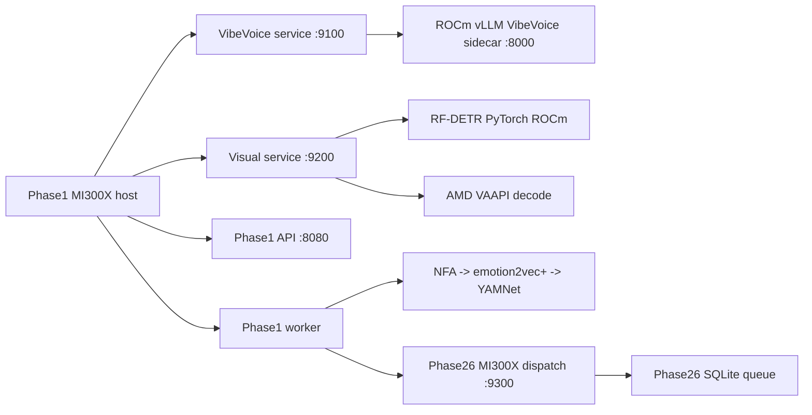
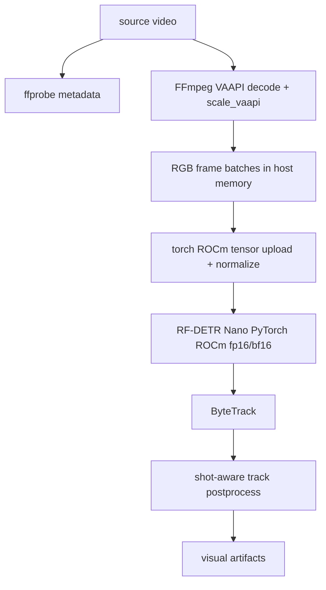
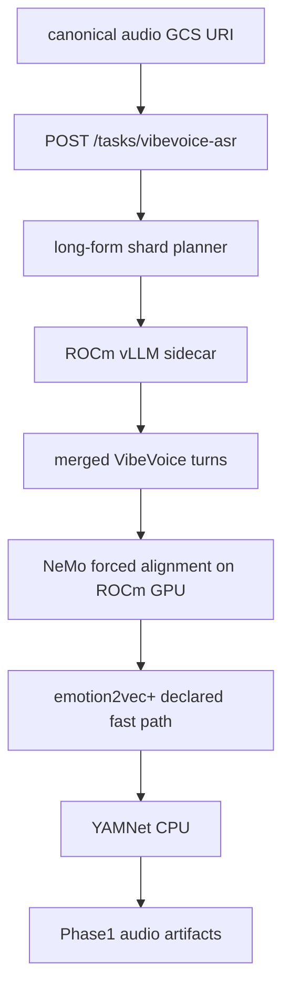
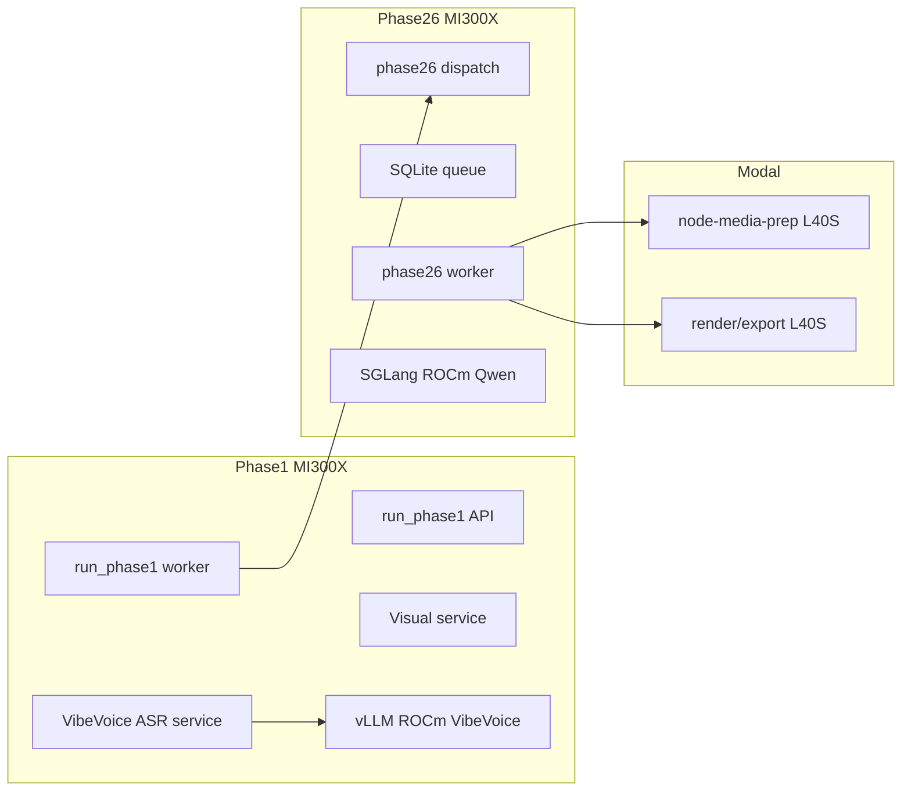
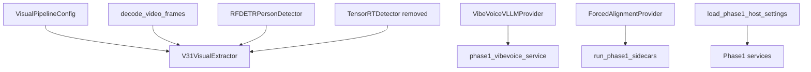

# Clypt V3.1 Spec: Phase1 AMD MI300X Switchover

**Status:** Active planning spec
**Date:** 2026-05-02
**Owner:** Phase1 runtime / deployment
**Scope:** Move the Phase1 host from the NVIDIA H200 runtime to a dedicated AMD MI300X runtime. The target keeps Phase1 ownership unchanged: runner/orchestrator, local VibeVoice service, local visual service, co-located VibeVoice vLLM sidecar, and in-process NFA -> emotion2vec+ -> YAMNet.

---

## 1. Locked Decisions

1. Phase1 runs on a dedicated **1x AMD MI300X** host.
2. Phase26 runs on a separate AMD MI300X host. Phase1 must not co-locate with SGLang Qwen.
3. This branch is an **atomic AMD refactor**. No NVIDIA/H200 fallback paths, CUDA compatibility branches, TensorRT fallback engines, or dual-runtime env overlays are retained.
4. Preserve every fast/GPU path from the H200 implementation wherever AMD has a viable equivalent. If a previously GPU-backed stage cannot run on MI300X, the migration fails hard until the user explicitly approves a slower declared mode.
5. TensorRT is removed from the active Phase1 visual path because it has no AMD drop-in. Phase1 visual inference lands first on **RF-DETR via PyTorch ROCm**; MIGraphX or ONNX Runtime MIGraphX becomes mandatory before production cutover if PyTorch ROCm misses the visual performance gate.
6. GPU decode/resize remains required. NVIDIA NVDEC/`scale_cuda` is replaced by AMD VAAPI first. rocDecode/HIP interop is the preferred follow-up if VAAPI+host download does not preserve the H200 speedup.
7. VibeVoice stays local and OpenAI-compatible through vLLM, but the sidecar image/runtime becomes ROCm-based and must pass a compatibility spike before Phase1 services are switched over.
8. NFA must first run on the MI300X through ROCm PyTorch. emotion2vec+ must also preserve any GPU acceleration the current runtime uses when ROCm packages allow it. No silent CPU downgrade and no empty timestamp degradation are allowed.
9. Phase1 audio-post still starts immediately after VibeVoice returns and does not wait for visual completion.
10. YAMNet and speaker verifier remain declared CPU stages because that is the current known-good runtime posture.
11. Modal L40S remains the active render/media-encode worker. Phase1 does not gain encode/render responsibility in this branch.
12. Historical H200 comparison data comes from existing Spanner run telemetry; no new H200 baseline capture is required before the AMD work starts.
13. DigitalOcean provisioning uses the distribution image slug **`gpu-amd-base`** ("AMD AI/ML Ready Image") as the default base image. Framework-specific UI images are probes only unless their exact image id and installed versions are verified on the live host.

---

## 2. Current State

The active H200 Phase1 host runs:

- `clypt-phase1-vllm-vibevoice.service`
- `clypt-phase1-vibevoice.service`
- `clypt-phase1-visual.service`
- `clypt-phase1-api.service`
- `clypt-phase1-worker.service`

Current visual fast path:

```text
NVDEC -> scale_cuda -> hwdownload -> RGB numpy -> CUDA tensor normalize -> TensorRT -> ByteTrack
```

The NVIDIA-specific surfaces are:

- `requirements-do-phase1-h200.txt`
  - `torch==2.6.0+cu124`
  - `torchvision==0.21.0+cu124`
  - `torchaudio==2.6.0+cu124`
- `scripts/do_phase1/deploy_phase1_services.sh`
  - installs NVIDIA Container Toolkit
  - installs `libnvinfer-bin`
  - installs `tensorrt-cu13`
  - prebuilds RF-DETR TensorRT engine
- `scripts/do_phase1/run_vllm_vibevoice_container.sh`
  - runs Docker with `--gpus all`
- `docker/vibevoice-vllm/Dockerfile`
  - based on `vllm/vllm-openai:v0.14.1`
- `backend/phase1_runtime/frame_decode.py`
  - hard-codes FFmpeg CUDA/NVDEC flags
- `backend/phase1_runtime/tensorrt_detector.py`
  - hard-codes TensorRT engine build/load/execute
- `backend/phase1_runtime/rfdetr_detector.py`
  - checks `torch.cuda.is_available()`, which works textually under ROCm but error messages/config names need to stop saying CUDA.

---

## 3. Target Runtime Graphs

### 3.1 Host Graph



### 3.2 Visual Graph



### 3.3 Audio Graph



### 3.4 Runtime Ownership Graph



---

## 4. Compatibility Audit

| Current H200 component | AMD MI300X target | Required change | Risk |
|---|---|---|---|
| CUDA driver/runtime | ROCm/HIP | Bootstrap ROCm image/driver validation, `rocm-smi`, `amd-smi` | Medium |
| `torch+cu124` wheels | ROCm PyTorch wheels or ROCm PyTorch base image | New requirements file and install path | Medium |
| TensorRT RF-DETR | PyTorch ROCm RF-DETR first, MIGraphX/ONNX Runtime MIGraphX if parity misses | Remove TensorRT active backend and engine prewarm | High |
| `trtexec` engine build | None in V1 | Delete from active deploy flow | Medium |
| NVDEC/`scale_cuda` | VAAPI/`scale_vaapi`, then rocDecode/HIP interop if needed | Add AMD GPU decode backend with dynamic render-node discovery | Medium |
| NVIDIA Docker `--gpus all` | ROCm Docker devices | Use `/dev/kfd`, `/dev/dri`, `--group-add video` | Medium |
| `vllm/vllm-openai` CUDA image | vLLM ROCm image | Rebuild VibeVoice image on ROCm base | Medium-high |
| NFA NeMo on CUDA | NeMo on ROCm GPU | Validate import/model load/inference on host; fail hard on GPU failure | Medium |
| emotion2vec+ FunASR | ROCm GPU when package/runtime supports it | Smoke test with live audio and verify no silent CPU downgrade | Medium-low |
| YAMNet | CPU | Keep `tensorflow-cpu`; no TensorFlow ROCm in V1 | Low |
| ByteTrack | CPU/Python | No expected change | Low |

---

## 5. Source Guidance Incorporated

1. AMD MI300X provides 192 GB HBM3 and 5.3 TB/s local memory bandwidth.
2. AMD MI300X includes hardware decode blocks for HEVC/H.265, AVC/H.264, VP9, AV1, and JPEG/MJPEG.
3. ROCm supports PyTorch and other AI frameworks on MI300X.
4. PyTorch HIP intentionally exposes many operations through the `torch.cuda` namespace; code can often stay operational while messages/config names are cleaned up.
5. TensorRT has no AMD drop-in replacement. The likely optimized path is MIGraphX or ONNX Runtime with MIGraphX, not a `.engine` file.
6. vLLM has ROCm Docker support, but the VibeVoice plugin/image must be validated against the chosen ROCm vLLM version.
7. DigitalOcean `doctl` exposes `gpu-amd-base` as the active AMD distribution image for the `Rithvik-AMD` team. Use that as the default provisioning base. The user-visible framework images include vLLM 0.17.1 ROCm 7.2, SGLang 0.5.9 ROCm 7.0, PyTorch 2.6.0 ROCm 7.0, Megatron ROCm 7.0, JAX ROCm 6.4.2, and ROCm-enabled GPT-OSS 120B; treat them as investigation shortcuts, not source-of-truth production images, until their exact image ids and package inventories are captured from the live host.

References:

- AMD MI300X datasheet: `https://www.amd.com/content/dam/amd/en/documents/instinct-tech-docs/data-sheets/amd-instinct-mi300x-data-sheet.pdf`
- PyTorch HIP semantics: `https://docs.pytorch.org/docs/stable/notes/hip.html`
- ROCm compatibility matrix: `https://rocm.docs.amd.com/en/latest/compatibility/compatibility-matrix.html`
- rocDecode docs: `https://rocm.docs.amd.com/projects/rocDecode/en/latest/`
- ONNX Runtime MIGraphX provider: `https://onnxruntime.ai/docs/execution-providers/MIGraphX-ExecutionProvider.html`
- vLLM ROCm Docker docs: `https://docs.vllm.ai/en/latest/deployment/docker/`

---

## 6. Required Version Matrix

Each MI300X canary must persist the exact runtime matrix into the run notes and, once accepted, into `docs/runtime/known-good-phase1-mi300x.env` or the deploy doc:

| Item | Required evidence |
|---|---|
| DigitalOcean image | image id, slug/name, region, creation date if available |
| Kernel / OS | `uname -a`, Ubuntu/Debian release |
| ROCm stack | `rocm-smi`, `amd-smi`, ROCm package version |
| Python | interpreter path and version for Phase1 venv |
| PyTorch | `torch.__version__`, `torch.version.hip`, `torch.cuda.get_device_name(0)` |
| TorchVision / TorchAudio | exact versions and import smoke |
| FFmpeg / VAAPI | `ffmpeg -version`, `ffmpeg -hwaccels`, `ffmpeg -filters`, `vainfo` output |
| Render node | selected `/dev/dri/renderD*` path and discovery evidence |
| vLLM | image tag, Python package version, ROCm version inside container |
| VibeVoice | repository URL, commit/ref, installed extras, served model name |
| RF-DETR | package version, model family, resolution, batch size |
| NeMo / NFA | `nemo-toolkit` version, model cache path, declared device |
| emotion2vec+ | FunASR version, model id, declared/observed device |
| YAMNet | TensorFlow CPU / TF Hub versions |

The first accepted AMD host snapshot must include this matrix before the migration is considered reproducible.

Default provisioning target:

```text
size:  gpu-mi300x1-192gb
image: gpu-amd-base
team:  Rithvik-AMD
```

---

## 7. File-Level Design

### 7.1 New files

- `requirements-do-phase1-mi300x.txt`
  - ROCm-compatible Phase1 runtime dependencies.
  - No CUDA extra index.
  - No TensorRT package.

- `scripts/do_phase1/bootstrap_phase1_mi300x.sh`
  - Creates `/opt/clypt-phase1` paths.
  - Verifies ROCm devices.
  - Verifies `/dev/kfd` and `/dev/dri`.
  - Installs base packages required for FFmpeg VAAPI, Docker, Python, and model downloads.

- `scripts/do_phase1/deploy_phase1_mi300x_services.sh`
  - Installs ROCm Phase1 venv.
  - Resolves `microsoft/VibeVoice-ASR` to an immutable HF revision and writes `/etc/clypt-phase1/vibevoice-model.env`.
  - Rejects empty, untagged, or `:latest` ROCm vLLM base images.
  - Builds ROCm VibeVoice vLLM image.
  - Prewarms VibeVoice, RF-DETR, NFA, emotion2vec+, and YAMNet.
  - Installs AMD-specific systemd units.

- `scripts/do_phase1/run_vllm_vibevoice_rocm_container.sh`
  - Runs ROCm Docker with `/dev/kfd`, `/dev/dri`, `--group-add video`, `--ipc=host`, `--cap-add SYS_PTRACE`, `--security-opt seccomp=unconfined`, and the VibeVoice cache mount.
  - Starts from the resolved in-container `VIBEVOICE_MODEL_PATH` with `HF_HUB_OFFLINE=1`; no mutable `snapshot_download` path is accepted during service start.

- `scripts/do_phase1/systemd/amd/clypt-phase1-vllm-vibevoice.service`
- `scripts/do_phase1/systemd/amd/clypt-phase1-vibevoice.service`
- `scripts/do_phase1/systemd/amd/clypt-phase1-visual.service`
- `scripts/do_phase1/systemd/amd/clypt-phase1-api.service`
- `scripts/do_phase1/systemd/amd/clypt-phase1-worker.service`

- `docker/vibevoice-vllm-rocm/Dockerfile`
  - ROCm vLLM base image supplied by required `VLLM_ROCM_BASE_IMAGE`.
  - Must fail build/deploy if the accepted MI300X ROCm vLLM image tag is not explicitly pinned.
  - VibeVoice `[vllm]` install.
  - FFmpeg/libsndfile install.
  - Same tokenizer generation behavior as current image.

- `docs/runtime/known-good-phase1-mi300x.env`
  - Canonical AMD Phase1 env snapshot.
  - May keep `VLLM_ROCM_BASE_IMAGE` commented until the first live MI300X canary accepts an exact tag; deploy must not proceed without it.

### 7.2 Modified files

- `backend/phase1_runtime/visual_config.py`
  - Replace TensorRT default with AMD target backend:
    - `CLYPT_PHASE1_VISUAL_BACKEND=rfdetr_rocm_fp16`
  - Add an explicit `CLYPT_PHASE1_VISUAL_GPU_DECODE_BACKEND=vaapi` field so `CLYPT_PHASE1_VISUAL_DECODE=gpu` cannot accidentally select a CUDA/NVDEC command.
  - Replace TensorRT engine path with generic artifact dir if needed.
  - Keep `CLYPT_PHASE1_VISUAL_DECODE=gpu`, but decode implementation chooses AMD backend based on accelerator.

- `backend/phase1_runtime/frame_decode.py`
  - Replace single hard-coded CUDA decode path with AMD-only active implementation.
  - Discover the render node dynamically, then validate it with `vainfo`.
  - Initial FFmpeg shape:
    - `-vaapi_device <discovered /dev/dri/renderD*>`
    - `-hwaccel vaapi`
    - `-hwaccel_output_format vaapi`
    - `scale_vaapi=<width>:<height>,hwdownload,format=nv12,format=rgb24`
  - Fail fast if the VAAPI device, codec, or filter is missing.
  - Add a software-vs-GPU frame-count parity check to the host validation path.

- `backend/phase1_runtime/rfdetr_detector.py`
  - Rename `_require_cuda` semantics to accelerator-neutral `_require_gpu`.
  - Keep `torch.cuda.is_available()` if required by PyTorch ROCm, but error messages must say ROCm/HIP GPU on AMD.
  - Keep RF-DETR Nano, batch 16, shape 640 unless AMD canary requires retuning.

- `backend/phase1_runtime/visual.py`
  - Remove active TensorRT detector selection.
  - Route all active AMD visual requests to RF-DETR PyTorch ROCm backend.

- `backend/providers/config.py`
  - Add or repurpose host settings for `CLYPT_ACCELERATOR=rocm`.
  - Remove active H200/TensorRT assumptions from Phase1 MI300X loader path.
  - Add declared NFA/emotion2vec device envs if needed; do not implement automatic CPU downgrade.

- `docs/runtime/RUNTIME_GUIDE.md`
  - Replace Phase1 H200 truth with Phase1 MI300X truth after implementation.

- `docs/deployment/PHASE1_HOST_DEPLOY.md`
  - Replace H200 procedure with MI300X procedure after implementation.

- `docs/ERROR_LOG.md`
  - Update only if a runtime/deploy/pipeline error is diagnosed and resolved during the migration.

### 7.3 Deleted or retired from active path

- `backend/phase1_runtime/tensorrt_detector.py`
  - Delete or archive only if no tests/imports need it. Because this branch does not retain backward compatibility, the preferred final state is deletion.

- H200-only deploy snippets in active Phase1 docs.
- TensorRT engine prewarm logic.
- `CLYPT_PHASE1_VISUAL_TRT_ENGINE_DIR` from active env records.

---

## 8. Implementation Streams

### Stream A: Host and ROCm bootstrap

1. Build the MI300X bootstrap script.
2. Verify `rocm-smi` and `amd-smi` see one MI300X.
3. Verify PyTorch ROCm:
   - `torch.cuda.is_available() == True`
   - `torch.version.hip` is non-empty
   - allocate and multiply a BF16 tensor on GPU.
4. Verify FFmpeg has VAAPI support:
   - `ffmpeg -hwaccels`
   - `ffmpeg -filters | grep scale_vaapi`
   - at least one `/dev/dri/renderD*` exists.
   - `vainfo --display drm --device <selected-render-node>` succeeds.

### Stream B: Visual decode and RF-DETR

1. Port frame decode to AMD VAAPI with dynamic render-node discovery.
2. Probe H.264/H.265/VP9/AV1 decode support against representative canonical source formats.
3. Run a visual-only fixture through software decode and VAAPI decode and assert frame-count parity.
3. Move RF-DETR Nano onto ROCm PyTorch.
4. Benchmark:
   - decode FPS
   - detector FPS
   - tracker FPS
   - end-to-end visual effective FPS
   - CPU load
   - GPU memory high-water mark.
5. Compare against existing H200/TensorRT telemetry in Spanner for equivalent assets.
6. If PyTorch ROCm is below acceptance threshold, implement an optimized MIGraphX/ONNX Runtime MIGraphX path before production cutover.

### Stream C: VibeVoice ROCm sidecar

1. Build ROCm vLLM VibeVoice image from a pinned, recorded image tag.
2. Run `/v1/models` and assert served model name is `vibevoice`.
3. Run short ASR smoke.
4. Run 40 minute, 80 minute, and 160 minute long-form canaries.
5. For each canary, assert:
   - expected shard count,
   - one-call outer service contract,
   - `finish_reason` is not a truncation/length stop,
   - parse failures persist raw response artifacts,
   - global speaker stitching succeeds,
   - ECAPA verifier loads in declared CPU mode,
   - audio-post starts immediately after merged ASR returns.
6. Tune:
   - `VIBEVOICE_VLLM_GPU_MEMORY_UTILIZATION`
   - `VIBEVOICE_VLLM_MAX_NUM_SEQS`
   - `VIBEVOICE_VLLM_DTYPE`.

### Stream D: Audio-post providers

1. Prewarm NFA model on the MI300X host with declared ROCm GPU device.
2. Run forced alignment smoke on known canonical audio and assert non-empty word timestamps.
3. Run emotion2vec+ smoke and record observed device. If the current fast path uses GPU and ROCm cannot, fail hard.
4. Keep YAMNet declared CPU and validate model load/inference.
5. Verify audio-post starts before visual completion in a run where visual is intentionally long.

### Stream E: Service graph and docs

1. Replace Phase1 service docs with MI300X service graph.
2. Add known-good MI300X env.
3. Update operational health checks:
   - `rocm-smi`
   - `curl :9100/health`
   - `curl :9200/health`
   - `curl :8080/healthz`
   - `curl :8000/v1/models`.

---

## 9. Concurrency and Resource Policy

### 9.1 GPU memory budget

Phase1 gets the entire 192 GB MI300X. The first target reserves headroom instead of maximizing occupancy:

- VibeVoice vLLM memory fraction: start at `0.50`, canary up to `0.60`.
- RF-DETR PyTorch ROCm: expected low tens of GB during batch inference.
- NFA/emotion2vec+: run after VibeVoice response while visual may still be active, so they must fit with visual and must not silently downgrade away from their declared GPU mode.
- YAMNet and speaker verifier: CPU.
- CPU budget is tighter than the current H200 host posture. Start with `VIBEVOICE_FFMPEG_MAX_CONCURRENCY` below the old `64` value unless live CPU telemetry proves it is safe with YAMNet, speaker verification, and FFmpeg active.

### 9.2 Initial env targets

```dotenv
CLYPT_ACCELERATOR=rocm
CLYPT_PHASE1_VISUAL_MODEL=nano
CLYPT_PHASE1_VISUAL_BACKEND=rfdetr_rocm_fp16
CLYPT_PHASE1_VISUAL_BATCH_SIZE=16
CLYPT_PHASE1_VISUAL_THRESHOLD=0.35
CLYPT_PHASE1_VISUAL_SHAPE=640
CLYPT_PHASE1_VISUAL_TRACKER=bytetrack
CLYPT_PHASE1_VISUAL_TRACKER_BUFFER=30
CLYPT_PHASE1_VISUAL_TRACKER_MATCH_THRESH=0.7
CLYPT_PHASE1_VISUAL_DECODE=gpu
CLYPT_PHASE1_VISUAL_GPU_DECODE_BACKEND=vaapi
CLYPT_PHASE1_NFA_DEVICE=cuda
CLYPT_PHASE1_EMOTION2VEC_DEVICE=cuda
CLYPT_PHASE1_YAMNET_DEVICE=cpu
VIBEVOICE_BACKEND=vllm
VIBEVOICE_VLLM_BASE_URL=http://127.0.0.1:8000
VIBEVOICE_VLLM_MODEL=vibevoice
VIBEVOICE_VLLM_GPU_MEMORY_UTILIZATION=0.50
VIBEVOICE_VLLM_MAX_NUM_SEQS=4
VIBEVOICE_VLLM_DTYPE=bfloat16
```

Batch size `16` is retained for the first canary to avoid changing detection semantics and runtime tuning at the same time.

---

## 10. Graph-Aware GitNexus Rules

Before implementation, use GitNexus to map and protect these symbols:

| Symbol | Why |
|---|---|
| `VisualPipelineConfig` | Env and backend routing changes affect visual service tests and runtime startup. |
| `decode_video_frames` | Decode path is currently hard-coded to CUDA. |
| `RFDETRPersonDetector` | Main ROCm detector path. |
| `TensorRTDetector` | Will be removed from active graph. |
| `V31VisualExtractor` | Orchestrates decode, detection, tracking, artifact shaping. |
| `VibeVoiceVLLMProvider` | VibeVoice service behavior and sidecar assumptions. |
| `ForcedAlignmentProvider` | NFA device/runtime validation. |
| `load_phase1_host_settings` | Env loader and service fail-fast behavior. |

Required graph workflow:

```bash
npx gitnexus impact -r Clypt-Backend VisualPipelineConfig --direction upstream --depth 3 --include-tests
npx gitnexus impact -r Clypt-Backend decode_video_frames --direction upstream --depth 3 --include-tests
npx gitnexus impact -r Clypt-Backend RFDETRPersonDetector --direction upstream --depth 3 --include-tests
npx gitnexus impact -r Clypt-Backend TensorRTDetector --direction upstream --depth 3 --include-tests
npx gitnexus impact -r Clypt-Backend VibeVoiceVLLMProvider --direction upstream --depth 3 --include-tests
npx gitnexus impact -r Clypt-Backend ForcedAlignmentProvider --direction upstream --depth 3 --include-tests
```

After edits, use the GitNexus MCP `gitnexus_detect_changes` tool when available. If only the local CLI is available in this checkout, run `git diff --check`, `git status --short`, and rerun the relevant `gitnexus impact` checks because this CLI build does not expose a `detect-changes` subcommand.

Expected affected graph:



---

## 11. Validation Gates

### 11.0 Version matrix gate

The version matrix in §6 must be captured before any service is declared ready. Missing image ids, ROCm versions, Python package versions, render-node evidence, or model revisions block the cutover.

### 11.1 Unit and offline tests

```bash
python -m pytest tests/backend/phase1_runtime -q
python -m pytest tests/backend/providers -q
python -m pytest tests/backend/runtime -q
python -m pytest tests/backend/pipeline -q
```

### 11.2 Host smoke tests

```bash
rocm-smi
amd-smi static
curl -sf http://127.0.0.1:9100/health
curl -sf http://127.0.0.1:9200/health
curl -sf http://127.0.0.1:8080/healthz
curl -sf http://127.0.0.1:8000/v1/models
python - <<'PY'
import torch
print("torch", torch.__version__)
print("hip", getattr(torch.version, "hip", None))
print("gpu", torch.cuda.get_device_name(0))
PY
```

### 11.3 VAAPI and visual benchmark

Before RF-DETR benchmarking:

```bash
vainfo --display drm --device <selected-render-node>
ffmpeg -hwaccels
ffmpeg -filters | grep scale_vaapi
```

For each representative codec, run a short VAAPI decode probe and compare frame counts with software decode.

Run the existing visual-only script against at least three canonical assets:

```bash
python scripts/tmp_rfdetr_visual_only.py \
  --source-path /opt/clypt-phase1/videos/<video>.mp4 \
  --batch-sizes 16
```

Acceptance:

- no software decode fallback,
- no dropped/truncated frame stream,
- visual artifacts schema-compatible,
- ByteTrack output non-empty on known-person fixtures,
- effective FPS is within 30 percent of equivalent H200 TensorRT run telemetry from Spanner, or the cutover is blocked until MIGraphX/ONNX Runtime MIGraphX closes the gap.

### 11.4 End-to-end Phase1 canary

```bash
python -m backend.runtime.run_phase1 \
  --job-id "amd_phase1_$(date +%Y%m%d_%H%M%S)" \
  --source-path /opt/clypt-phase1/videos/<video>.mp4 \
  --run-phase14
```

Acceptance:

- VibeVoice returns turns.
- NFA runs on ROCm GPU and word timestamps are present.
- emotion2vec+ segments present and device behavior matches the declared fast path.
- YAMNet events path completes.
- visual tracks present.
- Phase26 enqueue succeeds.
- audio-post begins immediately after VibeVoice response, before visual completion when visual is still running.
- Modal L40S node-media-prep/render endpoints remain the only encode/render path.

---

## 12. Rollout Plan

1. Provision 1x MI300X host.
2. Bootstrap ROCm and base filesystem.
3. Build and validate Phase1 MI300X venv.
4. Build ROCm VibeVoice image.
5. Bring up only VibeVoice sidecar and VibeVoice service.
6. Bring up visual service on AMD VAAPI + RF-DETR ROCm.
7. Bring up Phase1 API and worker.
8. Run Phase1 smoke without downstream enqueue if needed.
9. Run Phase1 full canary into Phase26 AMD host.
10. Update active docs and env records.
11. Remove active H200/TensorRT references.

---

## 13. Non-Goals

1. No AMD video encode migration in this spec.
2. No TensorRT compatibility layer.
3. No NVIDIA/H200 fallback env.
4. No change to Phase26 queue contract.
5. No change to Modal node-media-prep/render ownership.
6. No retuning RF-DETR thresholds unless canary data requires it.

---

## 14. Open Risks

1. VibeVoice plugin compatibility with ROCm vLLM may require a different vLLM version than current CUDA image.
2. RF-DETR PyTorch ROCm may be slower than H200 TensorRT; MIGraphX may become required.
3. FFmpeg VAAPI driver exposure on the selected DO MI300X image may differ from bare-metal AMD examples.
4. NeMo 1.23 dependency stack may need version pins on ROCm.
5. ROCm memory fragmentation under concurrent VibeVoice, visual, and NFA workloads must be tested with long-form inputs.

---

## 15. Final State

Phase1 is a single-purpose MI300X host with:

- ROCm vLLM VibeVoice on `127.0.0.1:8000`
- VibeVoice service on `127.0.0.1:9100`
- visual service on `127.0.0.1:9200`
- AMD VAAPI decode
- RF-DETR Nano PyTorch ROCm
- ByteTrack unchanged
- NFA on ROCm GPU, emotion2vec+ on the declared fast path, and YAMNet CPU prewarmed
- no TensorRT, no NVDEC, no CUDA wheels, no H200 fallback docs or env overlays
