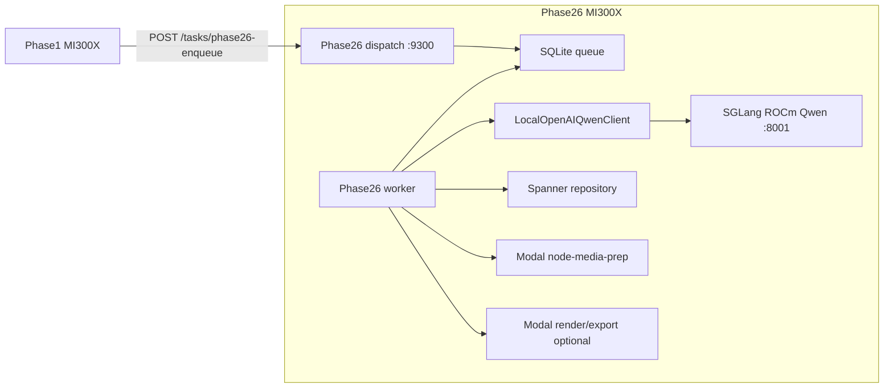
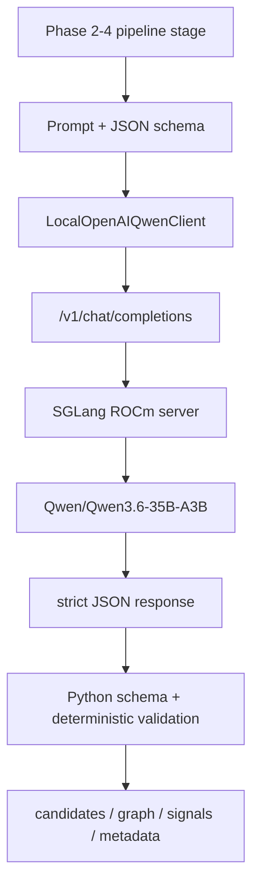
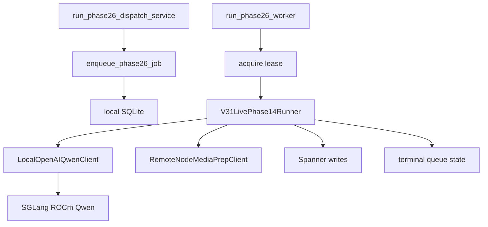
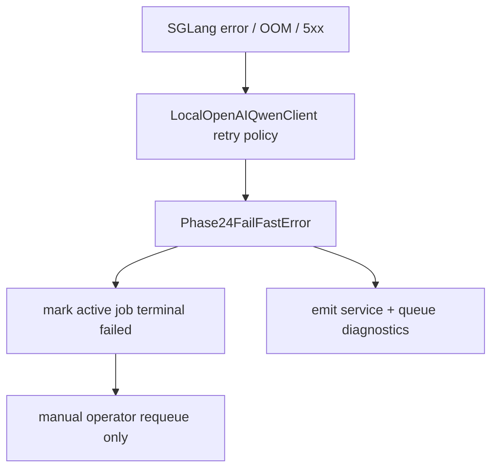
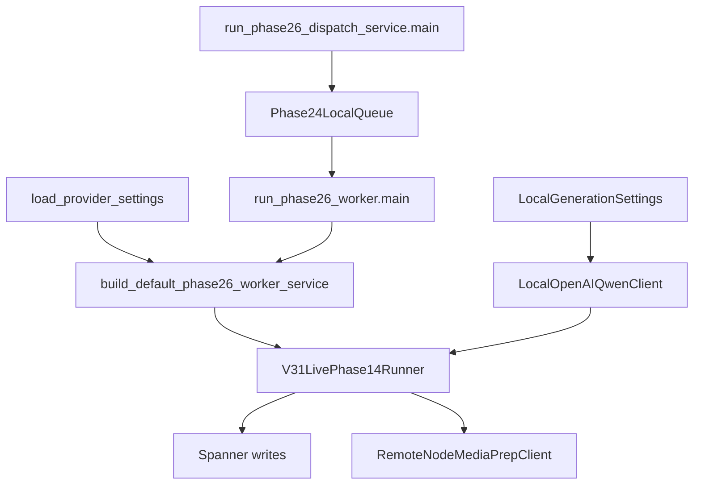

# Clypt V3.1 Spec: Phase26 AMD MI300X SGLang Qwen Switchover

**Status:** Active planning spec
**Date:** 2026-05-02
**Owner:** Phase26 runtime / inference
**Scope:** Move Phase26 from the H200 SGLang Qwen host to a dedicated AMD MI300X host running SGLang on ROCm. Phase26 remains the owner of dispatch API, local SQLite queue, local worker, Qwen generation, current Phase 2-4 runtime, and future Phase 5-6 orchestration.

---

## 1. Locked Decisions

1. Phase26 runs on a dedicated **1x AMD MI300X** host.
2. Phase1 runs on a separate AMD MI300X host and dispatches to Phase26 over the existing `POST /tasks/phase26-enqueue` boundary.
3. Qwen remains self-hosted through **SGLang**, not Nebius Token Factory.
4. This branch is an **atomic AMD refactor**. No H200 fallback, CUDA fallback, NVIDIA-specific service units, or Nebius provider fallback are retained.
5. The OpenAI-compatible local generation contract remains `http://127.0.0.1:8001/v1`.
6. `GENAI_GENERATION_BACKEND=local_openai` remains the active application-level backend name unless the implementation intentionally renames it to a hardware-neutral name in the same branch. The transport remains local OpenAI-compatible.
7. Initial model target remains `Qwen/Qwen3.6-35B-A3B`, with SGLang on ROCm and FP8 KV. Larger Qwen models require a separate capacity decision.
8. Phase26 keeps `CLYPT_PHASE24_QUEUE_BACKEND=local_sqlite`.
9. Node-media-prep remains remote Modal L40S. Phase26 does not regain an in-process ffmpeg fallback.
10. Default crash behavior remains fail-fast:
    - `CLYPT_PHASE24_LOCAL_RECLAIM_EXPIRED_LEASES=0`
    - `CLYPT_PHASE24_LOCAL_FAIL_FAST_ON_STALE_RUNNING=1`
11. SGLang ROCm serving must be `>=0.5.10` for Qwen3.6. DigitalOcean SGLang 0.5.9/0.4.9 images are not acceptable as production targets unless upgraded in place and verified by `sglang.__version__`, `/v1/models`, and strict JSON smoke tests.
12. Docker is the primary production SGLang path on AMD. A host venv path may exist for development, but production must avoid rebuilding the ROCm serving stack from pip unless explicitly validated.
13. The H200 launch flags are the desired end state, not the first-boot line. AMD SGLang flags are enabled in stages: minimal boot, strict JSON, FP8 KV, MTP/NextN, then concurrency.
14. Existing H200 comparison data comes from Spanner run telemetry and prior benchmark artifacts; no new H200 baseline capture is required before AMD implementation starts.
15. DigitalOcean provisioning uses the distribution image slug **`gpu-amd-base`** ("AMD AI/ML Ready Image") as the default base image. SGLang is then supplied by the pinned Docker image; the DO SGLang UI image is not the production serving image.

---

## 2. Current State

Current H200 Phase26 responsibilities:

- `python -m backend.runtime.run_phase26_dispatch_service`
- `python -m backend.runtime.run_phase26_worker`
- local SQLite queue
- SGLang Qwen on `127.0.0.1:8001`
- Phase 2-4 business logic
- Modal node-media-prep submit/poll client
- optional Modal render/export client

Current SGLang H200 target settings:

```text
--context-length 65536
--kv-cache-dtype fp8_e4m3
--mem-fraction-static 0.78
--speculative-algorithm NEXTN
--speculative-num-steps 3
--speculative-eagle-topk 1
--speculative-num-draft-tokens 4
--mamba-scheduler-strategy extra_buffer
--schedule-policy lpm
--chunked-prefill-size 8192
--grammar-backend xgrammar
--reasoning-parser qwen3
```

The AMD switchover should preserve the semantic serving contract while changing the hardware and runtime packaging.

---

## 3. Target Runtime Graphs

### 3.1 Host Graph



### 3.2 Generation Graph



### 3.3 Process Graph



### 3.4 Failure Graph



---

## 4. Source Guidance Incorporated

1. SGLang has an AMD GPU/ROCm platform path and ROCm Docker build flow.
2. SGLang documentation indicates AMD support across MI300X-class hardware.
3. AMD published Qwen3.6 support on Instinct GPUs with ROCm 7.0 and upstream serving optimizations.
4. Qwen model guidance recommends SGLang for Qwen3.6 and includes Qwen3 reasoning/parser flags.
5. MI300X provides 192 GB HBM3 and 5.3 TB/s bandwidth, which is sufficient for the current 35B-A3B class with long-context KV headroom on one GPU.
6. DigitalOcean `doctl` exposes `gpu-amd-base` as the active AMD distribution image for the `Rithvik-AMD` team. Use that as the default provisioning base. The user-visible SGLang 0.5.9 ROCm 7.0 image is below the Qwen3.6 target and must not be used as the production serving image unless upgraded and verified.

References:

- SGLang AMD GPUs: `https://sgl-project.github.io/platforms/amd_gpu.html`
- SGLang docs: `https://docs.sglang.io/`
- AMD Qwen3.6 on Instinct GPUs: `https://www.amd.com/en/developer/resources/technical-articles/2026/day-0-support-for-qwen-3-6-on-amd-instinct-gpus.html`
- Qwen3.6 model card: `https://huggingface.co/Qwen/Qwen3.6-35B-A3B`
- SGLang server arguments: `https://docs.sglang.io/docs/advanced_features/server_arguments`
- SGLang structured outputs: `https://docs.sglang.io/docs/advanced_features/structured_outputs`
- AMD MI300X datasheet: `https://www.amd.com/content/dam/amd/en/documents/instinct-tech-docs/data-sheets/amd-instinct-mi300x-data-sheet.pdf`
- ROCm compatibility matrix: `https://rocm.docs.amd.com/en/latest/compatibility/compatibility-matrix.html`

---

## 5. File-Level Design

### 5.1 New files

- `requirements-do-phase26-mi300x.txt`
  - Phase26 worker/runtime dependencies with ROCm-compatible packages where needed.
  - No CUDA extra index.
  - No NVIDIA-specific dependencies.

- `scripts/do_phase26/bootstrap_phase26_mi300x.sh`
  - Creates `/opt/clypt-phase26` paths.
  - Verifies ROCm devices.
  - Verifies Python, Docker, and host dependencies.

- `scripts/do_phase26/deploy_phase26_mi300x_services.sh`
  - Installs Phase26 worker venv.
  - Pulls the pinned SGLang ROCm Docker image for production.
  - Installs AMD systemd units.
  - Validates `/v1/models` before worker start.

- `scripts/do_phase26/run_sglang_qwen_rocm_container.sh`
  - Primary production SGLang launch path.
  - Uses `/dev/kfd`, `/dev/dri`, `--group-add video`, `--ipc=host`, `--cap-add SYS_PTRACE`, `--security-opt seccomp=unconfined`, and model cache mounts.

- `scripts/do_phase26/systemd/amd/clypt-phase26-dispatch.service`
- `scripts/do_phase26/systemd/amd/clypt-phase26-worker.service`
- `scripts/do_phase26/systemd/amd/clypt-phase26-sglang-qwen.service`

- `docs/runtime/known-good-phase26-mi300x.env`
  - Canonical AMD Phase26 env snapshot.

- `scripts/bench_phase26_rocm_qwen_concurrency.py` or an extension to `scripts/bench_phase24_llm_concurrency.py`
  - Captures ROCm-specific service stats, latency, error count, and throughput.

### 5.2 Modified files

- `backend/providers/config.py`
  - Keep active generation backend local OpenAI-compatible.
  - Ensure model defaults and local generation settings remain aligned with Qwen3.6 SGLang.
  - Optionally rename env descriptions to hardware-neutral language without adding fallback branches.

- `backend/providers/openai_local.py`
  - Keep strict JSON payload behavior.
  - Keep `chat_template_kwargs.enable_thinking=False`.
  - Validate compatibility of SGLang ROCm with:
    - `response_format`
    - `top_k`
    - `min_p`
    - `repetition_penalty`
    - `chat_template_kwargs`
  - If a payload field is unsupported on ROCm SGLang, remove it globally for this branch rather than adding NVIDIA/AMD conditionals.

- `backend/runtime/phase26_worker_app.py`
  - Keep fail-fast guard for unsupported generation backend.
  - If `local_openai` name remains, update error/help text to say local SGLang OpenAI-compatible, not H200/local CUDA.

- `scripts/bench_phase24_llm_concurrency.py`
  - Add AMD/ROCm metadata capture:
    - `rocm-smi` snapshot before/after
    - SGLang model id
    - context length
    - memory fraction
    - KV dtype
    - speculative settings

- `docs/runtime/RUNTIME_GUIDE.md`
  - Replace Phase26 H200 truth with Phase26 MI300X truth after implementation.

- `docs/deployment/PHASE26_HOST_DEPLOY.md`
  - Replace H200 procedure with MI300X procedure after implementation.

- `docs/runtime/ENV_REFERENCE.md`
  - Add MI300X Phase26 envs and remove active H200-only Qwen serving notes.

### 5.3 Deleted or retired from active path

- Active H200 SGLang deploy scripts and systemd units for Phase26.
- H200/CUDA-specific env records for Phase26.
- Nebius Token Factory provider work for this branch, if any partial files exist.

Because this is not a backward-compatible migration, the final active docs should not say "choose H200 or MI300X." They should say Phase26 is MI300X.

---

## 6. Required Version Matrix

Each Phase26 MI300X canary must persist the exact runtime matrix into run notes and, once accepted, into `docs/runtime/known-good-phase26-mi300x.env` or the deploy doc:

| Item | Required evidence |
|---|---|
| DigitalOcean image | image id, slug/name, region, creation date if available |
| Kernel / OS | `uname -a`, Ubuntu/Debian release |
| ROCm stack | `rocm-smi`, `amd-smi`, ROCm package version |
| SGLang | Docker image tag, `sglang.__version__`, launch command, server args help output |
| Python / PyTorch inside container | Python version, `torch.__version__`, `torch.version.hip`, GPU name |
| Model | exact HF repo, revision/commit, cache path, offline-start proof |
| Grammar backend | accepted backend and prewarm evidence |
| KV cache | accepted dtype and memory high-water mark |
| Speculative decode | accepted MTP/NextN flags or explicit disabled reason |
| Queue runtime | SQLite path, worker env, fail-fast envs |
| Modal boundary | node-media-prep/render endpoints and submit/poll smoke |

Default provisioning target:

```text
size:  gpu-mi300x1-192gb
image: gpu-amd-base
team:  Rithvik-AMD
```

---

## 7. SGLang ROCm Serving Design

### 7.1 Version and image policy

Production serving uses a pinned SGLang ROCm Docker image. The first acceptable target is:

```text
lmsysorg/sglang:v0.5.10-rocm720-mi30x
```

or a newer MI300X/ROCm image that passes the same validation gates. DigitalOcean's `SGLang 0.5.9 - ROCm 7.0` ready image is below the Qwen3.6 target and is not accepted as-is.

### 7.2 Staged launch gates

The H200 launch line is not copied wholesale into first boot. Enable features in this order:

1. **Minimal boot**

```bash
python -m sglang.launch_server \
  --model-path Qwen/Qwen3.6-35B-A3B \
  --host 127.0.0.1 \
  --port 8001 \
  --trust-remote-code \
  --reasoning-parser qwen3 \
  --attention-backend triton \
  --context-length 65536 \
  --mem-fraction-static 0.70
```

2. **Strict JSON gate**
   - Add `--grammar-backend xgrammar` or the accepted ROCm-compatible backend.
   - Prewarm one representative schema for every Phase 2-4 schema family.

3. **FP8 KV gate**
   - Add `--kv-cache-dtype fp8_e4m3`.
   - Verify memory savings and no schema-quality regression.

4. **Scheduler / cache gate**
   - Test `--schedule-policy lpm`, `--chunked-prefill-size 8192`, and radix-cache behavior.
   - AMD's Qwen3.6 example may require `--disable-radix-cache`; record the accepted setting rather than assuming the H200 default.

5. **MTP/NextN gate**
   - Add:
     - `SGLANG_ENABLE_SPEC_V2=1`
     - `--mamba-scheduler-strategy extra_buffer`
     - `--speculative-algorithm NEXTN`
     - `--speculative-num-steps 3`
     - `--speculative-eagle-topk 1`
     - `--speculative-num-draft-tokens 4`
   - Keep only if strict JSON and concurrency remain stable.

### 7.3 Desired final launch shape

```bash
python -m sglang.launch_server \
  --model-path Qwen/Qwen3.6-35B-A3B \
  --host 127.0.0.1 \
  --port 8001 \
  --trust-remote-code \
  --attention-backend triton \
  --reasoning-parser qwen3 \
  --grammar-backend xgrammar \
  --schedule-policy lpm \
  --chunked-prefill-size 8192 \
  --mem-fraction-static 0.78 \
  --context-length 65536 \
  --kv-cache-dtype fp8_e4m3 \
  --mamba-scheduler-strategy extra_buffer \
  --speculative-algorithm NEXTN \
  --speculative-num-steps 3 \
  --speculative-eagle-topk 1 \
  --speculative-num-draft-tokens 4
```

Required environment:

```dotenv
SGLANG_ENABLE_SPEC_V2=1
HF_HOME=/opt/clypt-phase26/.cache/huggingface
TORCH_HOME=/opt/clypt-phase26/.cache/torch
PYTORCH_KERNEL_CACHE_PATH=/opt/clypt-phase26/.cache/torch/kernels
HF_HUB_OFFLINE=1
```

### 7.4 ROCm-specific SGLang validation

The launch line is not considered accepted until these pass:

1. Server boots with no unsupported kernel or attention backend errors.
2. `/v1/models` returns `Qwen/Qwen3.6-35B-A3B`.
3. `python -c "import sglang; print(sglang.__version__)"` reports `>=0.5.10`.
4. One non-streaming strict JSON request completes with `response_format`, `top_k`, `min_p`, `repetition_penalty`, and `chat_template_kwargs.enable_thinking=False` all present.
5. One long-context request at representative Phase4 size completes.
6. Representative Phase 2-4 schema-family prewarm succeeds before the worker starts.
7. Concurrency benchmark completes with zero server crashes.
8. `rocm-smi` shows memory stable after the benchmark.
9. The model cache is complete enough that SGLang starts with `HF_HUB_OFFLINE=1`.

### 7.5 Fallback policy

No H200 fallback exists in this branch. If a flag is unsupported on ROCm SGLang, the implementation changes the one active launch line and benchmark reference data. Do not preserve alternate NVIDIA launch lines.

---

## 8. Phase26 Env Target

Initial canonical env:

```dotenv
GENAI_GENERATION_BACKEND=local_openai
GENAI_GENERATION_MODEL=Qwen/Qwen3.6-35B-A3B
GENAI_FLASH_MODEL=Qwen/Qwen3.6-35B-A3B
CLYPT_LOCAL_LLM_BASE_URL=http://127.0.0.1:8001/v1
CLYPT_LOCAL_LLM_MODEL=Qwen/Qwen3.6-35B-A3B
CLYPT_LOCAL_LLM_TEMPERATURE=0.0
CLYPT_LOCAL_LLM_TOP_P=1.0
CLYPT_LOCAL_LLM_TOP_K=40
CLYPT_LOCAL_LLM_MIN_P=0.0
CLYPT_LOCAL_LLM_PRESENCE_PENALTY=0.0
CLYPT_LOCAL_LLM_REPETITION_PENALTY=1.0

CLYPT_PHASE24_QUEUE_BACKEND=local_sqlite
CLYPT_PHASE24_LOCAL_MAX_INFLIGHT=1
CLYPT_PHASE24_LOCAL_RECLAIM_EXPIRED_LEASES=0
CLYPT_PHASE24_LOCAL_FAIL_FAST_ON_STALE_RUNNING=1

SG_MODEL=Qwen/Qwen3.6-35B-A3B
SG_BASE_URL=http://127.0.0.1:8001/v1
SG_DOCKER_IMAGE=lmsysorg/sglang:v0.5.10-rocm720-mi30x
SG_CONTEXT_LENGTH=65536
SG_MEM_FRACTION_STATIC=0.78
SG_KV_CACHE_DTYPE=fp8_e4m3
SG_GRAMMAR_BACKEND=xgrammar
SG_REASONING_PARSER=qwen3
SG_ENABLE_SPEC_V2=1
SG_SPECULATIVE_ALGORITHM=NEXTN
SG_SPECULATIVE_NUM_STEPS=3
SG_SPECULATIVE_EAGLE_TOPK=1
SG_SPECULATIVE_NUM_DRAFT_TOKENS=4
SG_MAMBA_SCHEDULER_STRATEGY=extra_buffer
SG_SCHEDULE_POLICY=lpm
SG_CHUNKED_PREFILL_SIZE=8192
HF_HOME=/opt/clypt-phase26/.cache/huggingface
TORCH_HOME=/opt/clypt-phase26/.cache/torch
PYTORCH_KERNEL_CACHE_PATH=/opt/clypt-phase26/.cache/torch/kernels
HF_HUB_OFFLINE=1
```

Per-stage concurrency envs keep current values until the ROCm benchmark says otherwise.

---

## 9. Graph-Aware GitNexus Rules

Before implementation, run impact analysis for the symbols most likely to change:

| Symbol | Why |
|---|---|
| `LocalOpenAIQwenClient` | All Phase 2-4 generation calls flow through it. |
| `LocalGenerationSettings` | Sampler/model/base URL settings affect every generation stage. |
| `load_provider_settings` | Env loading affects Phase1 and Phase26. |
| `build_default_phase26_worker_service` | Wires repository, LLM client, node-media-prep, render client. |
| `V31LivePhase14Runner` | Owns Phase 2-4 orchestration and generation call volume. |
| `run_phase26_worker.main` | Service entrypoint and worker lifecycle. |
| `run_phase26_dispatch_service.main` | Dispatch surface used by Phase1. |
| `Phase24LocalQueue` | Queue fail-fast and stale-running behavior. |
| `Phase24LocalWorkerLoop` | Worker leasing, fail-fast, and terminal-state behavior. |

Required graph workflow:

```bash
npx gitnexus impact -r Clypt-Backend LocalOpenAIQwenClient --direction upstream --depth 3 --include-tests
npx gitnexus impact -r Clypt-Backend LocalGenerationSettings --direction upstream --depth 3 --include-tests
npx gitnexus impact -r Clypt-Backend load_provider_settings --direction upstream --depth 3 --include-tests
npx gitnexus impact -r Clypt-Backend build_default_phase26_worker_service --direction upstream --depth 3 --include-tests
npx gitnexus impact -r Clypt-Backend V31LivePhase14Runner --direction upstream --depth 3 --include-tests
npx gitnexus impact -r Clypt-Backend Phase24LocalQueue --direction upstream --depth 3 --include-tests
npx gitnexus impact -r Clypt-Backend Phase24LocalWorkerLoop --direction upstream --depth 3 --include-tests
npx gitnexus context -r Clypt-Backend run_phase26_worker.main
npx gitnexus context -r Clypt-Backend run_phase26_dispatch_service.main
```

After edits, use the GitNexus MCP `gitnexus_detect_changes` tool when available. If only the local CLI is available in this checkout, run `git diff --check`, `git status --short`, and rerun the relevant `gitnexus impact` checks because this CLI build does not expose a `detect-changes` subcommand.

Expected affected graph:



Risk expectation:

- `load_provider_settings` and `LocalOpenAIQwenClient` are likely HIGH or CRITICAL because they sit on active runtime paths.
- Report the direct callers and affected processes before editing those symbols.

---

## 10. Implementation Streams

### Stream A: ROCm host bootstrap

1. Provision 1x MI300X host.
2. Install/validate ROCm.
3. Verify:
   - `rocm-smi`
   - `amd-smi static`
   - Python imports
   - PyTorch HIP allocation.
4. Create `/opt/clypt-phase26` filesystem and cache roots.

### Stream B: SGLang ROCm Qwen

1. Pull the pinned SGLang ROCm Docker image.
2. Download and prewarm the exact `Qwen/Qwen3.6-35B-A3B` revision into the canonical cache.
3. Write the resolved in-container snapshot path and served model name into `/etc/clypt-phase26/sg-model.env`, then start SGLang on `127.0.0.1:8001` with the staged launch process from §7.2.
4. Validate health/model endpoints.
5. Restart with `HF_HUB_OFFLINE=1` and prove the cache is complete.
6. Run strict JSON smoke through `LocalOpenAIQwenClient`.
7. Tune launch flags only after the first smoke passes.

### Stream C: Phase26 worker/runtime

1. Install Phase26 MI300X venv.
2. Bring up dispatch service on `:9300`.
3. Bring up worker with local SQLite queue.
4. Validate Phase1 can enqueue over public/private endpoint.
5. Run one synthetic queue job.

### Stream D: Concurrency benchmarking

1. Run `scripts/bench_phase24_llm_concurrency.py` against SGLang ROCm.
2. Sweep:
   - `1,2,4,6,8,10,12,16`
3. Capture:
   - request/sec
   - p50/p95 latency
   - error count
   - schema failures
   - SGLang restarts
   - MI300X memory high-water mark.
4. Compare against existing H200 run telemetry in Spanner and prior benchmark artifacts.
5. Update per-stage concurrency envs only where zero-error data supports it.

### Stream E: End-to-end Phase1 -> Phase26 canary

1. Run Phase1 AMD canary with `--run-phase14`.
2. Verify Phase26 queue terminal success.
3. Verify artifacts in Spanner/GCS.
4. Verify node-media-prep is still remote Modal only.

---

## 11. Benchmark Matrix

### 11.1 LLM concurrency scenarios

Run each scenario against AMD SGLang:

```bash
python scripts/bench_phase24_llm_concurrency.py \
  --scenario phase2_merge \
  --concurrency-values "1,2,4,6,8,10,12,16" \
  --rounds 2 \
  --base-url http://127.0.0.1:8001/v1 \
  --model Qwen/Qwen3.6-35B-A3B
```

Repeat for:

- `phase2_merge`
- `phase3_local`
- `phase3_long_range`
- `phase4_meta`
- `phase4_subgraph`
- `phase4_pool`

Acceptance:

- zero SGLang process crashes,
- zero malformed JSON for strict schema scenarios,
- p95 latency acceptable for current worker throughput,
- no ROCm memory growth across repeated rounds,
- best zero-error concurrency at least matches comparable H200 run telemetry from Spanner or is explicitly accepted.

### 11.2 Full pipeline tests

```bash
python -m pytest tests/backend/providers -q
python -m pytest tests/backend/runtime -q
python -m pytest tests/backend/pipeline -q
python -m pytest tests/backend/pipeline/test_subgraph_review_schema_compat.py -q
```

Also run one eval-bank or canonical end-to-end canary and enforce the `docs/EVALS.md` quality gate: more than 2 percent regression blocks cutover.

### 11.3 Host health checks

```bash
rocm-smi
docker ps --filter name=clypt-phase26-sglang-qwen
curl -sf http://127.0.0.1:8001/v1/models
curl -sf http://127.0.0.1:9300/health
systemctl status clypt-phase26-sglang-qwen.service --no-pager
systemctl status clypt-phase26-dispatch.service --no-pager
systemctl status clypt-phase26-worker.service --no-pager
```

Then enqueue a bounded synthetic job and inspect the queue row reaches a terminal state. Do not use a foreground infinite worker process as the health check.

---

## 12. Rollout Plan

1. Provision Phase26 MI300X.
2. Bootstrap ROCm.
3. Install SGLang ROCm Qwen.
4. Validate SGLang in isolation.
5. Install Phase26 worker/runtime.
6. Validate local SQLite queue.
7. Validate dispatch endpoint.
8. Point Phase1 AMD env at Phase26 AMD dispatch URL.
9. Run end-to-end canary.
10. Replace active Phase26 docs/env records with MI300X truth.
11. Remove active H200/Nebius references for Phase26.

---

## 13. Non-Goals

1. No Nebius Token Factory integration.
2. No H200 fallback or dual-runtime compatibility.
3. No in-process node-media-prep fallback.
4. No Phase1 AMD visual work in this spec.
5. No migration to 235B-class Qwen in this spec.
6. No change to Spanner schemas or Phase 2-4 business semantics.

---

## 14. Open Risks

1. SGLang ROCm may require different flag names or unsupported options for FP8 KV, MTP, grammar backend, or attention backend.
2. Qwen3.6 strict JSON behavior on ROCm SGLang may differ from H200 SGLang under `xgrammar`.
3. MI300X memory headroom is large, but long-context concurrency can still pressure KV cache.
4. ROCm kernel compilation and cache behavior may create first-request latency that must be prewarmed.
5. If a larger Qwen model becomes the target, one MI300X may no longer be enough.

---

## 15. Final State

Phase26 is a single-purpose MI300X host with:

- dispatch service on `:9300`
- local SQLite queue
- worker running Phase 2-4
- local SGLang ROCm Qwen on `127.0.0.1:8001`
- OpenAI-compatible generation client unchanged at the app boundary
- Modal node-media-prep/render remaining remote
- no H200, Nebius, CUDA, or NVIDIA service fallback in active docs or runtime scripts
