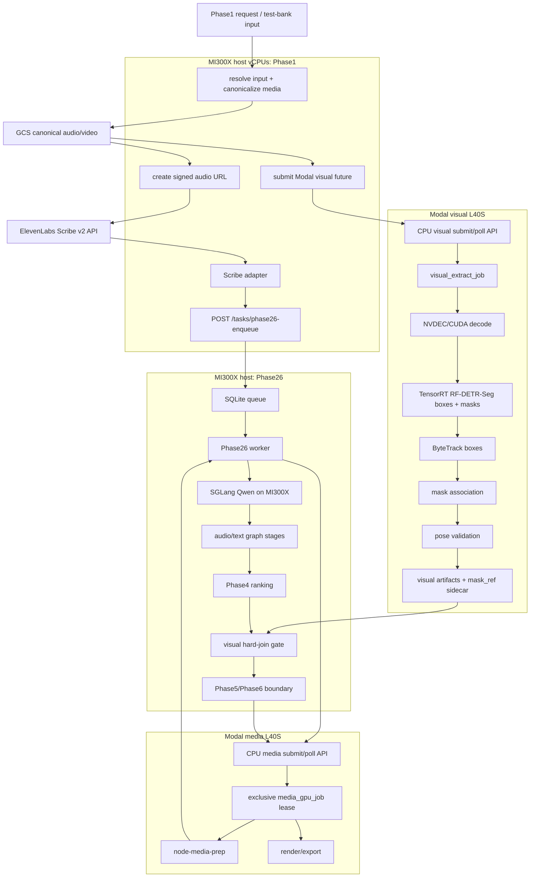
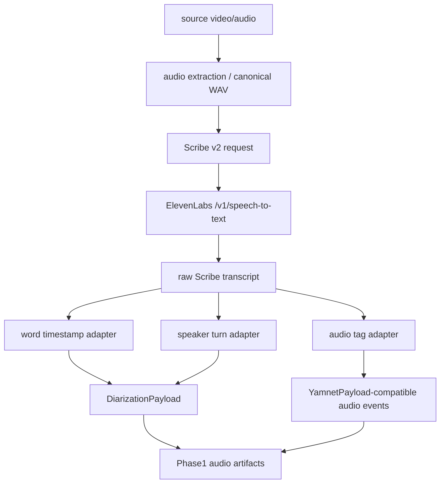
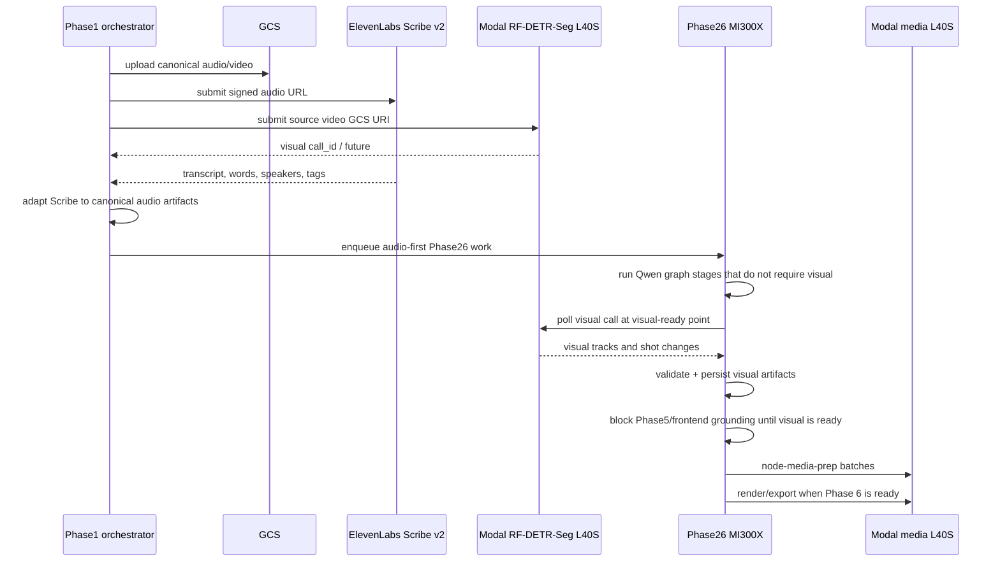
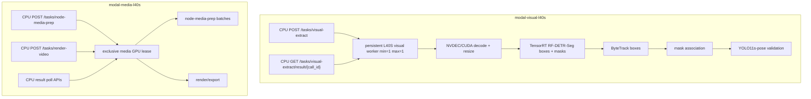

# Clypt V3.1 Spec: Scribe v2 Audio Stack and Dual Persistent Modal L40S Refactor

**Status:** Active planning spec
**Date:** 2026-05-02
**Owner:** Phase1 runtime / Phase26 runtime / Modal media workers
**Scope:** Refactor the AMD branch topology so Phase26 keeps self-hosted Qwen on one MI300X, Phase1 replaces VibeVoice + NFA + emotion2vec+ + YAMNet with ElevenLabs Scribe v2, and NVIDIA-native visual/media work moves to two persistent Modal L40S pools: one for RF-DETR-Seg visual extraction and one shared by node-media-prep plus Phase 6 render/export.

> 2026-05-04 implementation note: the topology, Scribe path, Modal visual path, and Modal media/render submit-poll path are implemented on `AMD-refactor`, but Phase5-less auto-follow render quality is **not accepted**. Latest reviewed clips rendered as valid vertical MP4s, but tracking/subject selection was poor and crop motion was still not smooth enough. Treat auto-follow rendering as an experimental fallback until a dedicated tracking/crop-quality pass lands; manual Phase5 grounding remains the production-quality route.
>
> 2026-05-05 crop-plan update: `tracklet_follow_9x16_smooth_inside_person` is superseded by `tracklet_follow_9x16_pose_x_dynamic_inside_person`. The compiler computes per-keyframe 9:16 crops inside the selected person bbox, uses pose only for horizontal head/face anchoring, keeps vertical placement bbox-top anchored, and treats shot or primary-tracklet changes as hard crop cuts instead of animated pans.
>
> 2026-05-07 render-runtime update: the live Modal FFmpeg path does **not** apply dynamic crop `w/h` inside one ffmpeg pass. It renders per-run/per-tracklet fixed-size cropped video pieces, stitches them back into one clip, and applies subtitles in a final pass, because dynamic crop `w/h` wedged ffmpeg/NVENC on real runs.
>
> 2026-05-06 visual-model update: the active Modal visual path now targets `RFDETRSegNano` instead of detection-only RF-DETR Nano. The TensorRT pass must expose boxes, scores/classes, and masks; masks are retained once per visual job in a compressed low-resolution `.npz` sidecar artifact, while JSON rows carry `mask_ref` pointers after box-only ByteTrack ID assignment. Segmentation was added for future person-aware captions, motion graphics/overlays inside the short/reel frame, and crop/negative-space decisions. Phase6 crop math and captions do not consume masks yet.

---

## 1. Locked Decisions

1. Phase26 remains on **1x AMD MI300X** running SGLang Qwen as described by `2026-05-02_phase26_amd_mi300x_sglang_qwen_spec.md`.
2. Phase1 no longer requires a dedicated MI300X host for audio or visual GPU work in this target topology.
3. Phase1 audio uses **ElevenLabs Scribe v2** as the primary transcription, diarization, word-timing, and coarse audio-tag backend.
4. Phase1 sends Scribe v2 a **signed HTTPS GCS URL** for the canonical audio object through the non-deprecated `source_url` request field, not a multipart upload, unless the signed URL path is proven incompatible in live API testing.
5. V1 uses **synchronous Scribe requests** from Phase1. ElevenLabs webhooks remain a later optimization and are not required for the first implementation.
6. Phase26 starts immediately after Scribe audio artifacts are ready. Phase1/Phase26 must not wait for RF-DETR-Seg before beginning audio/text Phase26 work.
7. RF-DETR-Seg visual output joins whenever it is ready. The hard requirement is that Phase5 must not start until RF-DETR-Seg is complete and visual artifacts have been persisted.
   - "Phase5 start" includes the frontend/user review entry point where users inspect tracks, draw or adjust boxes, and perform grounding. The frontend must not expose that workflow until RF-DETR-Seg artifacts are ready.
8. Phase26 owns the pending RF-DETR-Seg Modal `call_id`. Phase1 submits Modal RF-DETR-Seg, passes the `visual_call_id` to Phase26 with the audio-first enqueue payload, and Phase26 polls/joins that call when it reaches the visual-ready point.
9. Scribe speaker-count behavior has exactly two supported modes:
   - default: omit `num_speakers` and let Scribe detect the speaker count
   - explicit: pass `num_speakers` from a future frontend/user option
10. Scribe keyterms behavior has exactly two supported modes:
   - default: omit `keyterms`
   - explicit: pass keyterms from a future frontend/user option
11. Scribe `language_code` is always `en` in V1. Auto-detect and non-English inputs are out of scope for this refactor.
12. Scribe entity detection/redaction is entirely disabled in V1 and must not be sent in the default request.
13. Scribe `temperature` is configurable as a backend/eval knob and defaults to `0`. It is not a frontend product option in V1.
14. Scribe `seed` is unset by default and may only be set through env for controlled eval/debug runs. Do not claim deterministic Scribe output.
15. Modal RF-DETR-Seg must target the proven NVIDIA fast path first: NVDEC/CUDA decode + RF-DETR-Seg TensorRT + ByteTrack on boxes + mask association on L40S. CUDA PyTorch is not the target implementation unless TensorRT is proven impossible and explicitly approved.
16. The main-branch TensorRT/NVIDIA RF-DETR implementation remains the preferred port source for decode/TensorRT/ByteTrack structure, but detection-only RF-DETR models are superseded by `RFDETRSegNano`.
17. The following Phase1 audio components are superseded and must not remain in the active path:
   - VibeVoice vLLM sidecar
   - VibeVoice ASR service
   - NeMo Forced Aligner / NFA
   - emotion2vec+
   - YAMNet
18. Phase1 orchestration continues to run as a CPU-only service/runner. The canonical deployment target is a non-GPU DigitalOcean runtime under the Clypt project, or the existing backend runner if that becomes the production owner; it must not reserve a Phase1 GPU.
19. RF-DETR-Seg visual extraction runs on a dedicated persistent Modal `L40S` worker pool.
20. Node-media-prep and Phase 6 render/export share a separate persistent Modal `L40S` worker pool because they are not expected to run concurrently for the same pipeline and both are ffmpeg/NVDEC/NVENC shaped.
21. The first implementation uses **two persistent Modal L40S pools**, not one:
   - `modal-visual-l40s`: RF-DETR-Seg + ByteTrack + mask association only, `min_containers=1`, `max_containers=1`
   - `modal-media-l40s`: node-media-prep + render/export, `min_containers=1`, `max_containers=1`
22. There must be exactly one persistent visual L40S worker and exactly one persistent media L40S worker in V1. Do not create separate warm L40S pools for node-media-prep and render/export.
23. Modal visual submit/poll accepts multiple submissions, but the `modal-visual-l40s` pool runs only one active RF-DETR-Seg job at a time. Additional visual jobs queue behind `max_containers=1` and must expose queue-wait metrics.
24. Modal media runs in **cost-strict mode**: `min_containers=1`, `max_containers=1`, one warm L40S container, and queued submit/poll jobs. It must still preserve the main-branch timeline-batched node-media-prep structure inside each job.
25. Node-media-prep keeps main-branch internal batching behavior:
   - timeline-local batches
   - default max `8` nodes per batch
   - default max `120000 ms` span per batch
   - default split gap `2000 ms`
   - per-job clip extraction concurrency through `max_concurrency`, default `12`
   - pipelined multimodal embedding after each completed batch
26. A later one-L40S consolidation experiment is explicitly out of scope for the first implementation, but the spec must keep the queue/lease boundary clear enough to test it later.
27. Phase1 must preserve the long-video overlap property:
   - Scribe v2 audio output can dispatch Phase26 early.
   - RF-DETR-Seg continues on Modal while Phase26 begins Qwen-heavy audio/text reasoning on the MI300X.
   - Visual-dependent graph work hard-joins when RF-DETR-Seg output is available.
28. There is no local VibeVoice/NFA fallback on this branch. If Scribe v2 fails, the job fails fast with enough metadata to retry or diagnose.
29. Existing Spanner run telemetry remains the comparison baseline. No new H200 baseline capture is required before this refactor starts.
30. Existing Modal L40S node-media-prep and render submit/poll patterns should be reused where possible, but their GPU-backed workers should be reorganized so the persistent pools match this topology.

---

## 2. Current State

The current AMD-refactor specs describe:

- Phase1 MI300X:
  - VibeVoice vLLM ROCm sidecar
  - VibeVoice ASR service
  - RF-DETR PyTorch ROCm visual service
  - in-process NFA -> emotion2vec+ -> YAMNet
- Phase26 MI300X:
  - local SQLite queue
  - SGLang Qwen on `127.0.0.1:8001`
  - Phase 2-4 runtime and future Phase 5-6 orchestration
- Modal:
  - `node_media_prep_job` on one warm `L40S`
  - `render_video_job` on one warm `L40S` in its own app

The live MI300X smoke runs showed that the audio stack is the least attractive part of the AMD migration:

- VibeVoice repeated phrase loops can still recur on some long or noisy assets.
- NFA runs through ROCm PyTorch but uses a CUDA-born NeMo + custom Viterbi path whose performance is weaker and less predictable than H200.
- YAMNet is CPU-only because the active runtime uses `tensorflow-cpu` and TensorFlow does not see ROCm GPUs.
- RF-DETR is not primarily VRAM-bound, and the strongest historical RF-DETR acceleration path is NVIDIA-native decode/TensorRT/CUDA.

This refactor changes the topology instead of continuing to force every Phase1 audio and visual component onto AMD.

---

## 3. Target Runtime Graphs

### 3.1 Host and Worker Graph



### 3.2 Phase1 Audio Graph



### 3.3 Long-Video Concurrency Graph



### 3.4 Modal Worker Pool Graph



---

## 4. Source Guidance Incorporated

### 4.1 ElevenLabs Scribe v2

ElevenLabs documentation describes Scribe v2 as a batch speech-to-text model with:

- `POST /v1/speech-to-text`
- `model_id=scribe_v2`
- multipart `file` input, deprecated `cloud_storage_url`, or URL input through `source_url`; Clypt V1 uses `source_url=<signed HTTPS GCS URL>` by default
- word-level timestamp response through `words[].start` and `words[].end`
- `diarize=true` for speaker labels
- `num_speakers` support up to 32 speakers
- `timestamps_granularity` values `none`, `word`, and `character`
- `tag_audio_events=true` for non-speech tags such as laughter
- webhook mode exists in the ElevenLabs API, but Clypt V1 uses synchronous requests only
- `language_code` can be supplied when known; Clypt V1 always supplies `en`
- `temperature` and `seed` can be supplied, with determinism explicitly best-effort rather than guaranteed; Clypt defaults `temperature=0` and leaves `seed` unset outside controlled eval/debug runs
- `keyterms` can bias recognition but adds surcharge and constraints; Clypt omits keyterms by default and only passes them when supplied through a future frontend/user option
- entity detection/redaction exists but is disabled entirely for Clypt V1
- pricing page lists Scribe v1/v2 at `$0.22` per hour, with separate add-on pricing for entity detection and keyterm prompting
- the Creator API plan lists **100 included hours** for Scribe v1/v2 batch STT, so the first evaluation pass should stay inside included subscription usage unless repeated long-form sweeps exceed that monthly allowance

Important API references:

- `https://elevenlabs.io/docs/capabilities/speech-to-text/`
- `https://elevenlabs.io/docs/api-reference/speech-to-text/convert`
- `https://elevenlabs.io/docs/eleven-api/guides/how-to/speech-to-text/batch/webhooks`
- `https://elevenlabs.io/pricing/api`

### 4.2 Modal L40S

Modal documentation supports `gpu="L40S"` and recommends L40S as a cost/performance trade-off for inference workloads with 48 GB GPU RAM. Modal functions can keep containers warm through `min_containers`, and GPU functions can be split into multiple independently scaled worker pools.

Important Modal references:

- `https://modal.com/docs/guide/gpu`
- `https://modal.com/docs/guide/cold-start`
- `https://modal.com/docs/guide/scale`
- `https://modal.com/docs/guide/job-queues`

---

## 5. Target Component Responsibilities

### 5.1 Phase1 CPU Orchestrator

Phase1 keeps ownership of input resolution, source media preparation, Phase1 artifact writing, and Phase26 handoff, but it no longer owns persistent GPU services.

Deployment and ownership:

1. `run_phase1` remains the canonical Phase1 runner entry point.
2. The V1 deployment owner is a CPU-only Phase1 orchestrator runtime, preferably a small non-GPU DigitalOcean droplet/service in the Clypt project while live testing this branch.
3. This CPU runtime owns ffmpeg audio extraction, canonical audio upload, signed GCS URL generation, source video metadata, test-bank input resolution, service env baselines, and Phase26 enqueue credentials.
4. It may run on a developer machine for live test-bank runs, but production docs must define the non-GPU deploy target before this topology is considered shipped.
5. It must not start VibeVoice, NFA, emotion2vec+, YAMNet, local RF-DETR, vLLM, SGLang, or any local GPU service.

Responsibilities:

1. Resolve test-bank or source URL input.
2. Ensure canonical audio and source video are available locally or in GCS.
3. Submit Scribe v2 transcription.
4. Submit Modal RF-DETR-Seg visual extraction and receive the pending `visual_call_id`.
5. Convert Scribe output into current downstream payload shapes.
6. Enqueue Phase26 as soon as audio artifacts are ready.
7. Pass the Modal RF-DETR-Seg `visual_call_id` to Phase26 with the audio-first enqueue payload.
8. Fail hard on missing Scribe word timestamps, missing speaker labels when diarization is required, Modal visual submit failure, or missing Modal `visual_call_id`.

### 5.2 ElevenLabs Scribe Provider

New provider target:

- `backend/providers/elevenlabs_scribe.py`

Responsibilities:

1. Build a `POST https://api.elevenlabs.io/v1/speech-to-text` request using the signed canonical-audio HTTPS GCS URL in the `source_url` field.
2. Default request fields:
   - `model_id=scribe_v2`
   - `source_url=<signed_https_gcs_audio_url>`
   - `diarize=true`
   - `tag_audio_events=true`
   - `timestamps_granularity=word`
   - `language_code=en`
   - `file_format=pcm_s16le_16` only if the signed URL points to guaranteed 16-bit 16 kHz mono PCM; otherwise use `other`
   - `temperature=<configured value>`, default `0`
   - `seed=<configured integer>` only for controlled eval/debug runs; do not claim hard determinism
3. Optional request fields:
   - `num_speakers`, only when explicitly provided by frontend/user input
   - `diarization_threshold`
   - `keyterms`, only when explicitly provided by frontend/user input
4. Deprecated request fields:
   - Do not send `cloud_storage_url` in the default implementation. If live smoke proves `source_url` is rejected for signed GCS URLs while `cloud_storage_url` works, gate that provider-specific fallback behind `CLYPT_PHASE1_SCRIBE_URL_FIELD=cloud_storage_url`, document the provider error in `docs/ERROR_LOG.md`, and keep the signed HTTPS URL requirement unchanged.
5. Validate response invariants:
   - response object exists
   - `words` list exists
   - at least one `type=word` token exists for non-empty audio
   - word tokens have `start` and `end`
   - diarization is present when `CLYPT_PHASE1_SCRIBE_DIARIZE=1`
   - non-word tags are preserved rather than discarded silently
6. Emit metrics:
   - request mode: `signed_gcs_url`
   - URL field: `source_url` or explicitly configured fallback
   - signed URL expiry timestamp or TTL
   - audio duration
   - wall time
   - word count
   - speaker count
   - audio tag count
   - language code and language probability when present
   - ElevenLabs request id when present

### 5.3 Scribe Adapter

New adapter target:

- `backend/phase1_runtime/scribe_adapter.py`

Responsibilities:

1. Convert Scribe `words` into `DiarizationPayload.words`.
2. Build turns from contiguous word spans by speaker id.
3. Preserve Scribe spacing/punctuation in transcript text without creating fake word timings.
4. Convert Scribe speaker labels to stable Clypt speaker ids:
   - `speaker_0` -> `SPEAKER_0`
   - `speaker_1` -> `SPEAKER_1`
   - preserve unknown labels with a deterministic sanitized mapping
5. Convert non-speech audio tags into a YAMNet-compatible `YamnetPayload`.
   - If Scribe returns explicit non-word item types, map them directly.
   - If Scribe inserts parenthetical tags in text, extract only recognized tag-like spans with timing context.
   - Do not invent confidence values unless Scribe provides them.
6. Emit an empty `EmotionSegmentsPayload` only if downstream schemas still require the field during the transition; mark it as `source=scribe_v2_no_emotion_scores` in metadata if the schema supports metadata.
7. Fail hard if caption-critical word timings are absent.

### 5.4 Modal RF-DETR-Seg Visual Service

New Modal app target:

- `scripts/modal/visual_extract_app.py`

The service should mirror the existing submit/poll style:

- `GET /health`
- `POST /tasks/visual-extract`
- `GET /tasks/visual-extract/result/{call_id}`

Worker shape:

```python
@app.function(
    image=image,
    gpu="L40S",
    min_containers=1,
    max_containers=1,
    timeout=60 * 60,
    secrets=[modal.Secret.from_name("clypt-visual-extract")],
)
def visual_extract_job(payload: dict) -> dict:
    ...
```

Responsibilities:

1. Download or mount the source video.
2. Use the proven NVIDIA visual path as the required target:
   - NVDEC / CUDA decode
   - RFDETRSegNano only (`CLYPT_PHASE1_VISUAL_MODEL=seg_nano`)
   - TensorRT engine build/load/execute
   - ByteTrack on boxes only
   - same-frame IoU association of segmentation masks back to tracked rows
   - retained compressed low-resolution mask sidecar plus `mask_ref` pointers for raw detections, tracks, person detections, and tracklet geometry
3. Prefer porting the main-branch TensorRT/NVIDIA visual implementation if this branch's AMD visual code has removed or replaced those files.
4. Upload visual artifacts to GCS.
5. Return the same logical visual payload expected by Phase1:
   - tracks
   - shot changes
   - stage metrics
   - object counts
6. Include diagnostics:
   - queue wait time from submit to worker start
   - detector backend
   - decode backend
   - batch size
   - frame count
   - model id/checkpoint
   - warmup time
   - effective FPS
   - GPU name from `nvidia-smi`
   - TensorRT engine cache hit/miss if TensorRT is active

### 5.5 Modal Media L40S Service

Existing targets:

- `scripts/modal/node_media_prep_app.py`
- `scripts/modal/render_video_app.py`

Target refactor:

- Keep public endpoint contracts stable.
- Consolidate GPU-backed node-media-prep and render/export execution behind one shared media L40S worker/pool. Public ASGI endpoint paths may remain stable wrappers, but they must not reserve separate warm L40S workers.
- Ensure node-media-prep and render/export use one persistent `modal-media-l40s` pool, not two independent warm L40S reservations.
- Configure the media GPU worker with `min_containers=1` and `max_containers=1`.
- Configure the visual GPU worker with `min_containers=1` and `max_containers=1`.
- The concrete target is one Modal app named `clypt-media-l40s` with one GPU class/function family that owns both operations. `node_media_prep_app.py` and `render_video_app.py` may remain thin CPU ASGI wrappers only if both wrappers spawn methods on the same GPU worker and neither file defines its own warm `gpu="L40S"` function.

Concrete media worker shape:

```python
@app.cls(
    image=image,
    gpu="L40S",
    min_containers=1,
    max_containers=1,
    timeout=60 * 60,
    secrets=[modal.Secret.from_name("clypt-media-l40s")],
)
class MediaGpuWorker:
    @modal.method()
    def run_node_media_prep(self, payload: dict) -> dict:
        ...

    @modal.method()
    def run_render_export(self, payload: dict) -> dict:
        ...
```

The implementation may use an equivalent single `@app.function(gpu="L40S", min_containers=1, max_containers=1)` dispatcher if that is simpler, but there must be exactly one GPU allocation boundary for both node-media-prep and render/export. The old pattern of independent `node_media_prep_job` and `render_video_job` warm GPU functions must be removed or converted into CPU wrappers after this refactor.

Required lease policy:

1. Node-media-prep and render/export must not run concurrently on the shared media L40S.
2. If both are requested, render/export has priority only after Phase24/Phase5 data products are complete.
3. Phase26 should continue batching node-media-prep and multimodal embeddings as currently designed.
4. Render/export remains optional and only runs when `CLYPT_PHASE24_PHASE6_RENDER_*` is configured.
5. The media pool is cost-strict in V1: queued jobs share one warm L40S container with `min_containers=1`, `max_containers=1`.
6. Cost-strict mode intentionally gives up main-branch multi-container burst behavior, but it must preserve main-branch per-job batching and `max_concurrency` clip extraction inside each node-media-prep job.

Main-branch node-media-prep behavior to preserve:

- `plan_node_media_batches`
- default batch gap: `2000 ms`
- default max nodes: `8`
- default max span: `120000 ms`
- default pad: `2000 ms`
- default coarse seek pad: `10000 ms`
- default per-job clip extraction concurrency: `12`
- Phase26 starts multimodal embedding as each completed node-media batch returns
- final media descriptors and multimodal embeddings are reassembled into original node order

---

## 6. Data Contracts

### 6.1 Scribe Provider Output

Internal raw output must preserve the full ElevenLabs response:

```json
{
  "language_code": "en",
  "language_probability": 0.98,
  "text": "...",
  "words": [
    {
      "text": "Hello",
      "start": 0.0,
      "end": 0.5,
      "type": "word",
      "speaker_id": "speaker_0",
      "logprob": -0.124
    }
  ],
  "entities": []
}
```

The exact provider model should be tolerant of extra fields because ElevenLabs may add response fields.

### 6.2 DiarizationPayload Mapping

Rules:

1. Only `type=word` items become canonical words.
2. Word timestamps are seconds in Scribe; convert to integer milliseconds.
3. End time must be strictly greater than start time; otherwise fail for word items.
4. Consecutive words from the same speaker become one turn unless there is a configurable silence gap.
5. Default turn split gap:
   - `CLYPT_PHASE1_SCRIBE_TURN_GAP_MS=1200`
6. Speaker changes always split turns.
7. `word_id` values are generated deterministically as `w_000001`, `w_000002`, etc.
8. `turn_id` values are generated deterministically as `t_000001`, `t_000002`, etc.

### 6.3 Audio Event Mapping

Scribe v2 audio tags are less granular than emotion2vec+ and YAMNet. The adapter must be honest about that.

Rules:

1. Scribe non-speech tags map to `YamnetPayload.events` for compatibility.
2. Event labels preserve the Scribe label text after normalization.
3. Event timestamps use the Scribe item timestamps when available.
4. If Scribe tags appear as untimed parenthetical text, attach them to the nearest surrounding word span only if the timing can be inferred unambiguously.
5. Untimed ambiguous tags are preserved in raw Scribe artifacts but omitted from canonical timed audio events.
6. `confidence` is `null` unless Scribe provides a score.

### 6.4 Emotion Payload Policy

Scribe v2 does not replace emotion2vec+ semantics. Initial policy:

1. Remove emotion2vec+ from the active runtime.
2. If downstream code requires `emotion2vec_payload`, emit an empty payload with explicit provenance in metadata if supported.
3. Do not synthesize emotion scores from Scribe event tags.
4. Any future emotion layer should be a separate product decision and should not block this refactor.

### 6.5 Visual Payload Policy

Modal visual extraction must produce the same semantic payload shape as the existing Phase1 visual service. If moving RF-DETR to Modal changes file paths or artifact staging, the adapter must normalize that before Phase26 sees it.

---

## 7. Environment Variables

### 7.1 Phase1 Scribe

```text
CLYPT_PHASE1_AUDIO_BACKEND=elevenlabs_scribe_v2
ELEVENLABS_API_KEY=<secret>
CLYPT_PHASE1_SCRIBE_MODEL_ID=scribe_v2
CLYPT_PHASE1_SCRIBE_DIARIZE=1
CLYPT_PHASE1_SCRIBE_TAG_AUDIO_EVENTS=1
CLYPT_PHASE1_SCRIBE_TIMESTAMPS_GRANULARITY=word
CLYPT_PHASE1_SCRIBE_LANGUAGE_CODE=en
CLYPT_PHASE1_SCRIBE_NUM_SPEAKERS=
CLYPT_PHASE1_SCRIBE_DIARIZATION_THRESHOLD=
CLYPT_PHASE1_SCRIBE_TEMPERATURE=0
CLYPT_PHASE1_SCRIBE_SEED=
CLYPT_PHASE1_SCRIBE_KEYTERMS=
CLYPT_PHASE1_SCRIBE_USE_WEBHOOK=0
CLYPT_PHASE1_SCRIBE_TIMEOUT_S=7200
CLYPT_PHASE1_SCRIBE_MAX_RETRIES=2
CLYPT_PHASE1_SCRIBE_TURN_GAP_MS=1200
```

### 7.2 Phase1 Modal Visual

```text
CLYPT_PHASE1_VISUAL_BACKEND=modal_rfdetr
CLYPT_PHASE1_VISUAL_SERVICE_URL=https://<modal-visual-app>/tasks/visual-extract
CLYPT_PHASE1_VISUAL_SERVICE_AUTH_TOKEN=<secret>
CLYPT_PHASE1_VISUAL_SERVICE_TIMEOUT_S=7200
CLYPT_PHASE1_VISUAL_MODEL=seg_nano
CLYPT_PHASE1_VISUAL_BATCH_SIZE=16
CLYPT_PHASE1_VISUAL_THRESHOLD=0.85
CLYPT_PHASE1_VISUAL_SHAPE=648
CLYPT_PHASE1_VISUAL_POSE_VALIDATION=1
CLYPT_PHASE1_VISUAL_POSE_MODEL_PATH=yolo11s-pose.pt
```

### 7.3 Modal Visual Worker

```text
VISUAL_EXTRACT_AUTH_TOKEN=<secret>
GCS_BUCKET=clypt-storage-v3
GOOGLE_APPLICATION_CREDENTIALS_JSON=<secret>
CLYPT_MODAL_VISUAL_MODEL=seg_nano
CLYPT_MODAL_VISUAL_BATCH_SIZE=16
CLYPT_MODAL_VISUAL_THRESHOLD=0.85
CLYPT_MODAL_VISUAL_SHAPE=648
CLYPT_MODAL_VISUAL_BACKEND=tensorrt
CLYPT_PHASE1_VISUAL_POSE_VALIDATION=1
CLYPT_PHASE1_VISUAL_POSE_MODEL_PATH=yolo11s-pose.pt
CLYPT_MODAL_VISUAL_MAX_CONCURRENT_JOBS=1
```

### 7.4 Modal Media Worker

Existing node-media-prep and render envs remain, but the active deployment must document that both use the same persistent media L40S pool:

```text
NODE_MEDIA_PREP_AUTH_TOKEN=<secret>
PHASE6_RENDER_AUTH_TOKEN=<secret>
GCS_BUCKET=clypt-storage-v3
GOOGLE_APPLICATION_CREDENTIALS_JSON=<secret>
CLYPT_MODAL_MEDIA_MAX_CONCURRENT_GPU_JOBS=1
```

### 7.5 Superseded Phase1 Env

Remove from active Phase1 env records after implementation:

```text
VIBEVOICE_*
CLYPT_PHASE1_VIBEVOICE_*
CLYPT_PHASE1_NFA_DEVICE
CLYPT_PHASE1_EMOTION2VEC_DEVICE
CLYPT_PHASE1_YAMNET_DEVICE
CLYPT_PHASE1_VLLM_SLEEP_*
```

If files are edited in place rather than replaced, rename them to semantically match the new topology. For example, any `phase1-mi300x` env/script that no longer provisions a Phase1 MI300X must be replaced by a Scribe/Modal visual name, not left with stale MI300X wording.

---

## 8. File-Level Design

### 8.1 New Files

- `backend/providers/elevenlabs_scribe.py`
  - Scribe v2 API client, request building, retries, response validation, raw response persistence helpers.

- `backend/phase1_runtime/scribe_adapter.py`
  - Converts Scribe raw responses into Clypt diarization/audio-event payloads.

- `backend/providers/visual_extract_client.py`
  - Remote Modal visual-extract submit/poll client, matching the node-media-prep client style.

- `scripts/modal/visual_extract_app.py`
  - Modal ASGI submit/poll service and persistent L40S visual worker.

- `scripts/modal/media_worker_app.py`
  - Required consolidation target for node-media-prep + render/export unless the existing app files are rewritten into CPU wrappers that both call one shared `MediaGpuWorker`.

- `docs/runtime/known-good-phase26-mi300x.env`
  - Canonical colocated Phase1 Scribe/Modal + Phase26 MI300X env.

- `docs/deployment/MODAL_VISUAL_EXTRACT_DEPLOY.md`
  - Modal visual worker deploy, smoke, and runtime notes.

- `docs/deployment/PHASE1_SCRIBE_MODAL_DEPLOY.md`
  - CPU-only Phase1 orchestrator deploy, env, audio extraction, GCS signing, Scribe, Modal visual, and Phase26 enqueue notes.

### 8.2 Modified Files

- `backend/phase1_runtime/factory.py`
  - Instantiate Scribe provider and Modal visual client when env selects the new backend.
  - Remove active VibeVoice/NFA/emotion/YAMNet construction for this branch.

- `backend/phase1_runtime/extract.py`
  - Replace VibeVoice/audio-post orchestration with Scribe submission + adapter.
  - Preserve audio-first Phase26 handoff while Modal RF-DETR-Seg continues.

- `backend/phase1_runtime/runner.py`
  - Preserve early Phase26 enqueue semantics.
  - Add explicit visual-ready update/hard-join contract if not already adequate.

- `backend/providers/config.py`
  - Add Scribe settings.
  - Add Modal visual settings.
  - Remove active VibeVoice/NFA/YAMNet-required settings.

- `backend/phase1_runtime/payloads.py`
  - Add optional provenance fields only if needed; avoid breaking existing downstream schemas unless the branch updates all consumers.

- `scripts/modal/node_media_prep_app.py`
  - Become a CPU ASGI wrapper around the shared media worker or move implementation into `media_worker_app.py`.

- `scripts/modal/render_video_app.py`
  - Become a CPU ASGI wrapper around the shared media worker or move implementation into `media_worker_app.py`.

- `docs/runtime/RUNTIME_GUIDE.md`
  - Replace Phase1 MI300X audio/visual truth with Scribe + Modal visual truth after implementation.

- `docs/deployment/PHASE1_HOST_DEPLOY.md`
  - Mark Phase1 MI300X host deploy as superseded by Scribe + Modal visual topology after implementation.

- `docs/deployment/PHASE1_SCRIBE_MODAL_DEPLOY.md`
  - Add the new CPU-only Phase1 deploy path and make it the active Phase1 deploy doc for this topology.

- `docs/ARCHITECTURE.md`
  - Update active topology to Phase26 MI300X + two persistent Modal L40S pools + ElevenLabs Scribe v2.

- `docs/ERROR_LOG.md`
  - Add entries for any Scribe API, Modal visual, or migration failures diagnosed during implementation.

- `docs/specs/SPEC_INDEX.md`
  - Add this spec as active and note which older Phase1 AMD assumptions it supersedes.

### 8.3 Superseded Files

Likely superseded after implementation:

- `requirements-do-phase1-mi300x.txt`
- `scripts/do_phase1/bootstrap_phase1_mi300x.sh`
- `scripts/do_phase1/deploy_phase1_mi300x_services.sh`
- `scripts/do_phase1/run_vllm_vibevoice_rocm_container.sh`
- `scripts/do_phase1/systemd/amd/*`
- `docker/vibevoice-vllm/*`

Do not delete these until the replacement Scribe + Modal visual deploy path is working and docs identify the supersession. After replacement, archaic files should either be removed or clearly marked inactive; they should not remain as active-looking deploy paths.

---

## 9. Phase26 Concurrency Contract

The key product requirement is that long videos do not wait for full RF-DETR-Seg completion before Phase26 starts.

Current code note:

- Existing downstream inputs may still expect `phase1_visual` to be present when a Phase26 job starts. This refactor must replace that eager requirement with an explicit pending visual future contract. Do not satisfy existing schemas by fabricating empty visual payloads.

Target behavior:

1. Phase1 starts Scribe and Modal RF-DETR-Seg in parallel.
2. When Scribe returns, Phase1 writes audio artifacts and enqueues Phase26.
3. Phase1 includes `phase1_visual_status="pending"`, `visual_call_id`, source video metadata, visual service identifier, and visual result path/poll URL in the Phase26 enqueue payload.
4. Phase26 starts stages that only require transcript/audio semantics.
5. Modal RF-DETR-Seg continues independently.
6. Phase26 must not wait for RF-DETR-Seg before starting audio/text Qwen work.
7. Phase26 may poll and join the Modal RF-DETR-Seg result whenever the visual future is useful or ready.
8. Phase26 persists the visual artifact URI/result metadata after the Modal result is available.
9. Phase26 may complete Phase4 before or after the visual join, as long as visual-dependent artifacts are not fabricated.
10. Phase26 must block Phase5 start until visual artifacts are persisted and validated. This includes blocking any frontend/user review or grounding workflow that depends on tracks, boxes, or visual candidates.

Payload shape:

```json
{
  "phase1_audio": {"...": "..."},
  "phase1_visual_status": "pending",
  "phase1_visual": null,
  "visual_future": {
    "backend": "modal_rfdetr_l40s",
    "call_id": "fc-...",
    "service_url": "https://<modal-visual-app>/tasks/visual-extract",
    "result_url": "https://<modal-visual-app>/tasks/visual-extract/result/fc-...",
    "source_video_gcs_uri": "gs://...",
    "source_video_sha256": "...",
    "submitted_at": "2026-05-02T00:00:00Z"
  }
}
```

Phase26 must persist `visual_future` with the job before acknowledging enqueue. When the Modal result is ready, Phase26 replaces the pending state with the validated visual artifact metadata and the normal semantic `phase1_visual` payload.

Audio-only work allowed before visual join:

1. Transcript/canonical timeline construction from Scribe `DiarizationPayload`.
2. Scribe audio-event ingestion and audio-only graph features.
3. Phase2 semantic graph work that only depends on transcript/audio/source metadata.
4. Qwen summarization, segmentation, topics, comments/trends augmentation, and other text/audio reasoning that does not inspect tracklets, boxes, shots, or visual candidates.
5. Phase4 ranking may run for text/audio-only evidence, but any visual evidence fields must remain pending until the visual join.

Visual-ready point:

- The first strict join point is any Phase26 step that calls `build_tracklet_artifacts`, consumes `shot_tracklet_index.json`, reads `tracklet_geometry.json`, creates visual evidence for candidates, or prepares Phase5 grounding inputs.
- If no earlier step needs those artifacts, the absolute join point is the Phase5 gate. Phase5 backend setup and the frontend/user grounding entry point must not start until the validated RF-DETR-Seg result is available.

Recovery requirements:

1. If the Phase1 process exits after enqueue, Phase26 can still poll the `visual_call_id`.
2. If the Phase26 worker crashes before the visual-ready point, the leased retry uses the persisted `visual_call_id`.
3. If Modal reports an unknown or expired `visual_call_id`, Phase26 fails hard and records the missing visual future in Spanner/error logs.
4. Phase26 must not submit duplicate RF-DETR-Seg jobs during normal lease retry unless the previous `visual_call_id` is terminally failed or expired.

---

## 10. Failure Handling

### 10.1 Scribe Failures

Fail hard for:

- HTTP 401/403
- rate limit after configured retries
- missing transcript
- missing word timestamps
- missing speaker ids when diarization is required
- empty words for non-empty audio
- unsupported or malformed response shape
- signed URL generation failure
- signed URL expires before the Scribe request is submitted
- Scribe cannot fetch the signed URL

Retry policy:

- Retry transport errors and 5xx.
- Do not retry deterministic validation failures unless a different request profile is intentionally selected.
- Persist raw error body and request metadata, excluding secrets.

### 10.2 Modal Visual Failures

Fail hard for:

- no `call_id`
- result timeout
- RF-DETR-Seg model load or mask-binding failure
- missing codec support
- visual payload missing tracks/shot changes fields
- FPS below the configured gate unless the user explicitly approves the regression

### 10.3 Modal Media Failures

Keep current node-media-prep fail-fast behavior:

- no in-process ffmpeg fallback
- failed batch marks Phase24/Phase26 job failed
- render/export failures do not silently produce partial output

### 10.4 Webhook Failures

Webhook mode is explicitly out of scope for first implementation. If enabled later:

- webhook endpoint must be HTTPS
- verify ElevenLabs signature
- use `webhook_metadata` for run/job correlation
- 2xx means accepted
- 4xx means do not retry
- 5xx allows ElevenLabs retry behavior
- persist duplicate webhook deliveries idempotently by request id

---

## 11. Testing and Evals

### 11.1 Unit Tests

Add tests for:

- Scribe provider request construction
- Scribe provider validation failures
- Scribe word-to-diarization mapping
- speaker turn grouping by speaker changes and silence gaps
- default Scribe request omits `num_speakers`
- explicit speaker-count option passes `num_speakers`
- default Scribe request omits `keyterms`
- explicit keyterms option passes `keyterms`
- Scribe request always passes `language_code=en`
- Scribe request omits entity detection/redaction fields
- non-word tag mapping into audio events
- unknown Scribe fields preserved in raw artifact
- Modal visual client submit/poll success
- Modal visual client timeout/failure
- media worker lease prevents concurrent node-media-prep and render jobs
- media worker is capped at one warm L40S container
- node-media-prep preserves main-branch timeline batching and per-job clip concurrency
- visual submit/poll accepts multiple calls while only one RF-DETR-Seg job executes at a time
- visual queue wait is recorded in the result payload and Spanner stage metrics

Likely test files:

- `tests/backend/providers/test_elevenlabs_scribe.py`
- `tests/backend/phase1_runtime/test_scribe_adapter.py`
- `tests/backend/providers/test_visual_extract_client.py`
- `tests/scripts/test_modal_visual_extract_app.py`
- `tests/scripts/test_modal_media_worker_app.py`

### 11.2 Integration Tests

Add focused integration tests that do not hit external services by default:

- fake Scribe response -> Phase1 audio artifacts -> Phase26 enqueue
- fake Modal visual pending -> Phase26 reaches visual-ready point or Phase5/frontend grounding gate -> fake visual ready -> Phase26 continues
- node-media-prep and render share the media lease

### 11.3 Live Smoke Tests

Run on real services only with explicit env:

```bash
CLYPT_LIVE_ELEVENLABS=1 python -m pytest tests/live/test_elevenlabs_scribe.py -q
CLYPT_LIVE_MODAL_VISUAL=1 python -m pytest tests/live/test_modal_visual_extract.py -q
```

Initial live videos:

1. `mrbeastflagrant`
2. `zuckyc`
3. `joeroganflagrant`
4. the previously problematic `64qBE35S0ek` test-bank asset

Provider compatibility gates:

- Verify `source_url=<signed GCS URL>` succeeds for short and long canonical audio.
- Verify the signed URL TTL is long enough for the full Scribe fetch and transcription window; the default TTL should be at least the Scribe timeout plus upload/queue cushion.
- Record maximum tested audio duration, source file size, URL TTL, Scribe wall time, and provider request id in live smoke output.
- If `source_url` fails and `cloud_storage_url` succeeds, document the exact ElevenLabs response and opt-in fallback in `docs/ERROR_LOG.md` before proceeding.

### 11.4 Evaluation Criteria

Compare against existing Spanner runs:

- Scribe wall time vs VibeVoice ASR + NFA wall time
- Scribe word count vs known-good transcript word count
- speaker count and obvious turn segmentation drift
- caption timing spot checks
- audio event count and usefulness
- RF-DETR FPS vs H200 and MI300X measurements
- full long-video wall time preserving Phase26 overlap

Hard gates:

- no missing word timings
- no missing speaker ids when diarization is required
- no RF-DETR-Seg FPS regression beyond the approved threshold
- visual queue wait is observable and not confused with RF-DETR processing time
- Phase26 must begin before RF-DETR-Seg completes on long videos
- no accidental startup of VibeVoice/NFA/emotion/YAMNet services

---

## 12. Implementation Slices

### Slice 1: Scribe Provider and Adapter

1. Add Scribe settings in config.
2. Implement signed HTTPS GCS URL generation for canonical audio.
3. Implement `ElevenLabsScribeProvider`.
4. Implement `scribe_adapter`.
5. Add unit tests with saved fixture responses.
6. Add raw response persistence.

### Slice 2: Phase1 Orchestration Refactor

1. Replace VibeVoice/audio-post path with Scribe provider.
2. Keep RF-DETR behind the visual extractor interface.
3. Preserve audio-first Phase26 enqueue.
4. Add stage metrics:
   - `phase1_scribe_transcription`
   - `phase1_scribe_adapter`
   - `phase1_visual_extract_submit`
   - `phase1_visual_extract_join`
5. Remove active VibeVoice/NFA/emotion/YAMNet env requirements.

### Slice 3: Modal RF-DETR-Seg Visual Worker

1. Create `scripts/modal/visual_extract_app.py`.
2. Port the main-branch NVIDIA/TensorRT RF-DETR path structure if needed, but use `RFDETRSegNano`.
3. Build/load RF-DETR-Seg TensorRT engines in the Modal visual worker cache.
4. Use L40S NVDEC/CUDA decode and TensorRT inference as the required fast path.
5. Add submit/poll client.
6. Add smoke checks for `nvidia-smi`, ffmpeg CUDA/NVDEC support, TensorRT engine build/load, model load, and one small visual extraction.

### Slice 4: Shared Modal Media L40S Pool

1. Consolidate node-media-prep and render/export GPU work onto one persistent media L40S pool.
2. Create or rewrite `scripts/modal/media_worker_app.py` as the single `clypt-media-l40s` GPU allocation boundary for both node-media-prep and render/export.
3. Preserve public endpoint paths through CPU wrappers or provide clear env migrations.
4. Add an exclusive GPU lease or rely on the single worker method queue with one active input; in both cases, observable behavior must be one GPU job at a time.
5. Set the media GPU function/class to `min_containers=1` and `max_containers=1`.
6. Remove or convert independent warm `node_media_prep_job` and `render_video_job` GPU functions so they cannot reserve separate L40S containers.
7. Preserve main-branch `plan_node_media_batches` and per-job `max_concurrency` behavior.
8. Verify node-media-prep and render do not allocate separate warm L40S workers.

### Slice 5: Phase26 Visual Join

1. Extend the Phase26 enqueue payload with `visual_call_id`, visual result path, source video metadata, and visual service identifier.
2. Persist the pending visual future with the Phase26 job.
3. Implement Phase26 polling at the visual-ready point and Phase5 gate.
4. Persist visual artifacts and result metadata after Modal completion.
5. Add recovery tests for worker crash/release before the visual-ready point.
6. Verify long-video Phase26 starts before visual completion.
7. Verify Phase5 backend start and frontend/user grounding entry are blocked until visual completion.

### Slice 6: Docs, Cleanup, and Supersession

1. Update runtime/deploy docs.
2. Mark Phase1 MI300X audio/visual deploy docs as superseded.
3. Remove or archive superseded VibeVoice/NFA/MI300X Phase1 files.
4. Update `AGENTS.md` runtime truths.
5. Update `docs/ERROR_LOG.md` for any live migration failures.

---

## 13. Expected GPU Footprint

Initial target:

| Workload | Placement | GPU count |
|---|---|---:|
| Qwen/SGLang Phase26 | DigitalOcean MI300X | 1 always-on while testing |
| RF-DETR-Seg visual extraction | Modal persistent L40S visual pool | 1 warm pool |
| node-media-prep | Modal persistent L40S media pool | shared |
| Phase 6 render/export | Modal persistent L40S media pool | shared |
| Scribe v2 STT | ElevenLabs API | 0 local |

Total active GPU footprint:

- `1x MI300X`
- `2x persistent Modal L40S` warm workers total:
  - one visual worker
  - one shared media worker for node-media-prep + render/export

Later experiment:

- consolidate RF-DETR, node-media-prep, and render onto one Modal L40S only after measuring queue contention and RF-DETR FPS.

---

## 14. Supersession Notes

This spec supersedes the Phase1 portions of `2026-05-02_phase1_amd_mi300x_switchover_spec.md` where that spec requires a Phase1 MI300X host, VibeVoice ROCm, NFA ROCm, emotion2vec+, YAMNet, and RF-DETR ROCm.

This spec does **not** supersede the Phase26 Qwen MI300X plan in `2026-05-02_phase26_amd_mi300x_sglang_qwen_spec.md`. It depends on that plan.

This spec partially supersedes the Modal ownership assumptions in:

- `2026-04-20_phase24_node_media_prep_batched_l40s_spec.md`
- `2026-04-19_phase6_captions_metadata_render_spec.md`

Those specs remain valid for node-media-prep/render behavior, but the deployment ownership changes to a shared persistent media L40S pool.

This spec also supersedes the Phase 6 caption-timing assumption that names NFA-backed word timings as the primary caption source. Under this topology, Scribe v2 word timings are the canonical `canonical_timeline.words` backbone for caption planning. Phase 6 must continue to consume stored canonical words and must not rerun ASR or forced alignment.

---

## 15. Acceptance Criteria

1. Phase1 can run without a Phase1 GPU host.
2. Scribe v2 returns word timings and diarization for canonical test-bank assets.
3. Scribe adapter produces valid `DiarizationPayload` and audio-event payloads.
4. Phase26 starts after Scribe audio artifacts are ready and before RF-DETR-Seg completes on long videos.
5. Modal RF-DETR-Seg L40S produces visual artifacts at or above the approved FPS gate.
6. Node-media-prep and render/export share one persistent media L40S pool and do not reserve separate warm GPUs.
7. No active service, env file, deploy doc, or `AGENTS.md` runtime truth still claims VibeVoice/NFA/emotion2vec/YAMNet are active.
8. Existing offline pipeline/runtime tests pass.
9. Live smoke records Scribe, Modal visual, and Phase26 timings into Spanner.
10. Any significant implementation or deploy error is recorded in `docs/ERROR_LOG.md`.
